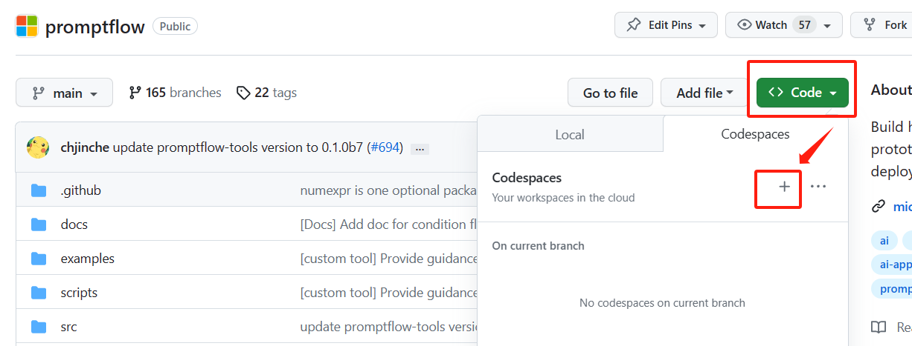

# Devcontainer for promptflow
To facilitate your promptflow project development and empower you to work on LLM projects using promptflow more effectively, 
we've configured the necessary environment for developing promptflow projects and utilizing flows through the dev container feature. 
You can seamlessly initiate your promptflow project development and start leveraging flows by simply using the dev container feature via VS Code or Codespaces.

# Use devcontainer
1. Use vscode to open promptflow repo, and install vscode extension: Dev Containers and then open promptflow with dev containers.
     
   
   **About dev containers please refer to: [devcontainers](https://code.visualstudio.com/docs/devcontainers/containers)**
2. Use codespaces to open promptflow repo, it will automatically build the dev containers environment and open promptflow with dev containers.
   

### Notes
1. If you only want to try out promptflow without developing promptflow, you can simply install Docker and use promptflow within Docker without the need for using DevContainers functionality.
   1. `docker build -t promptflow_container`
   2. `docker run -it promptflow_container`
2. When using the dev containers function, the promptflow and promptflow-tools installed in the container are the code of the current repo.
