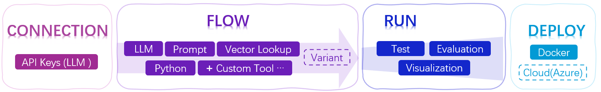

# Prompt flow


[](https://pypi.org/project/promptflow/)
[](https://pypi.org/project/promptflow/)
[](https://github.com/microsoft/promptflow/blob/main/LICENSE)

> Welcome to join us to make Prompt flow!

[Documentacion](https://microsoft.github.io/promptflow) • [Quick Start](https://github.com/microsoft/promptflow/blob/main/docs/how-to-guides/quick-start.md)  • [Discord](https://discord.gg/bnXr6kxs) •  [Discussions](https://github.com/microsoft/promptflow/discussions) • [Issues](https://github.com/microsoft/promptflow/issues/new/choose) • [Contribute PRs](https://github.com/microsoft/promptflow/pulls).

**Prompt flow** is a suite of development tools designed to streamline the end-to-end development cycle of LLM-based AI applications, from ideation, prototyping, testing, evaluation to production deployment and monitoring. It makes prompt engineering much easier and enables you to build LLM apps with production quality.

With prompt flow, you will be able to:

- **Create and Iteratively Develop Flow**
    - Create executable workflows that link LLMs, prompts, Python code and other tools together.
    - Debug and iterate your flows, especially the interaction with LLMs with ease.
- **Evaluate Flow Quality and Performance**
    - Evaluate your flow's quality and performance with larger datasets.
    - Integrate the testing and evaluation into your CI/CD system to ensure quality of your flow.
    - Deploy your flow to the serving platform you choose or integrate into your app's code base easily.
- (Optional but highly recommended) Collaborate with your team by leveraging the cloud version of [Prompt flow in Azure AI](https://learn.microsoft.com/en-us/azure/machine-learning/prompt-flow/overview-what-is-prompt-flow?view=azureml-api-2).

### Concept Overview


Learn more about the concept of Prompt flow [here](https://microsoft.github.io/promptflow/concepts/index.html).

------
## Get Started with Prompt flow ⚡

### Install
> ℹ️ A python environment, `python=3.9` is recommended.

```sh
pip install promptflow promptflow-tools
```

(Optional) Install **Prompt flow VS Code extension** from [visualstudio marketplace](https://marketplace.visualstudio.com/items?itemName=prompt-flow.prompt-flow).

### Set Up Connection for Your OpenAI API Key

Let's start by preparing a dedicated folder for this quick start and a yaml file `connection.yaml` to define the connection:

```sh
mkdir pf-test
cd pf-test
touch connection.yaml
```
Open the `connection.yaml` file. Paste the following connection configuration into the file, name this connection as `open_ai_connection`, and replace `<your_openai_key>` with your OpenAI API key:

```yaml
$schema: https://azuremlschemas.azureedge.net/promptflow/latest/OpenAIConnection.schema.json
name: open_ai_connection
type: open_ai
api_key: <your_openai_key>
```

To finalize the connection setup, run the following CLI command:

```sh
pf connection create -f connection.yaml
```
### Initialize a Prompt Flow Using the Chat Template

Use the following CLI command to initiate a prompt flow from a chat template. This action will create a new flow folder called "my_chatbot":

```sh
pf flow init --flow my_chatbot --type chat
```
### Chat with Your Flow
 
You can interact with your flow using the following command. Enter your question in the `User` section. Press `Ctrl + C` to end the session:

```sh
pf flow test --flow my_chatbot --interactive
```

What's Next? Continue with the **Tutorial**  👇 section to delve deeper into Prompt flow.

## Tutorial

### Value in Evaluation and Quality Improvement 🏃‍♂️

LLMs' randomness can yield unstable answers. Fine-tuning prompts can improve output reliability. Testing with larger datasets and comparing outputs to the ground truth is crucial for accurate quality assessment.

Prototype ➡️ Tunning  ➕  Batch Testing ➕ Evaluation ➡️ Ensure high quality before production

| Spare only 10 minutes to quickly grasp (👉[Try the easy case!](examples/tutorials/quick-start/tune-your-prompt.md) ) how prompt flow accelerate prompt tuning, testing, and evaluation.Find your ideal prompt (accuracy ↑,token ↓)| |  
| :------ | :------: |

Develop your LLM apps with Prompt flow: please start with our [docs](https://microsoft.github.io/promptflow) & [examples](./examples/README.md):
- [Getting Started with Prompt Flow](https://microsoft.github.io/promptflow/how-to-guides/quick-start.html): A step by step guidance to invoke your first flow run.
- [Tutorial: Chat with PDF](https://github.com/microsoft/promptflow/blob/main/examples/tutorials/e2e-development/chat-with-pdf.md): An end-to-end tutorial on how to build a high quality chat application with prompt flow, including flow development and evaluation with metrics.

Contribute to Prompt flow: please start with our dev setup guide: [dev_setup.md](./docs/dev/dev_setup.md).

## Contributing

This project welcomes contributions and suggestions.  Most contributions require you to agree to a
Contributor License Agreement (CLA) declaring that you have the right to, and actually do, grant us
the rights to use your contribution. For details, visit https://cla.opensource.microsoft.com.

When you submit a pull request, a CLA bot will automatically determine whether you need to provide
a CLA and decorate the PR appropriately (e.g., status check, comment). Simply follow the instructions
provided by the bot. You will only need to do this once across all repos using our CLA.

This project has adopted the [Microsoft Open Source Code of Conduct](https://opensource.microsoft.com/codeofconduct/).
For more information see the [Code of Conduct FAQ](https://opensource.microsoft.com/codeofconduct/faq/) or
contact [opencode@microsoft.com](mailto:opencode@microsoft.com) with any additional questions or comments.

## Trademarks

This project may contain trademarks or logos for projects, products, or services. Authorized use of Microsoft
trademarks or logos is subject to and must follow
[Microsoft's Trademark & Brand Guidelines](https://www.microsoft.com/en-us/legal/intellectualproperty/trademarks/usage/general).
Use of Microsoft trademarks or logos in modified versions of this project must not cause confusion or imply Microsoft sponsorship.
Any use of third-party trademarks or logos are subject to those third-party's policies.

## Code of Conduct

This project has adopted the
[Microsoft Open Source Code of Conduct](https://opensource.microsoft.com/codeofconduct/).
For more information see the
[Code of Conduct FAQ](https://opensource.microsoft.com/codeofconduct/faq/)
or contact [opencode@microsoft.com](mailto:opencode@microsoft.com)
with any additional questions or comments.

## License

Copyright (c) Microsoft Corporation. All rights reserved.

Licensed under the [MIT](LICENSE) license.
