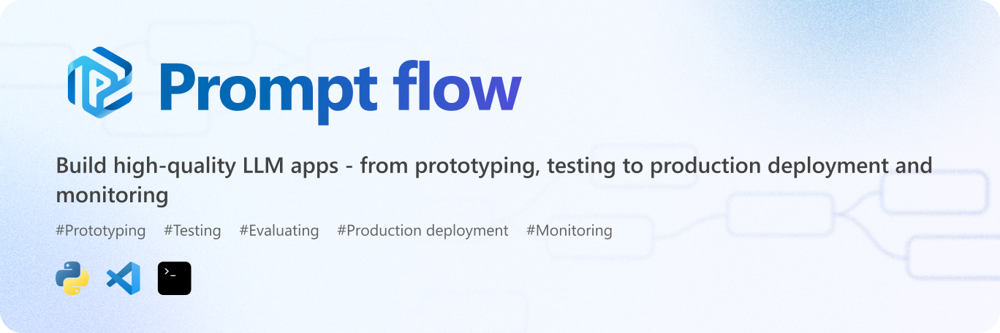
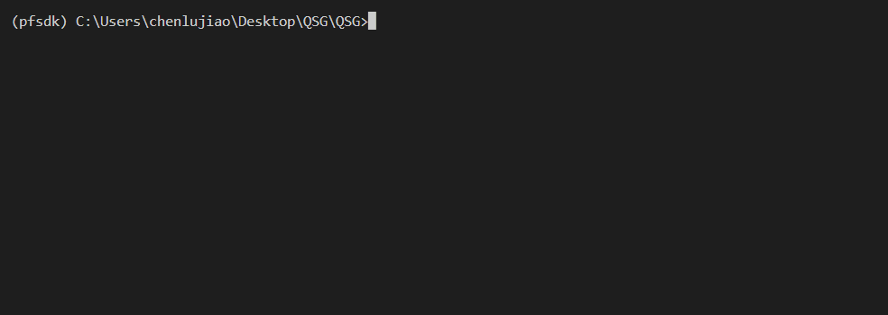
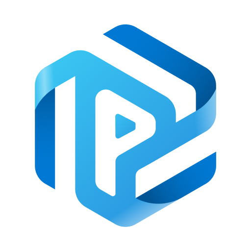

[](https://microsoft.github.io/promptflow/index.html)

------

# Prompt flow

[](https://pypi.org/project/promptflow/)
[](https://pypi.python.org/pypi/promptflow/) 
[](https://pypi.org/project/promptflow/)
[](https://microsoft.github.io/promptflow/reference/pf-command-reference.html)
[](https://marketplace.visualstudio.com/items?itemName=prompt-flow.prompt-flow)

[](https://microsoft.github.io/promptflow/index.html)
[](https://github.com/microsoft/promptflow/issues/new/choose)
[](https://discord.gg/bnXr6kxs)
[](https://github.com/microsoft/promptflow/issues/new/choose)
[](https://github.com/microsoft/promptflow/blob/main/CONTRIBUTING.md)
[](https://github.com/microsoft/promptflow/blob/main/LICENSE)

> Welcome to join us to make Prompt flow!

**Prompt flow** is a suite of development tools designed to streamline the end-to-end development cycle of LLM-based AI applications, from ideation, prototyping, testing, evaluation to production deployment and monitoring. It makes prompt engineering much easier and enables you to build LLM apps with production quality.

With prompt flow, you will be able to:

- **Create and Iteratively Develop Flow**
    - Create executable [flows](https://microsoft.github.io/promptflow/concepts/concept-flows.html) that link LLMs, prompts, Python code and other [tools](https://microsoft.github.io/promptflow/concepts/concept-tools.html) together.
    - Debug and iterate your flows, especially the [interaction with LLMs](https://microsoft.github.io/promptflow/concepts/concept-connections.html) with ease.
- **Evaluate Flow Quality and Performance**
    - Evaluate your flow's quality and performance with larger datasets.
    - Integrate the testing and evaluation into your CI/CD system to ensure quality of your flow.
- **Streamlined Development Cycle for Production**
    - Deploy your flow to the serving platform you choose or integrate into your app's code base easily.
    - (Optional but highly recommended) Collaborate with your team by leveraging the cloud version of [Prompt flow in Azure AI](https://learn.microsoft.com/en-us/azure/machine-learning/prompt-flow/overview-what-is-prompt-flow?view=azureml-api-2).

------

## Installation

Ensure you have a python environment, `python=3.9` is recommended.

```sh
pip install promptflow promptflow-tools
```

## Quick Start ⚡

**Create a chatbot with prompt flow**

Run the command to initiate a prompt flow from a chat template, it creates folder named `my_chatbot` and generates required files within it:

```sh
pf flow init --flow ./my_chatbot --type chat
```

**Setup a connection for your API key**

> <details>
> <summary>For Azure OpenAI key, establish the connection by running:</summary>
>
> ```sh
> # Override keys and endpoint with --set to avoid yaml file changes
> pf connection create --file ./my_chatbot/azure_openai.yaml --set api_key=<your_api_key> api_base=<your_api_endpoint>
> ```
> </details>

For OpenAI key, establish a connection by running the command, using the `openai.yaml` file in the `my_chatbot` folder, which stores your OpenAI key:

```sh
# Override keys with --set to avoid yaml file changes
pf connection create --file ./my_chatbot/openai.yaml --set api_key=<your_api_key>
```

**Chat with your flow**

In the `my_chatbot` folder, there's a `flow.dag.yaml` file that outlines the flow, including inputs/outputs, nodes,  connection, and the LLM model, etc

> Note that in the `chat` node, we're using a connection named `open_ai_connection` and the `gpt-35-turbo` model.

Interact with your chatbot by running: (press `Ctrl + C` to end the session)

```sh
pf flow test --flow ./my_chatbot --interactive
```

Then you will see the chatbot in action:

 

Next Step! Continue with the **Tutorial**  👇 section to delve deeper into Prompt flow.

## Tutorial 🏃‍♂️

Prompt Flow is a tool designed to **facilitate high quality LLM-native apps to production**, the development process in prompt flow follows these steps: develop a flow, improve the flow quality, deploy the flow to production.

### Develop your own LLM apps

#### VS Code Extension 

We also offer a VS Code extension (a flow designer) for an interactive flow development experience with UI. 


You can install it from the <a href="https://marketplace.visualstudio.com/items?itemName=prompt-flow.prompt-flow">visualstudio marketplace</a>.

#### Deep Dive into Flow Development

[Getting Started with Prompt Flow](https://microsoft.github.io/promptflow/how-to-guides/quick-start.html): A step by step guidance to invoke your first flow run.

### Learn from Use Cases

[Tutorial: Chat with PDF](https://github.com/microsoft/promptflow/blob/main/examples/tutorials/e2e-development/chat-with-pdf.md): An end-to-end tutorial on how to build a high quality chat application with prompt flow, including flow development and evaluation with metrics.
> More examples can be found [here](https://microsoft.github.io/promptflow/tutorials/index.html#samples). We welcome contributions of new use cases!

### Setup for Contributors

If you're interested in contributing, please start with our dev setup guide: [dev_setup.md](./docs/dev/dev_setup.md).

Next Step! Continue with the **Contributing**  👇 section to to contribute to Prompt flow.

## Contributing

This project welcomes contributions and suggestions.  Most contributions require you to agree to a
Contributor License Agreement (CLA) declaring that you have the right to, and actually do, grant us
the rights to use your contribution. For details, visit https://cla.opensource.microsoft.com.

When you submit a pull request, a CLA bot will automatically determine whether you need to provide
a CLA and decorate the PR appropriately (e.g., status check, comment). Simply follow the instructions
provided by the bot. You will only need to do this once across all repos using our CLA.

This project has adopted the [Microsoft Open Source Code of Conduct](https://opensource.microsoft.com/codeofconduct/).
For more information see the [Code of Conduct FAQ](https://opensource.microsoft.com/codeofconduct/faq/) or
contact [opencode@microsoft.com](mailto:opencode@microsoft.com) with any additional questions or comments.

## Trademarks

This project may contain trademarks or logos for projects, products, or services. Authorized use of Microsoft
trademarks or logos is subject to and must follow
[Microsoft's Trademark & Brand Guidelines](https://www.microsoft.com/en-us/legal/intellectualproperty/trademarks/usage/general).
Use of Microsoft trademarks or logos in modified versions of this project must not cause confusion or imply Microsoft sponsorship.
Any use of third-party trademarks or logos are subject to those third-party's policies.

## Code of Conduct

This project has adopted the
[Microsoft Open Source Code of Conduct](https://opensource.microsoft.com/codeofconduct/).
For more information see the
[Code of Conduct FAQ](https://opensource.microsoft.com/codeofconduct/faq/)
or contact [opencode@microsoft.com](mailto:opencode@microsoft.com)
with any additional questions or comments.

## License

Copyright (c) Microsoft Corporation. All rights reserved.

Licensed under the [MIT](LICENSE) license.
