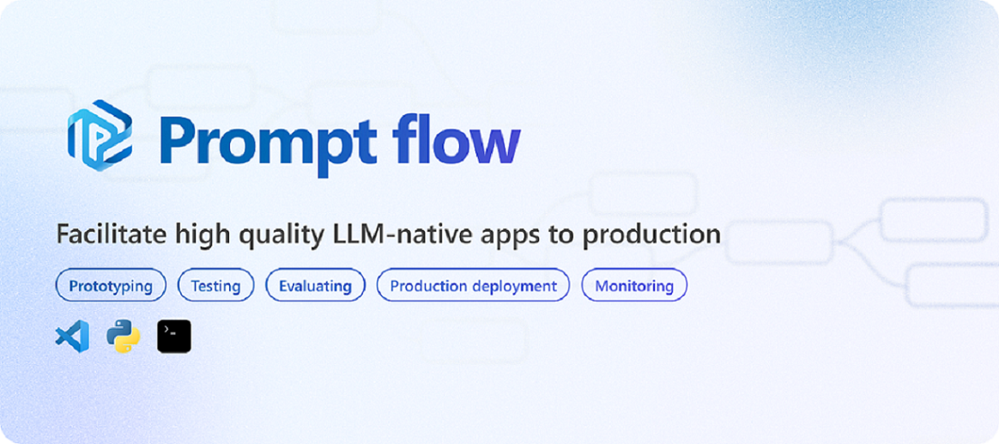

# Prompt flow


[](https://pypi.org/project/promptflow/)
[](https://pypi.org/project/promptflow/)
[](https://github.com/microsoft/promptflow/blob/main/LICENSE)

> Welcome to join us to make Prompt flow!

[Documentacion](https://microsoft.github.io/promptflow) • [Quick Start](https://github.com/microsoft/promptflow/blob/main/docs/how-to-guides/quick-start.md)  • [Discord](https://discord.gg/bnXr6kxs) •  [Discussions](https://github.com/microsoft/promptflow/discussions) • [Issues](https://github.com/microsoft/promptflow/issues/new/choose) • [Contribute PRs](https://github.com/microsoft/promptflow/pulls).

**Prompt flow** is a suite of development tools designed to streamline the end-to-end development cycle of LLM-based AI applications, from ideation, prototyping, testing, evaluation to production deployment and monitoring. It makes prompt engineering much easier and enables you to build LLM apps with production quality.

With prompt flow, you will be able to:

- **Create and Iteratively Develop Flow**
    - Create executable workflows that link LLMs, prompts, Python code and other tools together.
    - Debug and iterate your flows, especially the interaction with LLMs with ease.
- **Evaluate Flow Quality and Performance**
    - Evaluate your flow's quality and performance with larger datasets.
    - Integrate the testing and evaluation into your CI/CD system to ensure quality of your flow.
    - Deploy your flow to the serving platform you choose or integrate into your app's code base easily.
- (Optional but highly recommended) Collaborate with your team by leveraging the cloud version of [Prompt flow in Azure AI](https://learn.microsoft.com/en-us/azure/machine-learning/prompt-flow/overview-what-is-prompt-flow?view=azureml-api-2).

### Concept Overview


Learn more about the concept of Prompt flow [here](https://microsoft.github.io/promptflow/concepts/index.html).

------
## Get Started with Prompt flow ⚡

### Installation

> ℹ️ A python environment, `python=3.9` is recommended.

```sh
pip install promptflow promptflow-tools
```

### Set Up Connection for Your API Key

Create a yaml file `connection.yaml` to define the connection.
<details>
<summary> <b>connection.yaml</b> (click to toggle the yaml content)</summary>

```yaml
$schema: https://azuremlschemas.azureedge.net/promptflow/latest/OpenAIConnection.schema.json
name: open_ai_connection # name of the connection
type: open_ai
api_key: <your_openai_key> # replace with your OpenAI API key
```
</details>

Run the following CLI command to create the connection:

```sh
pf connection create -f connection.yaml
```
More details about connection can be found [here](https://microsoft.github.io/concepts/concept-connections.html).

### Quick Start from a Template

<details>
<summary><b>Initialize a prompt flow using the chat template.</b> (click to toggle the detailed introduction of the command)</summary>

Use the following CLI command to initiate a prompt flow from a chat template. This will create a new **flow folder** named "my_chatbot" and initiate flow files within it:

> The `--flow` argument is used to specify the path to the flow folder.

</details>

```sh
pf flow init --flow ./my_chatbot --type chat
```

<details>
<summary><b>Chat with your flow</b> (click to toggle the detailed introduction of the command)</summary>
 
You can interact with your flow using the following command. Enter your question in the `User` section. Press `Ctrl + C` to end the session.

</details>

```sh
pf flow test --flow ./my_chatbot --interactive
```

**What's Next? Ensuring ”High Quality“ with Prompt Flow**

Before deploying your application to production, it is crucial to evaluate its quality.

<details>
<summary><b> Why is quality evaluation so important?</b></summary>

LLMs' randomness can yield unstable answers. Fine-tuning prompts can improve output reliability.  For accurate quality assessment, it's essential to test with larger datasets and compare outcomes with the ground truth.

During fine-tuning the prompt, we also consider to strike a balance between the accuracy and the token cost of the LLM.

Invest just 15 minutes to understand how prompt flow accelerates prompt tuning, testing, and evaluation, to find an ideal prompt **(accuracy ↑,token ↓)**

</details>

Try the [15-mins Easy Case](examples/tutorials/quick-start/promptflow-quality-improvement.md) on Tuning ➕ Batch Testing ➕ Evaluation ➡ Quality ready for production.

Continue with the **Tutorial**  👇 section to delve deeper into Prompt flow.

## Tutorial 🏃‍♂️

Prompt Flow is a tool designed to **facilitate high quality LLM-native apps to production**, the development process in prompt flow follows these steps: Develop a flow， improve the flow quality, deploy the flow to production.

### Develop your own LLM apps

Begin with our comprehensive [Step-by-Step Guide](https://microsoft.github.io/promptflow/how-to-guides/quick-start.html): This is a detailed walkthrough step-by-step to create your own flow from scratch and invoke your first flow run.

#### VS Code Extension

In addition to the SDK, we offer a **Prompt flow VS Code extension** for an interactive and user-friendly flow development experience. Install it from [visualstudio marketplace](https://marketplace.visualstudio.com/items?itemName=prompt-flow.prompt-flow).

<details>
<summary> <b>Demo</b> (click to toggle the content)</summary>
This is a detailed walkthrough step-by-step to create your own flow from scratch and invoke your first flow run.

</details>

### Learn from Use Cases

Go through the tutorial of a practical use case, [Chat with PDF](https://github.com/microsoft/promptflow/blob/main/examples/tutorials/e2e-development/chat-with-pdf.md): This is an end-to-end tutorial on how to build a high quality chat application with prompt flow, including flow development and evaluation with metrics.
* You can find more examples [here](./examples/README.md). We always welcome contributions of new use cases!

### Setup for Contributors

Contribute to Prompt flow, please start with our dev setup guide: [dev_setup.md](./docs/dev/dev_setup.md).

Next, Continue with the **Contributing**  👇 section to to contribute to Prompt flow.

## Contributing

This project welcomes contributions and suggestions.  Most contributions require you to agree to a
Contributor License Agreement (CLA) declaring that you have the right to, and actually do, grant us
the rights to use your contribution. For details, visit https://cla.opensource.microsoft.com.

When you submit a pull request, a CLA bot will automatically determine whether you need to provide
a CLA and decorate the PR appropriately (e.g., status check, comment). Simply follow the instructions
provided by the bot. You will only need to do this once across all repos using our CLA.

This project has adopted the [Microsoft Open Source Code of Conduct](https://opensource.microsoft.com/codeofconduct/).
For more information see the [Code of Conduct FAQ](https://opensource.microsoft.com/codeofconduct/faq/) or
contact [opencode@microsoft.com](mailto:opencode@microsoft.com) with any additional questions or comments.

## Trademarks

This project may contain trademarks or logos for projects, products, or services. Authorized use of Microsoft
trademarks or logos is subject to and must follow
[Microsoft's Trademark & Brand Guidelines](https://www.microsoft.com/en-us/legal/intellectualproperty/trademarks/usage/general).
Use of Microsoft trademarks or logos in modified versions of this project must not cause confusion or imply Microsoft sponsorship.
Any use of third-party trademarks or logos are subject to those third-party's policies.

## Code of Conduct

This project has adopted the
[Microsoft Open Source Code of Conduct](https://opensource.microsoft.com/codeofconduct/).
For more information see the
[Code of Conduct FAQ](https://opensource.microsoft.com/codeofconduct/faq/)
or contact [opencode@microsoft.com](mailto:opencode@microsoft.com)
with any additional questions or comments.

## License

Copyright (c) Microsoft Corporation. All rights reserved.

Licensed under the [MIT](LICENSE) license.
