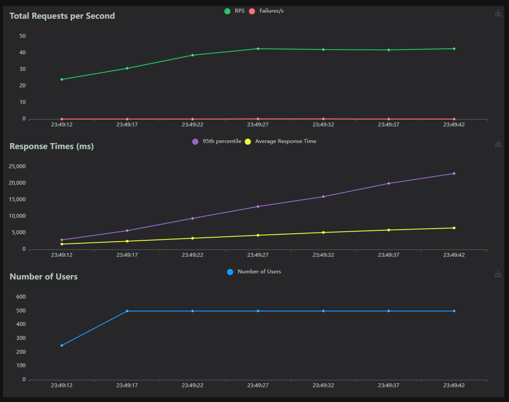
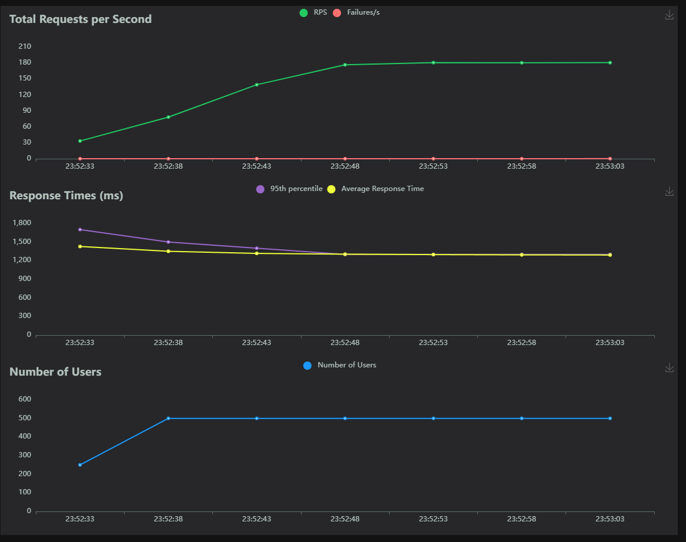
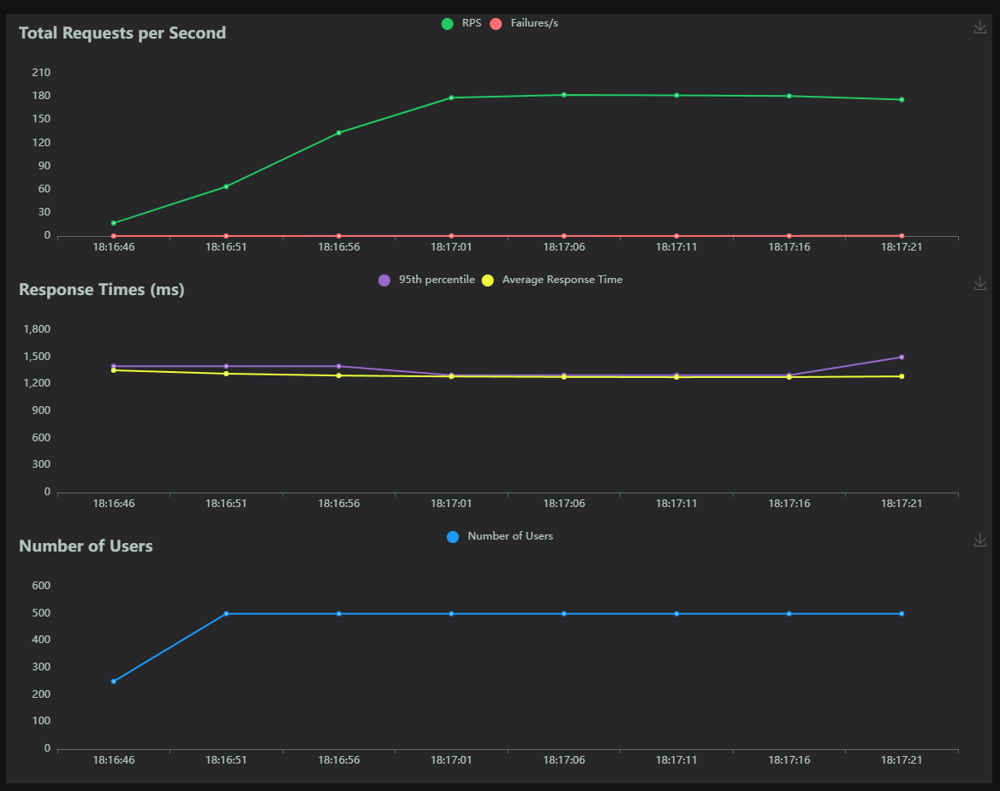

# PromptFlow Serve v1.12.0

## Config

```text
USERS=500
HATCH_RATE=50
RUN_TIME=60s
PROMPTFLOW_WORKER_NUM=8
PROMPTFLOW_WORKER_THREADS=4
```
## Flask + Sync Function Nodes

| Type | Name | Request Count | Failure Count | Median Response Time | Average Response Time | Min Response Time | Max Response Time | Average Content Size | Requests/s | Failures/s | 50% | 66% | 75% | 80% | 90% | 95% | 98% | 99% | 99.9% | 99.99% | 100% |
|------|------|---------------|---------------|---------------------|-----------------------|-------------------|-------------------|----------------------|-------------|-------------|-----|-----|-----|-----|-----|-----|-----|-----|-------|--------|------|
| POST | //score | 2432 | 1 | 5800.0 | 8065.454250779605 | 1.944665999872086 | 25289.052397999967 | 136.6953125 | 41.17208026926904 | 0.016929309321245492 | 5800 | 10000 | 14000 | 15000 | 21000 | 25000 | 25000 | 25000 | 25000 | 25000 | 25000 |
|      | Aggregated | 2432 | 1 | 5800.0 | 8065.454250779605 | 1.944665999872086 | 25289.052397999967 | 136.6953125 | 41.17208026926904 | 0.016929309321245492 | 5800 | 10000 | 14000 | 15000 | 21000 | 25000 | 25000 | 25000 | 25000 | 25000 | 25000 |



## FastApi + Async Function Nodes

| Type | Name | Request Count | Failure Count | Median Response Time | Average Response Time | Min Response Time | Max Response Time | Average Content Size | Requests/s | Failures/s | 50% | 66% | 75% | 80% | 90% | 95% | 98% | 99% | 99.9% | 99.99% | 100% |
|------|------|---------------|---------------|---------------------|-----------------------|-------------------|-------------------|----------------------|-------------|-------------|-----|-----|-----|-----|-----|-----|-----|-----|-------|--------|------|
| POST | //score | 9816 | 5 | 1300.0 | 1286.097093404957 | 1.1461390004114946 | 1674.347330999808 | 136.6794009779951 | 166.23424865808806 | 0.08467514703447843 | 1300 | 1300 | 1300 | 1300 | 1300 | 1400 | 1500 | 1500 | 1600 | 1700 | 1700 |
|      | Aggregated | 9816 | 5 | 1300.0 | 1286.097093404957 | 1.1461390004114946 | 1674.347330999808 | 136.6794009779951 | 166.23424865808806 | 0.08467514703447843 | 1300 | 1300 | 1300 | 1300 | 1300 | 1400 | 1500 | 1500 | 1600 | 1700 | 1700 |



## FastApi + Flex Async Function Nodes

| Type | Name | Request Count | Failure Count | Median Response Time | Average Response Time | Min Response Time | Max Response Time | Average Content Size | Requests/s | Failures/s | 50% | 66% | 75% | 80% | 90% | 95% | 98% | 99% | 99.9% | 99.99% | 100% |
|------|------|---------------|---------------|---------------------|-----------------------|-------------------|-------------------|----------------------|-------------|-------------|-----|-----|-----|-----|-----|-----|-----|-----|-------|--------|------|
| POST | //score | 9840 | 6 | 1300.0 | 1283.105743044001 | 0.6390180005837465 | 1894.6711440003128 | 126.67418699186992 | 166.46825073381316 | 0.10150503093525194 | 1300 | 1300 | 1300 | 1300 | 1300 | 1400 | 1500 | 1500 | 1800 | 1900 | 1900 |
|      | Aggregated | 9840 | 6 | 1300.0 | 1283.105743044001 | 0.6390180005837465 | 1894.6711440003128 | 126.67418699186992 | 166.46825073381316 | 0.10150503093525194 | 1300 | 1300 | 1300 | 1300 | 1300 | 1400 | 1500 | 1500 | 1800 | 1900 | 1900 |

