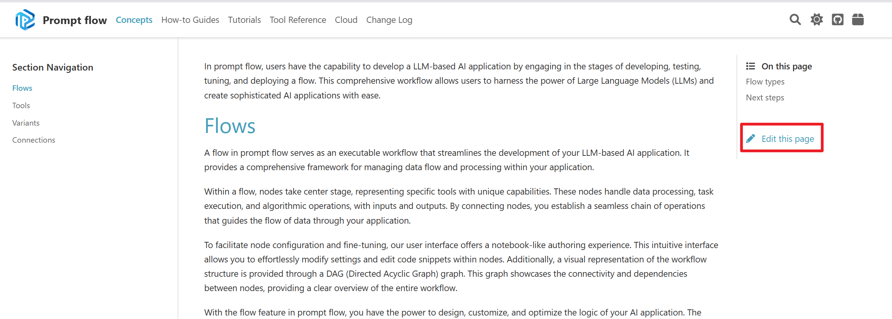

# Promptflow documentation contribute guidelines

This folder contains the source code for [prompt flow documentation site](https://microsoft.github.io/promptflow). 

This readme file will not be included in above doc site. It keeps a guide for promptflow documentation contributors.

## Content
Below is a table of important doc pages.
| Category              | Article             |
|----------------|----------------|
|Quick start|[Get started with prompt flow](./how-to-guides/quick-start.md)|
|Concepts|[Flows](./concepts/concept-flows.md)<br> [Tools](./concepts/concept-tools.md)<br> [Connections](./concepts/concept-connections.md)<br> [Variants](./concepts/concept-variants.md)<br> |
|How-to guides|[How to initialize and test a flow](./how-to-guides/init-and-test-a-flow.md) <br>[How to run and evaluate a flow](./how-to-guides/run-and-evaluate-a-flow.md)<br> [How to tune prompts using variants](./how-to-guides/tune-prompts-with-variants.md)<br>[How to deploy and export a flow](./how-to-guides/deploy-and-export-a-flow.md)<br>[How to create and use your own tool package](./how-to-guides/how-to-create-and-use-your-own-tool-package.md)|
|Tools reference|[LLM tool](./tools-reference/llm-tool.md)<br> [Prompt tool](./tools-reference/prompt-tool.md)<br> [Python tool](./tools-reference/python-tool.md)<br> [SERP API tool](./tools-reference/serp-api-tool.md)<br> [Embedding tool](./tools-reference/embedding_tool.md)||


## Writing tips
0. Reach the doc source repository by clicking `Edit this page` on any page.
   
1. Please use :::{admonition} for experimental feature or notes, and admonition with dropdown for the Limitation Part.
2. Please use ::::{tab-set} to group your sdk/cli example, and put the cli at first. Use :sync: to sync multiple tables . 
3. If you are unclear with the above lines, refer to [get started](./how-to-guides/quick-start.md) to see the usage.
4. Add gif: Use [ScreenToGif](https://www.screentogif.com/) to record your screen, edit and save as a gif.
5. Reach more element style at [Sphinx Design Components](https://pydata-sphinx-theme.readthedocs.io/en/latest/user_guide/web-components.html).

## Preview your changes


**Local build**: We suggest using local build at the beginning, as it's fast and efficiency. 
```powershell
cd .\scripts\docs

.\doc_generation.ps1 # Install requirements and build doc
# .\doc_generation.ps1 -SkipInstall # Skip install dependencies and build doc

start .\_build\index.html # See the homepage in your browser
```


## FAQ
### Adding image in doc
Please use markdown syntax `` to reference image, because the relative path of image will be changed after sphinx build, and image placed in html tags can not be referenced when build. 

### Draw flow chart in doc 
We recommend using the mermaid, learn more from the [mermaid syntax doc](https://mermaid-js.github.io/mermaid/#/./flowchart?id=flowcharts-basic-syntax)
- Recommend to install [vscode extension](https://marketplace.visualstudio.com/items?itemName=bierner.markdown-mermaid) to preview graph in vscode.

## Reference
- [md-and-rst](https://coderefinery.github.io/sphinx-lesson/md-and-rst/)
- [sphinx-quickstart](https://www.sphinx-doc.org/en/master/usage/quickstart.html)