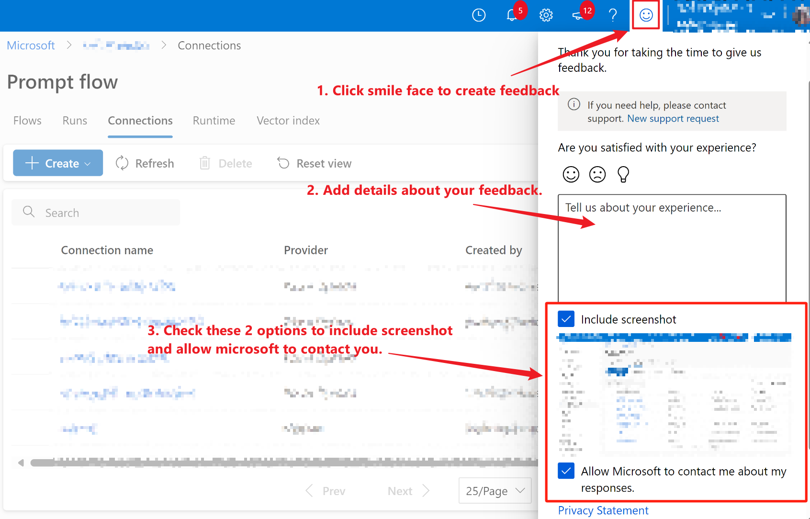

# Frequency asked questions (FAQ)


## How to create feedback for azure portal experience 

For azure portal experience related issues, please create feedback on azure portal.



## Token expired when run pfazure cmd

If hit error "AADSTS700082: The refresh token has expired due to inactivity." when running pfazure cmd, it's caused by local cached token expired. Please clear the cached token under "%LOCALAPPDATA%/.IdentityService/msal.cache". Then run below command to login again:
```sh
az login
```