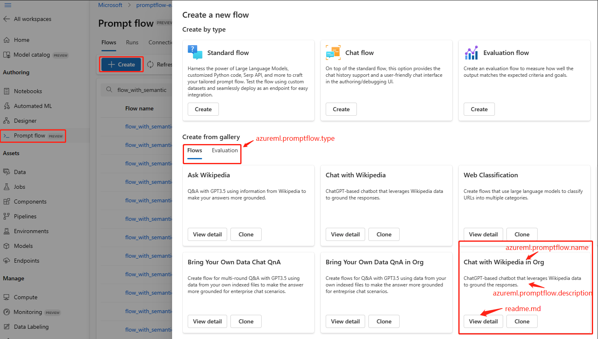

# Flow Example Sharing in Organization

:::{admonition} Experimental feature
This is an experimental feature, and may change at any time. Learn [more](../faq.md#stable-vs-experimental).
:::

Flow developers may want to share their flows within their organization to enhance collaborative development. In this document, we will provide a detailed walkthrough on how to share a flow as a model in an organization registry. Additionally, we will demonstrate how to locate a flow in the Flow Gallery.

## How to share flow as a model in an organization registry

To share a flow, the flow needs to be registered as a model with some specific properties in an organization registry.

### Prepare a `readme.md` file for the flow

To make the flow easily understand, it is better to include an `readme.md` file for the flow in the flow folder. Here we'll use [this existing readme](https://github.com/microsoft/promptflow/blob/main/examples/flows/chat/chat-with-wikipedia/README.md) as an example:
The readme file may include the following sections:
- The purpose of the flow.
- The tools utilized in the flow.
- The prerequisites required to execute the flow.
- What knowledge can be gained from this flow..
Any other information you wish to share about your flow.

### Prepare a model yaml for the flow

In this section, we will focus on the model properties related to the user interface display of this flow. For details on other model fields, please refer to [model yaml schema](https://learn.microsoft.com/en-us/azure/machine-learning/reference-yaml-model?view=azureml-api-2). Below is the `model.yml` file for flow:

```yaml
$schema: https://azuremlschemas.azureedge.net/latest/model.schema.json
name: <model_name>
type: custom_model
path: <the relative path from this model file to the flow folder>
description: <model_description>
version: <model_version>
properties:
  is-promptflow: true
  azureml.promptflow.section: gallery
  azureml.promptflow.type: <flow_type>
  azureml.promptflow.name: <flow_name>
  azureml.promptflow.description: <flow_description>
```

Properties released to user interface display of this flow:
1. `is-promptflow`: value will always be `true`. This property distinguishes it from other models, enabling us to filter it out.
2. `azureml.promptflow.section`: value will always be `gallery`. This property indicates UI that this flow needs to be shown in Flow Gallery.
3. `azureml.promptflow.type`: value can be `chat`, `standard` or `evaluate`. This property identifies the type of your flow, and the UI will display different types of flows under separate tabs accordingly.
4. `azureml.promptflow.name`: the name of the flow which will be shown as the flow name in Flow Gallery.
5. `azureml.promptflow.description`: the description of the flow which will be shown as flow description in Flow Gallery.

Take [this existing flow](https://github.com/microsoft/promptflow/tree/main/examples/flows/chat/chat-with-wikipedia) as an example, the model yml for it will look like below:
```yaml
$schema: https://azuremlschemas.azureedge.net/latest/model.schema.json
name: chat-with-wikipedia-in-org
type: custom_model
path: chat_with_wikipedia
description: promptflow flow registered as a custom model
version: 1
properties:
  is-promptflow: true
  azureml.promptflow.section: gallery
  azureml.promptflow.type: chat
  azureml.promptflow.name: Chat with Wikipedia in Org
  azureml.promptflow.description: ChatGPT-based chatbot that leverages Wikipedia data to ground the responses.
```

### Register a model in an organization registry

Run the following command to register the previous model to an organization registry. More details about [model creation](https://learn.microsoft.com/en-us/cli/azure/ml/model?view=azure-cli-latest#az-ml-model-create):
```
az ml model create -f model.yml --registry-name <organization-registry-name>
```

## How to locate a flow in the Flow Gallery

- Open a workspace in a region that is compatible with the organization registry.
- Click the `Create` button to open the Flow Gallery, and you can find the flow registered before:



1. `azureml.promptflow.type`: the `evaluate` will be displayed under the 'Evaluation' tab, while other values will appear under the 'Flow' tab.
2. `azureml.promptflow.name`: shown as flow name in the flow card.
3. `azureml.promptflow.description`: shown as flow description in the flow card.
4. `readme.md`: click the `View detail` button will show the content in the `readme.md`.