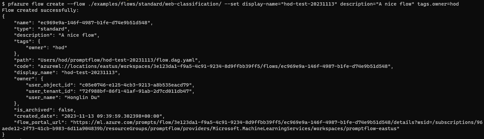
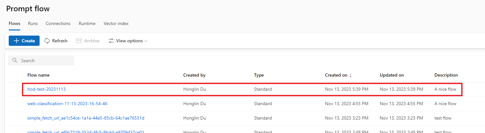
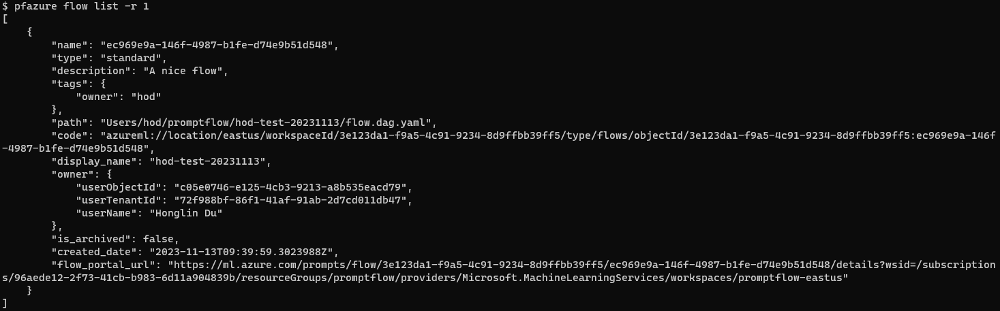

# Manage flows

This documentation will walk you through how to manage your flow with CLI and SDK on [Azure AI](https://learn.microsoft.com/en-us/azure/machine-learning/prompt-flow/overview-what-is-prompt-flow?view=azureml-api-2). 
The flow examples in this guide come from [examples/flows/standard](https://github.com/microsoft/promptflow/tree/main/examples/flows/standard).

In general:
- For `CLI`, you can run `pfazure flow --help` in the terminal to see help messages.
- For `SDK`, you can refer to [Promptflow Python Library Reference](../../reference/python-library-reference/promptflow-azure/promptflow.rst) and check `promptflow.azure.PFClient.flows` for more flow operations.

:::{admonition} Prerequisites
- Refer to the prerequisites in [Quick start](./run-promptflow-in-azure-ai.md#prerequisites).
- Use the `az login` command in the command line to log in. This enables promptflow to access your credentials. 
:::

Let's take a look at the following topics:
- [Manage flows](#manage-flows)
  - [Create a flow](#create-a-flow)
  - [List flows](#list-flows)

## Create a flow

::::{tab-set}
:::{tab-item} CLI
:sync: CLI

To set the target workspace, you can either specify it in the CLI command or set default value in the Azure CLI.
You can refer to [Quick start](./run-promptflow-in-azure-ai.md#submit-a-run-to-workspace) for more information.

To create a flow to Azure from local flow directory, you can use 

```bash
# create the flow 
pfazure flow create --flow <path-to-flow-folder> 

# create the flow with metadata
pfazure flow create --flow <path-to-flow-folder> --set display_name=<display-name> description=<description> tags.key1=value1
```

After the flow is created successfully, you can see the flow summary in the command line.




:::


:::{tab-item} SDK
:sync: SDK

1. Import the required libraries
```python
from azure.identity import DefaultAzureCredential, InteractiveBrowserCredential
# azure version promptflow apis
from promptflow.azure import PFClient
```

2. Get credential
```python
try:
    credential = DefaultAzureCredential()
    # Check if given credential can get token successfully.
    credential.get_token("https://management.azure.com/.default")
except Exception as ex:
    # Fall back to InteractiveBrowserCredential in case DefaultAzureCredential not work
    credential = InteractiveBrowserCredential()
```

3. Get a handle to the workspace
```python
# Get a handle to workspace
pf = PFClient(
    credential=credential,
    subscription_id="<SUBSCRIPTION_ID>",  # this will look like xxxxxxxx-xxxx-xxxx-xxxx-xxxxxxxxxxxx
    resource_group_name="<RESOURCE_GROUP>",
    workspace_name="<AML_WORKSPACE_NAME>",
)
```

4. Create the flow

```python

# specify flow path
flow = "./web-classification"

# create flow to Azure
flow = pf.flows.create_or_update(
    flow=flow,  # path to the flow folder
    display_name="my-web-classification",  # it will be "web-classification-{timestamp}" if not specified
    type="standard",  # it will be "standard" if not specified
)
```

:::

::::

On Azure portal, you can see the created flow in the flow list.



And the flow source folder on file share is `Users/<alias>/promptflow/<flow-display-name>`:


Note that if the flow display name is not specified, it will default to the flow folder name + timestamp. (e.g. `web-classification-11-13-2023-14-19-10`)

## List flows


::::{tab-set}
:::{tab-item} CLI
:sync: CLI

List flows with default json format:
```bash
pfazure flow list --max-results 1
```




:::

:::{tab-item} SDK
:sync: SDK

```python
# reuse the pf client created in "create a flow" section
flows = pf.flows.list(max_results=1)
```

:::

::::