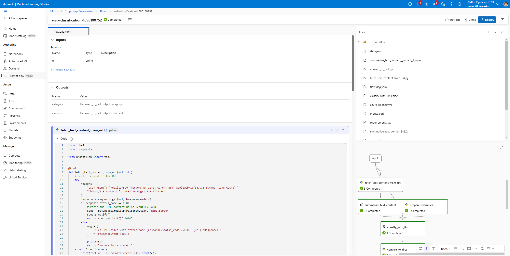

# Run prompt flow in Azure AI

:::{admonition} Experimental feature
This is an experimental feature, and may change at any time. Learn [more](https://aka.ms/azuremlexperimental).
:::

Assuming you have learned how to create and run a flow following [Quick start](../../how-to-guides/quick-start.md). This guide will walk you through the main process of how to submit a promptflow run to [Azure AI](https://learn.microsoft.com/en-us/azure/machine-learning/prompt-flow/overview-what-is-prompt-flow?view=azureml-api-2).

Benefits of use Azure AI comparison to just run locally:
- **Designed for team collaboration**: Portal UI is a better fix for sharing & presentation your flow and runs. And workspace can better organize team shared resources like connections.
- **Enterprise Readiness Solutions**: prompt flow leverages Azure AI's robust enterprise readiness solutions, providing a secure, scalable, and reliable foundation for the development, experimentation, and deployment of flows.

## Prerequisites

1. An Azure account with an active subscription - [Create an account for free](https://azure.microsoft.com/free/?WT.mc_id=A261C142F)
2. An Azure AI ML workspace - [Create workspace resources you need to get started with Azure AI](https://learn.microsoft.com/en-us/azure/machine-learning/quickstart-create-resources).
3. A python environment, `python=3.9` or higher version like 3.10 is recommended.
4. Install `promptflow` with extra dependencies and `promptflow-tools`.
```sh
pip install promptflow[azure] promptflow-tools
```
5. Clone the sample repo and check flows in folder [examples/flows](https://github.com/microsoft/promptflow/tree/main/examples/flows).
```sh
git clone https://github.com/microsoft/promptflow.git
```

## Create necessary connections
Connection helps securely store and manage secret keys or other sensitive credentials required for interacting with LLM and other external tools for example Azure Content Safety.

In this guide, we will use flow `web-classification` which uses connection `open_ai_connection` inside, we need to set up the connection if we haven't added it before.

Please go to workspace portal, click `Prompt flow` -> `Connections` -> `Create`, then follow the instruction to create your own connections. Learn more on [connections](https://learn.microsoft.com/en-us/azure/machine-learning/prompt-flow/concept-connections?view=azureml-api-2).


## Submit a run to workspace

Assuming you are in working directory `<path-to-the-sample-repo>/examples/flows/standard/`

::::{tab-set}

:::{tab-item} CLI
:sync: CLI

Use `az login` to login so promptflow can get your credential.

```sh
az login
```

Submit a run to workspace.

```sh
pfazure run create --subscription <my_sub> -g <my_resource_group> -w <my_workspace> --flow web-classification --data web-classification/data.jsonl --stream 
```

**Default subscription/resource-group/workspace**

Note `--subscription`, `-g` and `-w` can be omitted if you have installed the [Azure CLI](https://learn.microsoft.com/en-us/cli/azure/install-azure-cli) and [set the default configurations](https://learn.microsoft.com/en-us/cli/azure/azure-cli-configuration).

```sh
az account set --subscription <my-sub>
az configure --defaults group=<my_resource_group> workspace=<my_workspace>
```

**Serverless runtime and named runtime**

Runtimes serve as computing resources so that the flow can be executed in workspace. Above command does not specify any runtime which means it will run in serverless mode. In this mode the workspace will automatically create a runtime and you can use it as the default runtime for any flow run later.

Instead, you can also [create a runtime](https://learn.microsoft.com/en-us/azure/machine-learning/prompt-flow/how-to-create-manage-runtime?view=azureml-api-2) and use it with `--runtime <my-runtime>`:
```sh
pfazure run create --flow web-classification --data web-classification/data.jsonl --stream --runtime <my-runtime>
```

**Specify run name and view a run**

You can also name the run by specifying `--name my_first_cloud_run` in the run create command, otherwise the run name will be generated in a certain pattern which has timestamp inside.

With a run name, you can easily stream or view the run details using below commands:

```sh
pfazure run stream -n my_first_cloud_run  # same as "--stream" in command "run create"
pfazure run show-details -n my_first_cloud_run
pfazure run visualize -n my_first_cloud_run
```

More details can be found in [CLI reference: pfazure](../../reference/pfazure-command-reference.md)

:::

:::{tab-item} SDK
:sync: SDK

1. Import the required libraries
```python
from azure.identity import DefaultAzureCredential, InteractiveBrowserCredential
# azure version promptflow apis
from promptflow.azure import PFClient
```

2. Get credential
```python
try:
    credential = DefaultAzureCredential()
    # Check if given credential can get token successfully.
    credential.get_token("https://management.azure.com/.default")
except Exception as ex:
    # Fall back to InteractiveBrowserCredential in case DefaultAzureCredential not work
    credential = InteractiveBrowserCredential()
```

3. Get a handle to the workspace
```python
# Get a handle to workspace
pf = PFClient(
    credential=credential,
    subscription_id="<SUBSCRIPTION_ID>",  # this will look like xxxxxxxx-xxxx-xxxx-xxxx-xxxxxxxxxxxx
    resource_group_name="<RESOURCE_GROUP>",
    workspace_name="<AML_WORKSPACE_NAME>",
)
```

4. Submit the flow run

```python

# load flow
flow = "web-classification"
data = "web-classification/data.jsonl"
runtime = "demo-mir" # assume you have existing runtime with this name provisioned
# runtime = None # un-comment use automatic runtime

# create run
base_run = pf.run(
    flow=flow,
    data=data,
    runtime=runtime,
)

pf.stream(base_run)
```
5. View the run info
```python
details = pf.get_details(base_run)
details.head(10)

pf.visualize(base_run)
```

:::

::::


## View the run in workspace

At the end of stream logs, you can find the `portal_url` of the submitted run, click it to view the run in the workspace.





## Next steps

Learn more about:
- [CLI reference: pfazure](../../reference/pfazure-command-reference.md)
