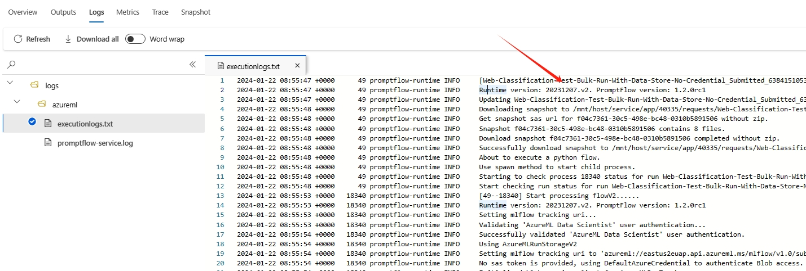

# Change log of default runtime image
## Runtime image
In Azure Machine Learning prompt flow, runtime provides the environment to execute flows. The default runtime includes a pre-built Docker image, which contains all necessary dependent packages.

### Pull image
The image can be pulled by specifying a runtime version and executing the following command:
```
docker pull mcr.microsoft.com/azureml/promptflow/promptflow-runtime-stable:<runtime_version>
```

### Check image version
You can check the runtime image version from the flow execution log:


## Change log
Default runtime image is continuously updated, and here we record the new features and fixed bugs of each image version.

### 20251211.v2

#### New features
- NA

#### Bugs fixed
- Upgrade pip==25.3 go==1.24.9 mlflow>=3.6.0 to fix vulnerabilities

### 20251014.v1

#### New features
- NA

#### Bugs fixed
- fix GNU C Library and dpkg vulnerabilities in Ubuntu Image

### 20250831.v1

#### New features
- NA

#### Bugs fixed
- Update Ubuntu Image 22.04:latest to fix several security issues in Perl and SQLite

### 20250806.v3

#### New features
- NA

#### Bugs fixed
- Upgrade aiohttp>=3.12.14 to fix vulnerability

### 20250728.v1

#### New features
- NA

#### Bugs fixed
- Update Ubuntu Image 22.04 to fix several security issues in libssh and Git

### 20250220.v2

#### New features
- Update promptflow-tools to 1.6.0

#### Bugs fixed
- Pin marshmallow to ensure compatibility with older versions of promptflow for customer use.

### 20250131.v2
Promptflow version 1.17.1 or higher is required due to a known issue with marshmallow.
#### New features
- Update promptflow-tools to 1.5.0
- Update promptflow to 1.17.2

#### Bugs fixed
NA

### 20250109.v2

#### New features
- Update promptflow to 1.17.0
- PromptFlow-vectordb package update : To support langchain 0.3.x

#### Bugs fixed
- Update golang crypto, net to fix vulnerabilities
- Pin aiohttp in runtime image to fix vulnerability

### 20241214.v1
Do not use this version due to known issues and bugs.
#### New features
NA

#### Bugs fixed
- Update langchain-community>=0.3.0 to fix vulnerability
- Update mlflow>=2.16.0 to fix vulnerability

### 20241126.v3

#### New features
- Upgrade promptflow version to 1.16.2

#### Bugs fixed
NA

### 20241114.v2

#### New features
NA

#### Bugs fixed
- Update langchain-community>=0.2.19 to fix vulnerability

### 20241031.v1

#### New features
- Upgrade promptflow version to 1.16.1

#### Bugs fixed
NA

### 20241021.v1

#### New features
NA

#### Bugs fixed
- Upgrade langchain>=0.2.5 and langchain-community>=0.2.5,<0.3.0,!=0.2.14 to fix vulnerability

### 20240918.v2

#### New features
NA

#### Bugs fixed
NA

### 20240909.v2

#### New features
NA

#### Bugs fixed
NA

### 20240829.v1

#### New features
NA

#### Bugs fixed
- Add uvicorn dependency explicitly

### 20240814.v1

#### New features
NA

#### Bugs fixed
- Fix non serializable search results

### 20240731.v1

#### New features
- Add Reranker tool with Cohere accessibility to Prompt flow

#### Bugs fixed
- Fix run id duplicate check
- Upgrade langchain version in promptflow-vectordb-sdk

### 20240709.v1

#### New features
- cosmos db vector db support
- Build and publish promptflow-parallel

#### Bugs fixed
- Add aad auth check
- Fix metadata parser error

### 20240619.v2

#### New features
NA

#### Bugs fixed
- Add @blob_error_handling_decorator for cancelling_run and get_run_status in async storage
- Use dataplane api to list embedding deployments
- Fix KeyError when get run meet UserAuthenticationValidationError.

### 20240529.v1

#### New features
- [BYOI] Implement PostgreSQL
- [Lookup tool] Implement BYO-Weaviate Index

#### Bugs fixed
- The destination of _download_fileshare_directory should be str
- Passing DefaultAzureCredential into as_langchain_vectorstore
- Upgrade Werkzeug to 3.0.3.

### 20240515.v1

#### New features
- runtime support batch run prompty
- Support init_kwargs for multi-container c# batch run
- Upgrade gunicorn and mlflow

#### Bugs fixed
- Fix and avoid FlowExecutor in PythonApiExecutorProxy

### 20240511.v1

#### New features
- Add support for more huggingface models

#### Bugs fixed
- _download_azure_file_share should return str
- When ingress call gunicorn met timeout, we should not return 200.
- Pin azureml-rag version to 0.2.30.2
- Upgrade golang.org/x/net from 0.17.0 to 0.23.0 to fix vulnerability

### 20240429.v8

#### New features
- Remove preview tag from Index Lookup
- Support init_kwargs in c# batch run in cloud

#### Bugs fixed
- Pass init_kwargs to executor in multi container case
- Fix error of span.attributes.flow_log_path in multi-container.
- Add duplicated key in SystemLogContext to avoid breaking when LogContext does not have it
- Add clarification to migration notebook and small fixes
- [Lookup tool] Update list pinecone index endpoint
- Handle case where flow_logs_folder is None

### 20240424.v1

#### New features
- Support download working_dir from fileshare.  
- Enable line log for batch run
- Add prompt_tokens/completion_tokens to run properties
- Support C# batch run in multi-container runtime
- Implement ESIndex in common index lookup
- Handle metadata processing better in Index Lookup
- implement mongodb support

#### Bugs fixed
- Remove Promptflow-evals publish.
- [Lookup tool] Add workspace name in get()
- changes to utils.py were accidentally left out of previous PR.

### 20240411.v4

#### New features
- Add 'detail' parameter on 'Azure OpenAI GPT-4 Turbo with Vision" tool and "OpenAI GPT-4V" tool.

#### Bugs fixed
- Resolve an intermittent ImportError that arose while loading the package tool.
- Upgrade langchain>=0.1.1 and langchain-core>=0.1.30 to fix vulnerability.

### 20240403.v2

#### New features
NA

#### Bugs fixed
NA


### 20240326.v2

#### New features
- Support environment variables for C# batch run.

#### Bugs fixed
NA


### 20240319.v1

#### New features
NA

#### Bugs fixed
NA


### 20240313.v1

#### New features
NA

#### Bugs fixed
- Fix an issue where calling a flow with a flow function would result in failure.
- Improve error handling by categorizing errors as user errors when a run is archived prior to being processed by the runtime.


### 20240306.v5

#### New features
- Support "seed" parameter for built-in LLM tools and GPT-4V tools.

#### Bugs fixed
- Handle ClientAuthenticationError properly.
- Fix appending blob exceeded size limit error by truncating debug info.


### 20240228.v3

#### New features
- Support async flow test for long running jobs.

#### Bugs fixed
- Fix bug when collecting package tools.


### 20240222.v3

#### New features
- Added support for executing C# batch runs in eager mode.
- Introduced the ability to specify the number of workers for batch runs.
- Implemented functionality to define a timeout for batch runs.

#### Bugs fixed
NA

### 20240205.v2

#### New features
NA

#### Bugs fixed
- Fix the bug that deployed promptflow endpoint fails to get user assigned identity token.

### 20240124.v3

#### New features
- Support downloading data from Azure Machine Learning registry for batch run.
- Show node status when one line of a batch run times out.

#### Bugs fixed
- Fix the bug that exception raised during preparing data is not set in run history.
- Fix the bug that unexpected exception is raised when executor process crushes.

### 20240116.v1

#### New features
NA

#### Bugs fixed
- Add validation for wrong connection type for LLM tool.

### 20240111.v2

#### New features
- Support error log scrubbing for heron jobs.

#### Bugs fixed
- Fixed the compatibility issue between runtime and promptflow package < 1.3.0
