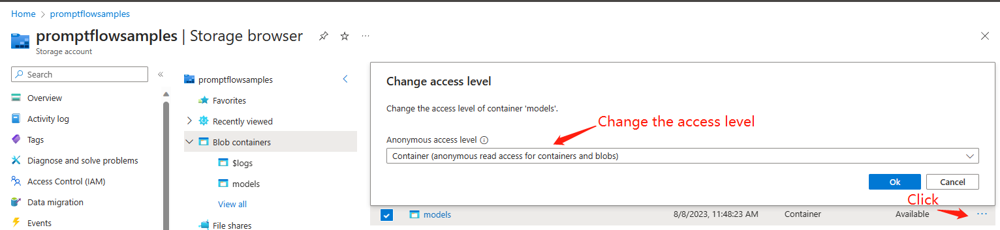
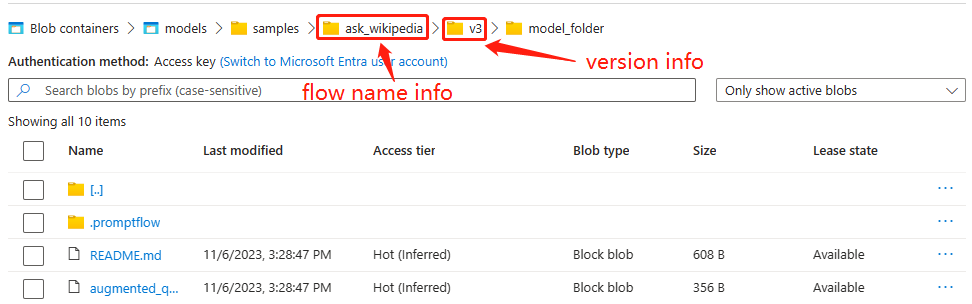
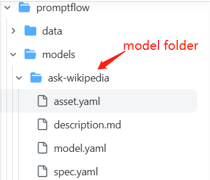
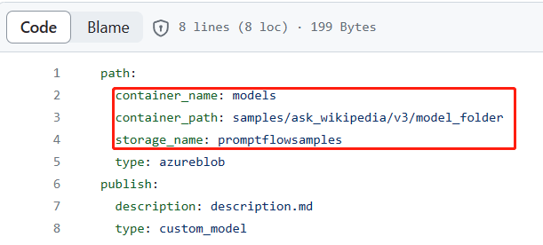
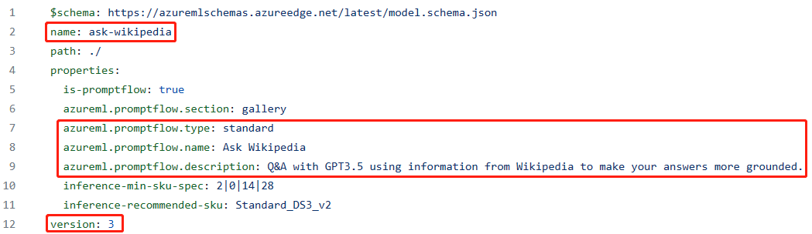
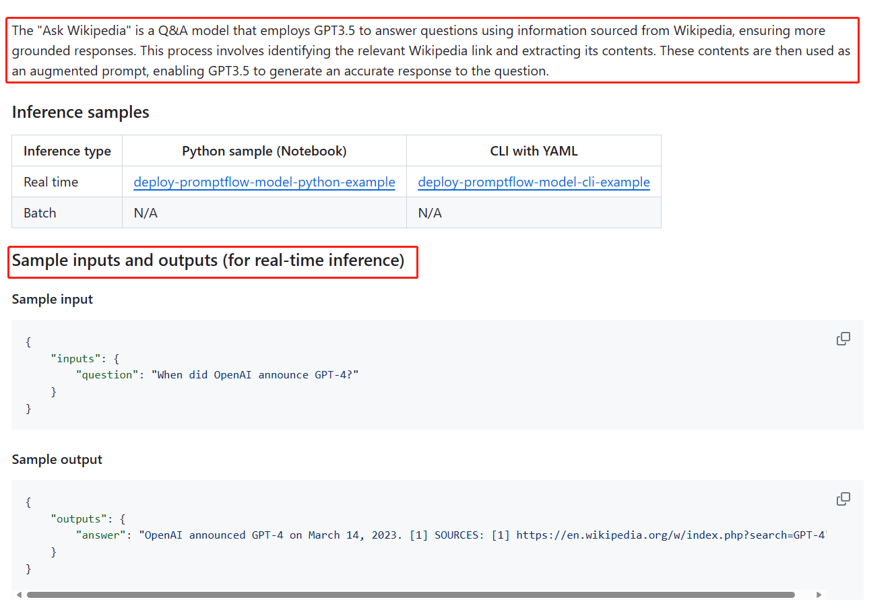
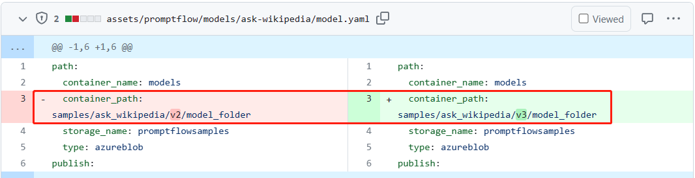
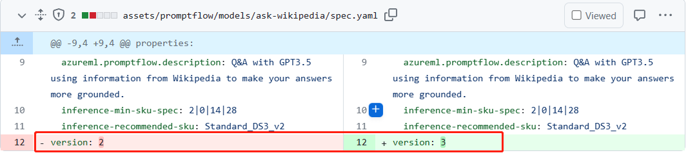
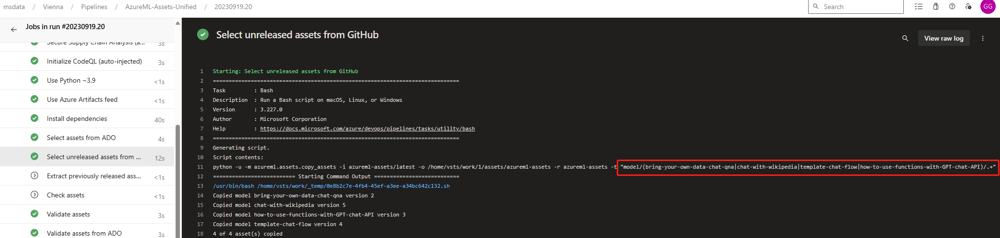

# Sharing Your Flows in Prompt Flow Gallery

:::{admonition} Experimental feature
This is an experimental feature, and may change at any time. Learn [more](../../how-to-guides/faq.md#stable-vs-experimental).
:::

In this document, we will walk you through the steps to share your flows in Prompt Flow Gallery. This needs to register your flow as a model with specific flow metadata in [azureml registry](https://ml.azure.com/registries/azureml/models?tid=72f988bf-86f1-41af-91ab-2d7cd011db47). Once completed, the model will be shown as a flow example in Prompt Flow Gallery on the workspace portal page.

## Passing CELA review of your flow

As your flow needs to be registered in system registry and shared globally, it requires a CELA pass review. Please contact PM: chenjieting@microsoft.com to go through the CELA review process.

## Preparing your flow for sharing

### Creating a `README.md` file for your flow

To make the flow easily understandable, include a `README.md` file in the flow folder explaining how to use it. The README might contain the following sections:
- The purpose of the flow.
- The tools utilized in the flow.
- The prerequisites required to execute the flow.
- The knowledge that can be acquired from this flow.
- Any additional information about your flow.

Refer to [this example README](https://github.com/Azure/promptflow/blob/main/examples/ask_wikipedia/README.md) with sections addressing points 1 to 4. A well-written README improves discoverability and encourages collaboration.

### Uploading your flow to an azure blob container

1. Prepare an azure blob container (e.g.: models) with 'anonymous read access for containser and blobs' level, e.g.:



2. Upload your flow to the azure blob container with version info in the path, e.g.:



> [!Note] When you want to update your flow after it has been published, please create a new version folder (e.g.: v2) to hold the updated flow.

### Preparing a PR to [azrueml-assets GitHub repo](https://github.com/Azure/azureml-assets/tree/main/assets/promptflow/models)

Please refer [this PR](https://github.com/Azure/azureml-assets/pull/1673/files) to update an existing prompflow model or add a new promptflow model

#### Add a new promptflow model:
1. Create a folder under [this path](https://github.com/Azure/azureml-assets/tree/main/assets/promptflow/models), and in this foler it will contain below 4 files:



2. Require changes to model.yaml:



```yml
container_name: the azure blob container name
container_path: the path to your flow
storage_name: the storage name
```
  
3. Require changes to spec.yaml:



```yml
name: provide a name for your promptflow model
azureml.promptflow.type: value can be `chat`, `standard` or `evaluate`. This property identifies the type of your flow, and UI will display flows with  `evaluate` value under the 'Evaluation' tab, and display flows with other values under the 'Flow' tab.
azureml.promptflow.name: the name of the flow which will be shown as the flow name in the Flow Gallery.
azureml.promptflow.description: the description of the flow which will be shown as flow description in the Flow Gallery.
version: the current version for your promptflow model.
```

4. Require change to description.md: need to change the model description, sample inputs and outputs part



5. Keep the asset.yaml as it is

6. When the PR is ready, please send it to [azureml-assets channel](https://teams.microsoft.com/l/channel/19%3aeb1edc86fc204c07bc767b7bd7c8b091%40thread.tacv2/System%2520Registry%2520Assets?groupId=9afd1b1e-79ba-4975-9d50-912f53962917&tenantId=72f988bf-86f1-41af-91ab-2d7cd011db47) to ask approve and merge

#### Update an existing promptflow model:

1. Change the container_path to include your new updated flow:


  
2. Change the model version by increasing it by 1:



1. When the PR is ready, please send it to [azureml-assets channel](https://teams.microsoft.com/l/channel/19%3aeb1edc86fc204c07bc767b7bd7c8b091%40thread.tacv2/System%2520Registry%2520Assets?groupId=9afd1b1e-79ba-4975-9d50-912f53962917&tenantId=72f988bf-86f1-41af-91ab-2d7cd011db47) to ask approve and merge

### Preparing a PR to [azrueml asset ADO repo](https://msdata.visualstudio.com/Vienna/_git/azureml-asset?version=GBmain)

> [!Note] This step is only required when there is new promptflow models added, please skip this step when you only update existing promptflow models.
- Please refer [this PR](https://msdata.visualstudio.com/Vienna/_git/azureml-asset/pullrequest/1201381?_a=files) to add the new added promptflow model names to azureml-dev.yml, azureml-staging.yml and azureml.yml.
- Send the PR to [azureml-assets channel](https://teams.microsoft.com/l/channel/19%3aeb1edc86fc204c07bc767b7bd7c8b091%40thread.tacv2/System%2520Registry%2520Assets?groupId=9afd1b1e-79ba-4975-9d50-912f53962917&tenantId=72f988bf-86f1-41af-91ab-2d7cd011db47) to ask approve and merge

## Registering your flow in AzureML Registry

### Trigger [AzureML-Assets-Unified](https://dev.azure.com/msdata/Vienna/_build?definitionId=25490&_a=summary) to only build the new added models and the updated models
1. Refer [this build](https://dev.azure.com/msdata/Vienna/_build/results?buildId=105308431&view=results)
2. Pay attention to the pattern variable for this pipeline, use it to only build models that you want to release:



### Trigger [AzureML-Assets-CD-Unified](https://dev.azure.com/msdata/Vienna/_release?definitionId=2346&view=mine&_a=releases) using the build from last step to release the updated models
1. Refer [this release](https://dev.azure.com/msdata/Vienna/_releaseProgress?_a=release-pipeline-progress&releaseId=1197564)
2. For the stage which needs ame approve, just ping your manager to get an approval.

## Adding your promptflow model names into the promptflow gallery exampels allowlist
> [!Note] This step is only required when there is new promptflow models added, please skip this step when you only update existing promptflow models.

Please contact PM: chenjieting@microsoft.com to help added your new promptflow model names into the promptflow gallery examples allow list.

## Locate the flow in the Flow Gallery

- Open a workspace.
- Click the `Create` button to open the Flow Gallery, and you can find the flow registered before:


1. `azureml.promptflow.type`: flows with  `evaluate` value will be displayed under the 'Evaluation' tab, while flows with other values will appear under the 'Flow' tab.
2. `azureml.promptflow.name`: shown as flow name in the flow card.
3. `azureml.promptflow.description`: shown as flow description in the flow card.
4. `readme.md`: click the `View detail` button will show the content in the `readme.md`.