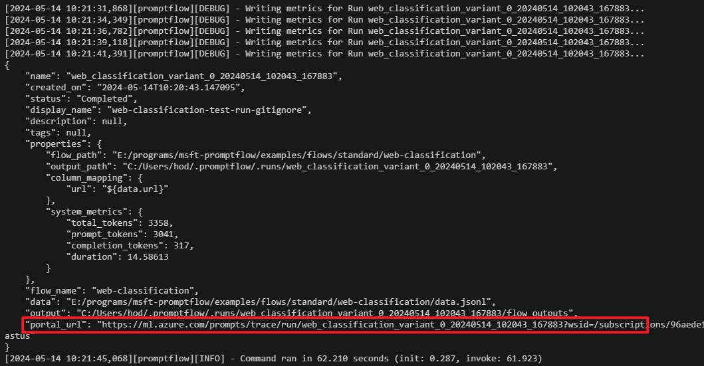
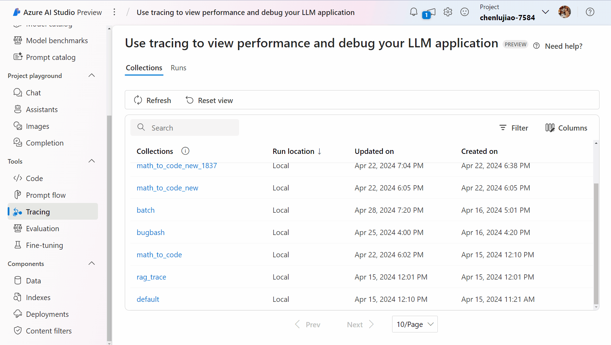

# Tracing from local to cloud

:::{admonition} Experimental feature
This is an experimental feature, and may change at any time. Learn [more](../../../how-to-guides/faq.md#stable-vs-experimental).
:::

Prompt flow [tracing feature](../../../how-to-guides/tracing/index.md) enables users to trace LLM calls, functions and even LLM frameworks. Besides, with `promptflow[azure]` installed, prompt flow can also log traces to an Azure ML workspace or Azure AI project, which makes it possible to share traces with your team members.

## Installing the package

```console
pip install "promptflow[azure]>=1.11.0"
```

## Set cloud destination

To log traces to cloud, first of all, you need an [Azure ML workspace](https://learn.microsoft.com/en-us/azure/machine-learning/concept-workspace?view=azureml-api-2) or [Azure AI project](https://learn.microsoft.com/en-us/azure/ai-studio/how-to/create-projects). Then, you can set the destination. Make sure you have logged in Azure CLI (`az login`, refer to [Azure CLI doc](https://learn.microsoft.com/en-us/cli/azure/) for more informations) before execute below CLI command:

```console
pf config set trace.destination=azureml://subscriptions/<subscription-id>/resourcegroups/<resource-group-name>/providers/Microsoft.MachineLearningServices/workspaces/<workspace-or-project-name>
```

Fill in with your own subscription ID, resource group name, workspace or project name, and all is ready now. You can make LLM calls, run LLM application or execute your flow with `pf flow test` or `pf run create`, you will see an Azure portal URL link in the console:



Click the link to view the traces in Azure portal, and feel free to share it with your team members.



## Storage

Traces in Azure ML workspace/AI project are persisted in an [Azure Cosmos DB](https://learn.microsoft.com/en-us/azure/cosmos-db/) associated with the workspace/project. It will be automatically setup the first time you execute CLI command `pf config set trace.destination` for a workspace/project.

## Set different destination

Prompt flow also supports to log traces to different workspace/project across different flows. To configure this, you need to set config to `azureml` via CLI command:

```console
pf config set trace.destination=azureml
```

Then, you need to prepare the configuration files pointing to different workspace/project; prompt flow currently recognizes [workspace configuration file](https://learn.microsoft.com/en-us/azure/machine-learning/how-to-configure-environment?view=azureml-api-2#local-and-dsvm-only-create-a-workspace-configuration-file) `config.json`, you can manually create one or download from Azure portal, this JSON file contains all required informations of a workspace/project:

```json
{
    "subscription_id": "<subscription-id>",
    "resource_group": "<resource-group-name>",
    "workspace_name": "<workspace-name>"
}
```

When `trace.destination` is set to `azureml`, prompt flow will search for a `config.json`, starts from `.azureml` under flow folder, then goes up to parent folder until it finds one. If no `config.json` is found, an error will be raised. It is recommended to place `config.json` under a folder named `.azureml` in your flow directory, which makes prompt flow to find it easily.

Below is an example folder structure:

```
flows
├── flow1
│   ├── .azureml
│   │   └── config.json  # workspace/project A
│   ├── flow.flex.yaml
│   ├── llm.py
│   ├── data.jsonl
│   ...
├── flow2
│   ├── .azureml
│   │   └── config.json  # workspace/project B
│   ├── flow.dag.yaml
│   ├── hello.py
│   ├── data.jsonl
└── ...
```

Then when execute `flow1`, traces will be logged to workspace/project A, while execute `flow2`, traces will be logged to workspace/project B.

## Disable logging to cloud

When you want to disable logging traces to cloud, you can switch back to local by below CLI command:

```console
pf config set trace.destination=local
```

`local` is the default value for `pf.trace.destination`, and no traces will be logged to Azure anymore with this value; note that traces will still be logged to local.

## Disable tracing feature

Use below CLI command to disable prompt flow tracing feature:

```console
pf config set trace.destination=none
```

Then no traces will be logged to neither local nor cloud.


```{toctree}
:maxdepth: 1
:hidden:

run_tracking
```