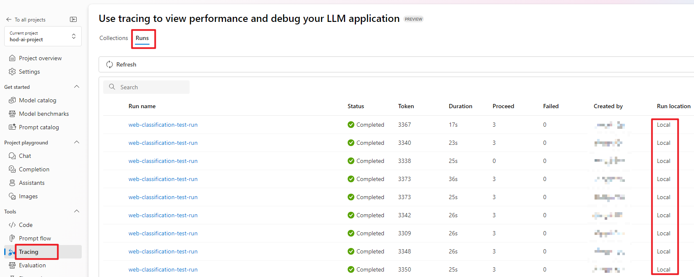

# Run tracking

:::{admonition} Experimental feature
This is an experimental feature, and may change at any time. Learn [more](../../../how-to-guides/faq.md#stable-vs-experimental).
:::

After you follow [tracing](./index.md) to set trace destination to cloud and successfully run a flow locally, there will be a run record in Azure ML workspace or Azure AI project. You can view the traces in cloud from Azure portal, and feel free to share it with your team members.

## Portal tracing run list

Except clicking the portal URL link in the console, you can also find the result in the tab `Tracing` -> `Runs`:

As a result, you will not be able to find these local-to-cloud runs in the tab `Prompt flow` -> `Runs`.

## View with pfazure commands

You can also view the details of the run record with most of the [pfazure run commands](../../../reference/pfazure-command-reference.md#pfazure-run).

## Compare with a cloud run

|  | Local-to-cloud run | Cloud run |
|---|---|---|
| Compute | Local | Automatic runtime/Compute instance |
| Run tracking timing | After the run is completed locally | Real-time on cloud |

## Next steps

Learn more about:
- [Run prompt flow in Azure AI](../run-promptflow-in-azure-ai.md)
- [CLI reference: pfazure](../../../reference/pfazure-command-reference.md)