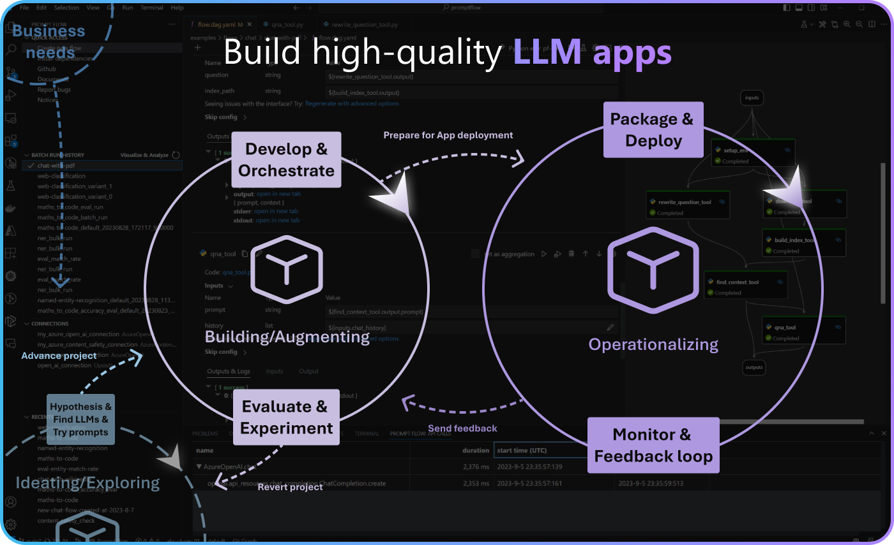

# Cloud

Prompt flow streamlines the process of developing AI applications based on LLM, easing prompt engineering, prototyping, evaluating, and fine-tuning for high-quality products.

Transitioning to production, however, typically requires a comprehensive **LLMOps** process, LLMOps is short for large language model operations. This can often be a complex task, demanding high availability and security, particularly vital for large-scale team collaboration and lifecycle management when deploying to production.

To assist in this journey, we've introduced **Azure AI**, a **cloud-based platform** tailored for executing LLMOps, focusing on boosting productivity for enterprises.

* Private data access and controls
* Collaborative development
* Automating iterative experimentation and CI/CD
* Deployment and optimization
* Safe and Responsible AI



## Transitioning from local to cloud (Azure AI)

In prompt flow, You can develop your flow locally and then seamlessly transition to Azure AI. Here are a few scenarios where this might be beneficial:
| Scenario | Benefit | How to|
| --- | --- |--- |
| Collaborative development | Azure AI provides a cloud-based platform for flow development and management, facilitating sharing and collaboration across multiple teams, organizations, and tenants.| [Submit a run using pfazure](./azureai/run-promptflow-in-azure-ai.md), based on the flow file in your code base.|
| Processing large amounts of data in parallel pipelines | Transitioning to Azure AI allows you to use your flow as a parallel component in a pipeline job, enabling you to process large amounts of data and integrate with existing pipelines. | Learn how to [Use flow in Azure ML pipeline job](./azureai/use-flow-in-azure-ml-pipeline.md).|
| Large-scale Deployment | Azure AI allows for seamless deployment and optimization when your flow is ready for production and requires high availability and security. | Use `pf flow build` to deploy your flow to [Azure App Service](./azureai/deploy-to-azure-appservice.md).|
| Data Security and  Responsible AI Practices | If your flow handling sensitive data or requiring ethical AI practices, Azure AI offers robust security, responsible AI services, and features for data storage, identity, and access control. | Follow the steps mentioned in the above scenarios.|


For more resources on Azure AI, visit the cloud documentation site: [Build AI solutions with prompt flow](https://learn.microsoft.com/en-us/azure/machine-learning/prompt-flow/get-started-prompt-flow?view=azureml-api-2).

```{toctree}
:caption: Flow
:maxdepth: 2
azureai/manage-flows
azureai/run-promptflow-in-azure-ai
azureai/create-run-with-compute-session
azureai/use-flow-in-azure-ml-pipeline
azureai/generate-test-data-cloud.md
```

```{toctree}
:caption: Deployment
:maxdepth: 2
azureai/deploy-to-azure-appservice
```
```{toctree}
:caption: FAQ
:maxdepth: 2
azureai/faq
azureai/consume-connections-from-azure-ai
azureai/runtime-change-log.md
```