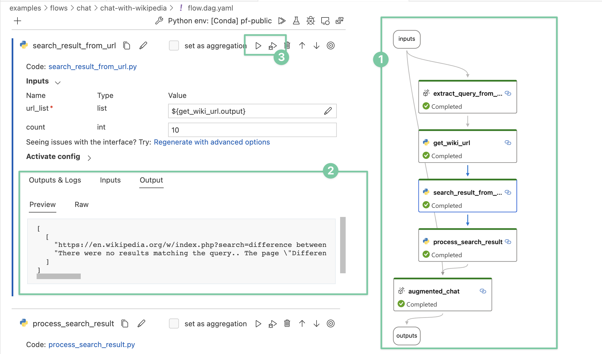

# Design principles

When we started this project, [LangChain](https://www.langchain.com/) already became popular esp. after the ChatGPT launch. One of the questions we’ve been asked is what’s the difference between prompt flow and LangChain. This article is to elucidate the reasons for building prompt flow and the deliberate design choices we have made. To put it succinctly, prompt flow is a suite of development tools for you to build LLM apps with a strong emphasis of quality through experimentations, not a framework - which LangChain is.

While LLM apps are mostly in exploration stage, Microsoft started in this area a bit earlier and we’ve had the opportunity to observe how developers are integrating LLMs into existing systems or build new applications. These invaluable insights have shaped the fundamental design principles of prompt flow. 

## 1. Expose the prompts vs. hiding them

The core essence of LLM applications lies in the prompts themselves, at least for today. When developing a reasonably complex LLM application, the majority of development work should be “tuning” the prompts (note the intentional use of the term "tuning," which we will delve into further later on). Any framework or tool trying to help in this space should focus on making prompt tuning easier and more straightforward. On the other hand, prompts are very volatile, it's unlikely to write a single prompt that can work across different models or even different version of same models. Building a successful LLM-based application, you have to understand every prompt introduced, so that you can tune it when necessary. LLM is simply not powerful or deterministic enough that you can use a prompt written by others like you use libraries in traditional programming languages.

In this context, any design that tries to provide a smart function or agent by encapsulating a few prompts in a library is unlikely to yield favorable results in real-world scenarios. And hiding prompts inside a library’s code base only makes it’s hard for people to improve or tailor the prompts to suit their specific needs.

Prompt flow, being positioned as a tool, refrains from wrapping any prompts within its core codebase. The only place you will see prompts are our sample flows, which are, of course, available for adoption and utilization. Every prompt should be authored and controlled by the developers themselves, rather than relying on us.

## 2. A new way of work

LLMs possess remarkable capabilities that enable developers to enhance their applications without delving deep into the intricacies of machine learning. In the meantime, LLMs make these apps more stochastic, which pose new challenges to application development. Merely asserting "no exception" or "result == x" in gated tests is no longer sufficient. Adopting a new methodology and employing new tools becomes imperative to ensure the quality of LLM applications — an entirely novel way of working is required.

At the center of this paradigm shift is evaluation, a term frequently used in machine learning space, refers to the process of assessing the performance and quality of a trained model. It involves measuring how well the model performs on a given task or dataset, which plays a pivotal role in understanding the model's strengths, weaknesses, and overall effectiveness. Evaluation metrics and techniques vary depending on the specific task and problem domain. Some common metrics include accuracy, precision and recall, you probably already familiar with. Now the LLM apps share similarities with machine learning models, they requires an evaluation-centric approach integrated into the development workflow, with a robust set of metrics and evaluation forming the foundation for ensuring the quality of LLM applications.

Prompt flow offers a range of tools to streamline the new way of work:

* Develop your evaluation program as Evaluation flow to calculate metrics for your app/flow, learn from our sample evaluation flows.
* Iterate on your application flow and run evaluation flows via the SDK/CLI, allowing you to compare metrics and choose the optimal candidate for release. These iterations include trying different prompts, different LLM parameters like temperature etc. - this is referred as “tuning” process earlier, or sometime referred as experimentation.
* Integrate the evaluation into your CI/CD pipeline, aligning the assertions in your gated tests with the selected metrics.

Prompt flow introduces two conceptual components to facilitate this workflow:

* Evaluation flow: a flow type that indicates this flow is not for deploy or integrate into your app, it’s for evaluating an app/flow performance.
* Run: every time you run your flow with data, or run an evaluation on the output of a flow, a Run object is created to manage the history and allow for comparison and additional analysis.

While new concepts introduce additional cognitive load, we firmly believe they hold greater importance compared to abstracting different LLM APIs or vector database APIs.

## 3. Optimize for “visibility”

There are quite some interesting application patterns emerging because of LLMs, like Retrieval Augmented Generation (RAG), ReAct and more. Though how LLMs work may remain enigmatic to many developers, how LLM apps work is not - they essentially involve a series of calls to external services such as LLMs, databases, and search engines, all glued together. Architecturally there isn’t much new, patterns like RAG and ReAct are both straightforward to implement once a developer understands what they are - plain Python programs with API calls to external services can totally serve the purpose effectively.

By observing many internal use cases, we learned that deeper insight into the detail of the execution is critical. Establishing a systematic method for tracking interactions with external systems is one of design priority. Consequently, We adopted an unconventional approach - prompt flow has a YAML file describing how function calls (we call them [Tools](../concepts/concept-tools.md)) are executed and connected into a Directed Acyclic Graph (DAG). 

This approach offers several key benefits, primarily centered around **enhanced visibility**:
1) During development, your flow can be visualized in an intelligible manner, enabling clear identification of any faulty components. As a byproduct, you obtain an architecturally descriptive diagram that can be shared with others.
2) Each node in the flow has it’s internal detail visualized in a consistent way.
3) Single nodes can be individually run or debugged without the need to rerun previous nodes.
</b>

The emphasis on visibility in prompt flow's design helps developers to gain a comprehensive understanding of the intricate details of their applications. This, in turn, empowers developers to engage in effective troubleshooting and optimization.

Despite there're some control flow features like "activate-when" to serve the needs of branches/switch-case, we do not intend to make Flow itself Turing-complete. If you want to develop an agent which is fully dynamic and guided by LLM, leveraging [Semantic Kernel](https://github.com/microsoft/semantic-kernel) together with prompt flow would be a favorable option.
