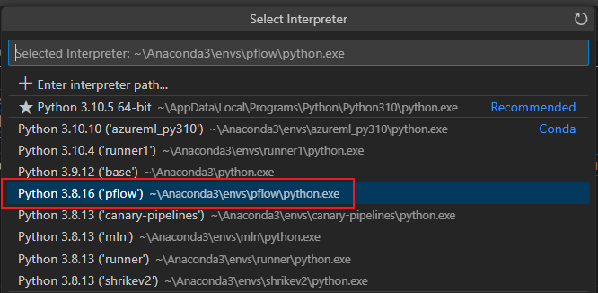
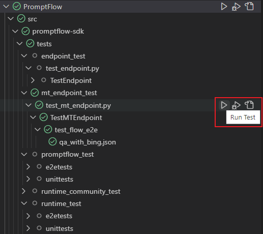
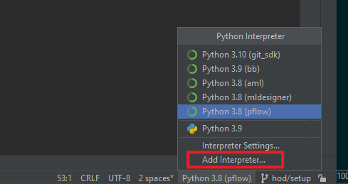

# Dev Steup

## Set up process

- First create a new [conda](https://conda.io/projects/conda/en/latest/user-guide/getting-started.html) environment. Please specify python version as 3.9.
  `conda create -n <envname> python=3.9`.
- Activate the env you created.
- Set environment variable `PYTHONPATH` in your new conda environment.
  `conda env config vars set PYTHONPATH=<path-to-src\promptflow>`.
  Once you have set the environment variable, you have to reactivate your environment.
  `conda activate <envname>`.
- In root folder, run `python scripts/building/dev_setup.py --promptflow-extra-deps azure` to install the package and dependencies.

## How to run tests

### Set up your secrets

`dev-connections.json.example` is a template about connections provided in `src/promptflow`. You can follow these steps to refer to this template to configure your connection for the test cases:
1. `cd ./src/promptflow`
2. Run the command `cp dev-connections.json.example connections.json`;
3. Replace the values in the json file with your connection info;
4. Set the environment `PROMPTFLOW_CONNECTIONS='connections.json'`;

After above setup process is finished. You can use `pytest` command to run test, for example in root folder you can:

### Run tests via command

- Run all tests under a folder: `pytest src/promptflow/tests -v`
- Run a single test: ` pytest src/promptflow/tests/promptflow_test/e2etests/test_executor.py::TestExecutor::test_executor_basic_flow -v`

### Run tests in VSCode

1. Set up your python interperter

- Open the Command Palette (Ctrl+Shift+P) and select `Python: Select Interpreter`.

- Select existing conda env which you created previously.

2. Set up your test framework and directory

- Open the Command Palette (Ctrl+Shift+P) and select `Python: Configure Tests`.

- Select `pytest` as test framework.

- Select `Root directory` as test directory.

3. Click the `Run Test` button on the left

### Run tests in pycharm

1. Set up your pycharm python interpreter

2. Select existing conda env which you created previously

3. Run test, right-click the test name to run, or click the green arrow button on the left.

## How to write tests

- Put all test data/configs under `src/promptflow/tests/test_configs`.
- Write unit tests:
  - Flow run in local: `src/promptflow/tests/sdk_cli_test/unittest/`
  - Flow run in azure: `src/promptflow/tests/sdk_cli_azure_test/unittest/`
- Write e2e tests:
  - Flow run in local: `src/promptflow/tests/sdk_cli_test/e2etests/`
  - Flow run in azure: `src/promptflow/tests/sdk_cli_azure_test/e2etests/`
- Test file name and the test case name all start with `test_`.
- A basic test example, see [test_connection.py](../src/promptflow/tests/sdk_cli_test/e2etests/test_connection.py).

### Test structure

Currently all tests are under `src/promptflow/tests/` folder:

- tests/
  - promptflow/
    - sdk_cli_test/
      - e2etests/
      - unittests/
    - sdk_cli_azure_test/
      - e2etests/
      - unittests/
  - test_configs/
    - connections/
    - datas/
    - flows/
    - runs/
    - wrong_flows/
    - wrong_tools/

When you want to add tests for a new feature, you can add new test file let's say a e2e test file `test_construction.py`
under `tests/promptflow/**/e2etests/`.

Once the project gets more complicated or anytime you find it necessary to add new test folder and test configs for
a specific feature, feel free to split the `promptflow` to more folders, for example:

- tests/
  - <Test folder name>/
    - e2etests/
      - test_xxx.py
    - unittests/
      - test_xxx.py
  - test_configs/
    - <Data or config folder name>/
