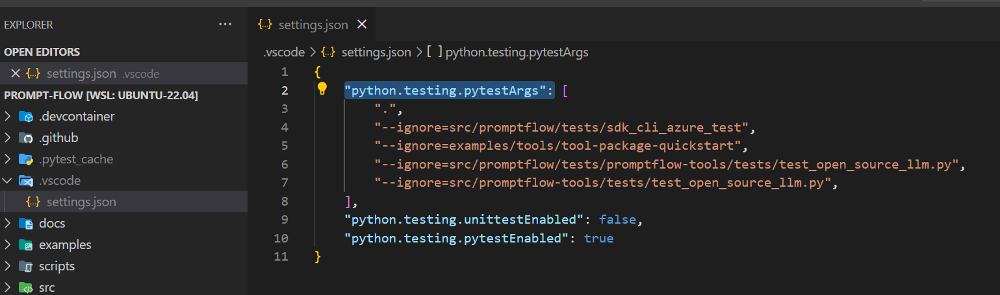

# Dev Setup

## Set up process

- First create a new [conda](https://conda.io/projects/conda/en/latest/user-guide/getting-started.html) environment. Please specify python version as 3.9.
  `conda create -n <env_name> python=3.9`.
- Activate the env you created.
- In root folder, run `python scripts/dev-setup/main.py` to install the packages and dependencies; if you are using Visual Studio Code, it is recommended to add `--vscode` (which is `python scripts/dev-setup/main.py --vscode`) to enable VS Code to recognize the packages.

## How to run tests

### Set up your secrets

`dev-connections.json.example` is a template about connections provided in `src/promptflow`. You can follow these steps to refer to this template to configure your connection for the test cases:
1. `cd ./src/promptflow`
2. Run the command `cp dev-connections.json.example connections.json`;
3. Replace the values in the json file with your connection info;
4. Set the environment `PROMPTFLOW_CONNECTIONS='connections.json'`;

After above setup process is finished. You can use `pytest` command to run test, for example in root folder you can:

### Run tests via command

- Run all tests under a folder: `pytest src/promptflow/tests -v`
- Run a single test: ` pytest src/promptflow/tests/promptflow_test/e2etests/test_executor.py::TestExecutor::test_executor_basic_flow -v`

### Run tests in VSCode

1. Set up your python interperter

- Open the Command Palette (Ctrl+Shift+P) and select `Python: Select Interpreter`.

- Select existing conda env which you created previously.

2. Set up your test framework and directory

- Open the Command Palette (Ctrl+Shift+P) and select `Python: Configure Tests`.

- Select `pytest` as test framework.

- Select `Root directory` as test directory.

3. Exclude specific test folders.

You can exclude specific test folders if you don't have some extra dependency to avoid VS Code's test discovery fail.
For example, if you don't have azure dependency, you can exclude `sdk_cli_azure_test`.
Open `.vscode/settings.json`, write `"--ignore=src/promptflow/tests/sdk_cli_azure_test"` to `"python.testing.pytestArgs"`.

4. Click the `Run Test` button on the left

### Run tests in pycharm

1. Set up your pycharm python interpreter

2. Select existing conda env which you created previously

3. Run test, right-click the test name to run, or click the green arrow button on the left.

## How to write docstring

A clear and consistent API documentation is crucial for the usability and maintainability of our codebase. Please refer to [API Documentation Guidelines](./documentation_guidelines.md) to learn how to write docstring when developing the project.

## How to write tests

- Put all test data/configs under `src/promptflow/tests/test_configs`.
- Write unit tests:
  - Flow run: `src/promptflow/tests/sdk_cli_test/unittest/`
  - Flow run in azure: `src/promptflow/tests/sdk_cli_azure_test/unittest/`
- Write e2e tests:
  - Flow run: `src/promptflow/tests/sdk_cli_test/e2etests/`
  - Flow run in azure: `src/promptflow/tests/sdk_cli_azure_test/e2etests/`
- Test file name and the test case name all start with `test_`.
- A basic test example, see [test_connection.py](../../src/promptflow/tests/sdk_cli_test/e2etests/test_connection.py).

### Test structure

In the future, tests will under corresponding source folder, and test_configs are shared among different test folders:

- src/promptflow/
  - test_configs/
    - connections/
    - datas/
    - flows/
    - runs/
    - wrong_flows/
    - wrong_tools/
- src/promptflow-core/
  - tests/
    - core/ # Basic test with promptflow-core installed.
      - e2etests/
      - unittests/
    - azureml-serving/  # Test with promptflow-core[azureml-serving] installed.
      - e2etests/
      - unittests/
    - executor-service/ # Test with promptflow-core[executor-service] installed.
      - e2etests/
      - unittests/
- src/promptflow-devkit/
  - tests/
    - executable/ # Test with promptflow-devkit[executable] installed.
- src/promptflow-azure/
  - tests/  # promptflow-azure doesn't have extra-requires, so all tests are under the test folder.
    - e2etests/
    - unittests/

Principal #1: Put the tests in the same folder as the code they are testing, to ensure code can work within minor environment requirements.

For example, you write code requires basic `promptflow-core` package, then put the tests in `promptflow-core/tests/core`, DO NOT put it in the promptflow-devkit or promptflow-azure.

Principal #2: Setup separate workflow for tests with extra-requires.

For example, you want to test `promptflow-core[azureml-serving]`, then add a new test folder `promptflow-core/tests/azureml-serving` to test the azure related code,
and add new test steps and environment setup step into `promptflow-core-test.yml` for that folder. DO NOT update the environment of `promptflow-core` basic test directly.

### Record and replay tests

Please refer to [Replay End-to-End Tests](./replay-e2e-test.md) to learn how to record and replay tests.
