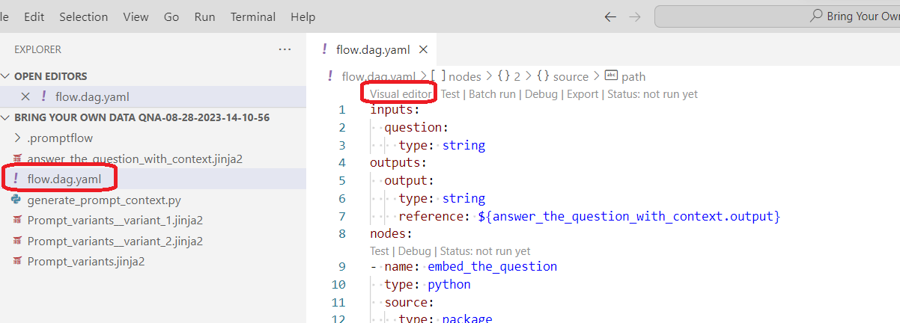
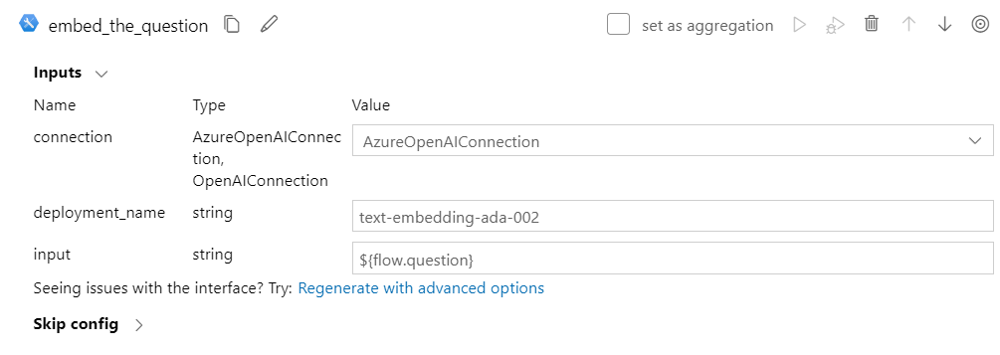
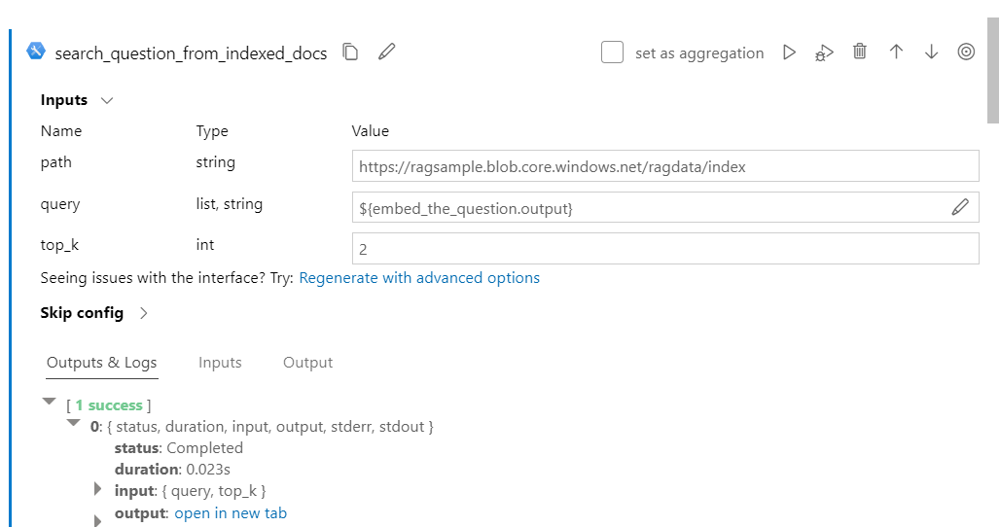
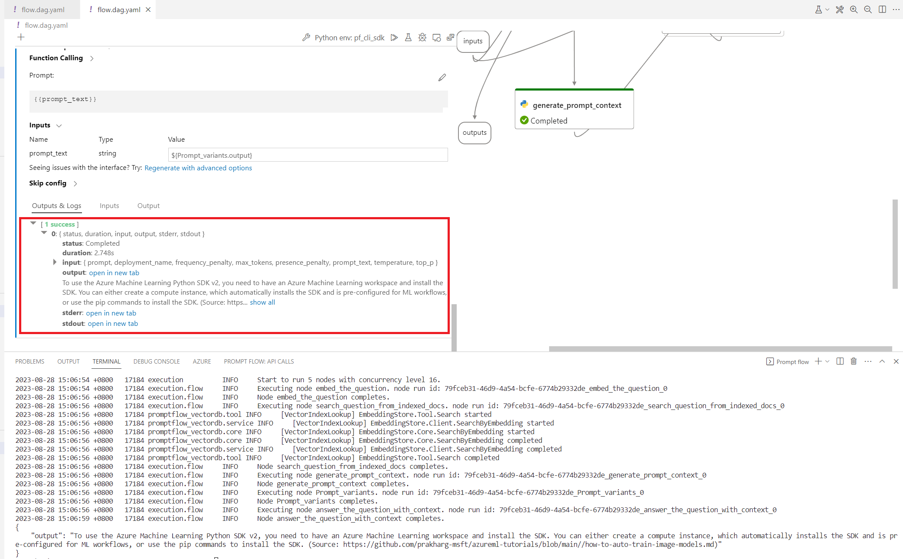

# From cloud to local - Bring Your Own Data QnA

> [!NOTE]
> when legacy tools switching to code first mode, "not found" error may occur, please refer to [Vector DB/Faiss Index/Vector Index Lookup tool rename reminder](./Tool_Reminder.md)

## Prerequisites

1. Install promptflow SDK: 
   ``` bash
      pip install promptflow promptflow-tool
   ```

   More detail you can refer to [promptflow local qucik start](https://github.com/Azure/promptflow/blob/main/docs/community/local/quick-start.md)

2. Install promptflow-vectordb SDK:
   ``` bash
      pip install promptflow-vectordb
   ```

3. (Optional) Install promptflow extension in VS Code


## Download your flow files to local

For example, there is already a flow "Bring Your Own Data Qna" in the workspace, which use the **Vector index lookup** tool to search question from the indexed docs. 

The index docs is stroed in the workspace binding storage blog.

   

Go to the flow authoring, click **Download** icon in the file explorer. It will download the flow zip package to local, such as "Bring Your Own Data Qna.zip" file which contains the flow files.

   

## Open the flow folder in VS Code

Unzip the "Bring Your Own Data Qna.zip" locally, and open the "Bring Your Own Data Qna" folder in VS Code desktop. 

> [!TIPS]
> If you don't depend on the prompt flow extension in VS Code, you can open the folder in any IDE you like.

## Create a local connection

To use the vector index lookup tool locally, you need to create the same connection to the vector index service as you did in the cloud.

  

Open the "flow.dag.yaml" file, search the "connections" section, you can find the connextion configuration you used in your Azure Machine Learning workspace.

  
Create a local connection same as the cloud one. 

::::{tab-set}

:::{tab-item} CLI :sync: CLI

Create a connection yaml file "AzureOpenAIConnection.yaml", then run the connection create CLI command in the terminal:
``` yaml
   $schema: https://azuremlschemas.azureedge.net/promptflow/latest/AzureOpenAIConnection.schema.json
   name: azure_open_ai_connection
   type: azure_open_ai  
   api_key: "<aoai-api-key>" #your key
   api_base: "aoai-api-endpoint"
   api_type: "azure"
   api_version: "2023-03-15-preview"
```

``` bash
   pf connection create -f AzureOpenAIConnection.yaml
```
:::

:::{tab-item} VS Code Extension :sync: VS Code Extension

If you have the **promptflow extension** installed in VS Code desktop, you can create the connection in the extension UI.

Click the promptflow extension icon to go to the promptflow management central place. Click the **+** icon in the connection explorer, and select the connection type "AzureOpenAI"

   

:::

::::


## Check and modify the flow files

::::{tab-set}

:::{tab-item} CLI :sync: CLI

:::

:::{tab-item} VS Code Extension :sync: VS Code Extension

1. Open "flow.dag.yaml" and click "Visual editor"

   

2. Jump to the "embed_the_question" node, make sure the connection is the local connection you have created, and double check the deployment_name which is the model you use here for the embedding.
    
    

 
3. Jump to the "search_question_from_indexed_docs" node, which consume the Vector Index Lookup Tool in this flow.

   

4. fill the "answer_the_question_with_context" node

  

## Test the flow

Scroll up to the top of the flow, fill in the "Inputs" value of this single run for testing, e.g.: "How to use SDK V2?", then run the flows.

Then click the "Run" button in the top right corner, and select "Run locally" in the drop down list.

   

:::

::::