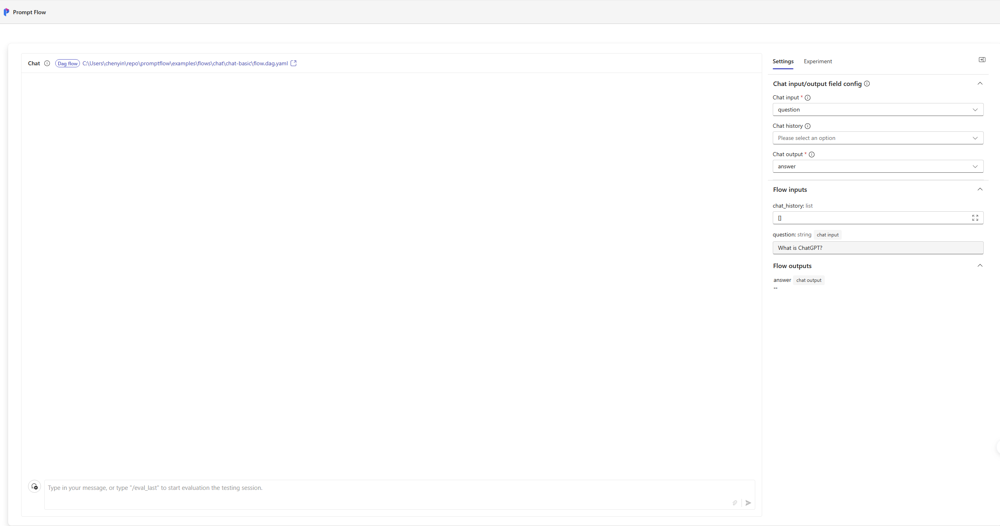
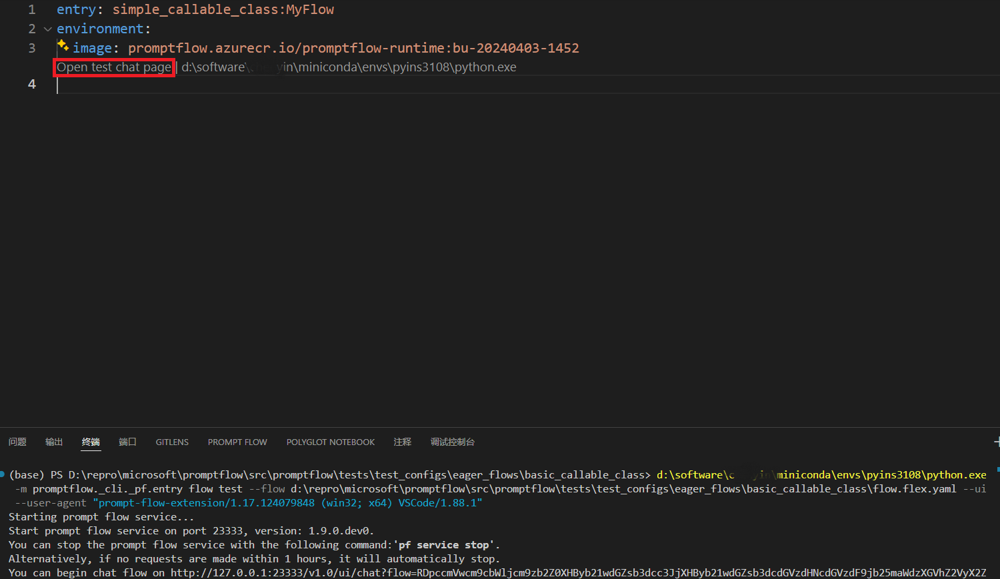

# Chat with a flow

:::{admonition} Experimental feature
This is an experimental feature, and may change at any time. Learn [more](../faq.md#stable-vs-experimental).
:::

Prompt flow provides the chat window feature to facilitate an interactive chat experience within a local environment. 
You can engage in conversation with the flow and view its responses directly within the chat window.

## Initiating a chat window
There are two methods to open a chat window: executing the prompt flow CLI command or clicking the 
`Open test chat page` button when viewing a flow YAML file in the Prompt flow VS Code extension.

::::{tab-set}
:::{tab-item} CLI
:sync: CLI

The following CLI command allows you to trigger a chat window.
```shell
pf flow test --flow . --ui
```
Running the above command will yield the following example output:
```
Starting prompt flow service...
...
You can begin chat flow on http://127.0.0.1:**/v1.0/ui/chat?flow=***
```
The browser page corresponding to the chat URL will automatically open and direct the user to a chat page 
corresponding to the passed flow:

:::

:::{tab-item} VS Code Extension
:sync: VSC

Click the `Open test chat page` button while viewing a flow YAML file in the Prompt flow VS Code extension, and you 
will be directed to the chat page.

:::
::::