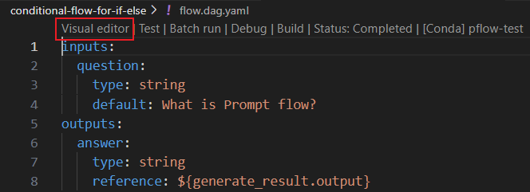
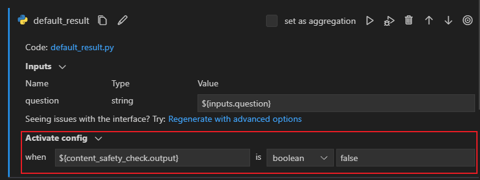

# Create a conditional flow using activate config

:::{admonition} Experimental feature
This is an experimental feature, and may change at any time. Learn [more](faq.md#stable-vs-experimental).
:::

In Prompt flow, we support control logic by activate config, like if-else, switch. Activate config enables conditional execution of nodes within your flow, ensuring that specific actions are taken only when the specified conditions are met.

This guide will help you learn how to create a conditional flow using activate config.

## Prerequisites

Please ensure that your promptflow version is greater than `0.1.0b5`.

## Usage Description

Each node in your flow can have an associated activate config, specifying when it should execute and when it should bypass. If a node has activate config, it will only be executed when the activate condition is met. The configuration consists of two essential components:
- `activate.when`: The condition that triggers the execution of the node. It can be based on the outputs of a previous node, or the inputs of the flow.
- `activate.is`: The condition's value, which can be a constant value of string, boolean, integer, double.

You can manually change the flow.dag.yaml in the flow folder or use the visual editor in VS Code Extension to add activate config to nodes in the flow.

::::{tab-set}
:::{tab-item} Yaml
:sync: Yaml

You can add activate config in the node section of flow yaml.
```yaml
activate:
  when: ${node.output}
  is: true
```

:::

:::{tab-item} VS Code Extension
:sync: VS Code Extension

- Click `Visual editor` in the flow.dag.yaml to enter the flow interface.


- Click on the `Activation config` section in the node you want to add and fill in the values for "when" and "is".


:::

::::

## Example flow

Let's illustrate how to use activate config with practical examples.

- If-Else scenario: Learn how to create a conditional flow for if-else scenarios. [View Example](https://github.com/microsoft/promptflow/tree/main/examples/flows/standard/conditional-flow-for-if-else)
- Switch scenario: Explore conditional flow for switch scenarios. [View Example]()


## Troubleshoot

If you encounter any issues or errors while using `activate config` in Prompt flow, this section provides guidance and solutions for common error codes. Refer to the following error codes and their respective solutions to quickly and efficiently resolve issues during your flow development.

1. ReferenceNodeBypassed
- Error message:
- Error description:
- Solution:
2. OutputReferenceBypassed
- Error message:
- Error description:
- Solution:
3. OutputReferenceNotExist
- Error message:
- Error description:
- Solution:

These error codes and their respective solutions should help you troubleshoot common issues related to `activate config` and ensure the smooth execution of your conditional flow. If you continue to experience difficulties, please consult our comprehensive documentation or reach out to our support team for assistance.

## Next steps

Learn more about:
- [Tune prompts with variants](./tune-prompts-with-variants.md)
- [Deploy a flow](./deploy-a-flow/index.md)