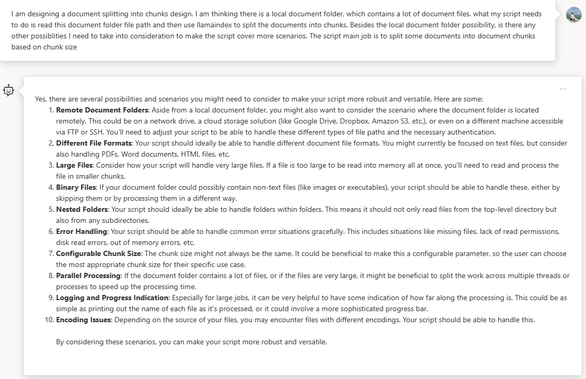

# How to construct test data based on documents


## Data preprocess
### Local
#### Prerequisites
Enter `test_data_gen_local` folder, run below command to install required packages.
```bash
pip install -r requirements.txt
```

#### Get started

### Cloud
#### Prerequisites
Enter `test_data_gen_pipeline` folder, run below command to install required packages.
```bash
pip install -r requirements.txt
```

#### Get started
- Fill in the config values in `config.in`

## Appendix
Run doc_split script.
Interface:
- documents folder path
- output file path
- chunk_size
- ?? do we need to provide test size? How to combine with the flow? How to instruct users to set their own chunk size?

?? what if the documents folder is in azure blob folder? Or any other possibility?



In this sample script, the `SimpleDirectoryReader` of llamaindex is used to split the documents into smaller granularity. For more supported file types, please check [here](https://docs.llamaindex.ai/en/stable/module_guides/loading/simpledirectoryreader.html).
more file readers: ??


Locally run doc_split script. Then upload the generated doc nodes jsonl file to portal as a data asset.
-> In this way, we should at least consider how user can do both process in local and cloud.
local: read folder from remote site, then upload to cloud.
portal: process and split directly in portal.

## Build your test data generation flow
Interface:
- question type
- test distribution
- document chunk
- llm connection


## Deal with big data
Use pipeline to run test data gen. Run sample script to submit your pipeline.

## Use generated test data in flow/experiment
For local extension, we will provide a data.jsonl file.
For portal, the generated test data needs to be registered as a data asset in order to be used in experiment.
### Local story in flow
### Protal story in flow
### Local story in experiment
### Protal story in experiment