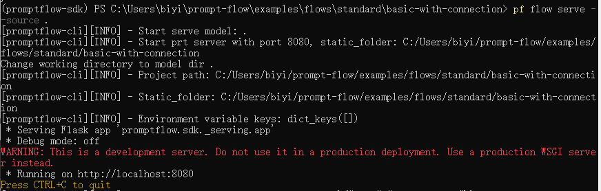
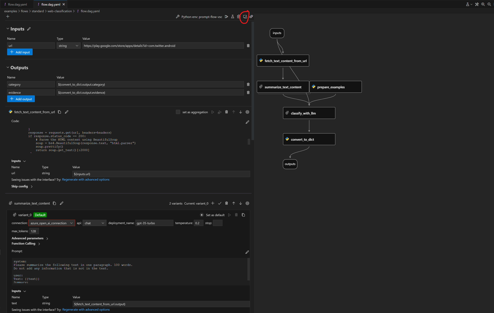
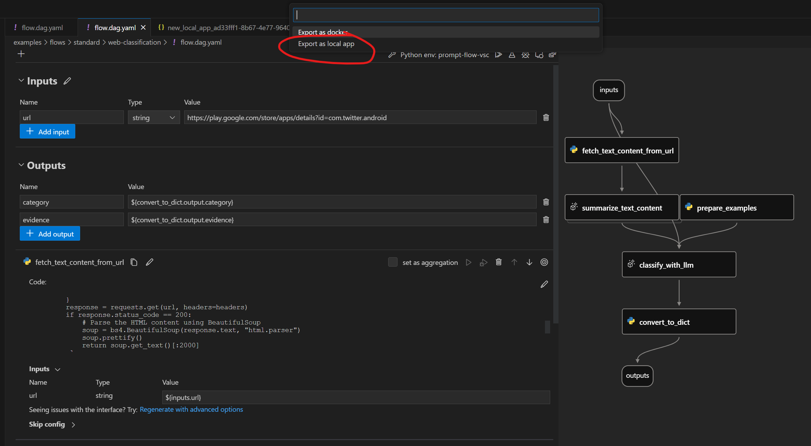

# Deploy a flow using development server
:::{admonition} Experimental feature
This is an experimental feature, and may change at any time. Learn [more](https://aka.ms/azuremlexperimental).
:::

Once you have created and thoroughly tested a flow, you can use it as an HTTP endpoint.

::::{tab-set}
:::{tab-item} CLI
:sync: CLI
We are going to use the [web-classification](https://github.com/microsoft/promptflow/tree/main/examples/flows/standard/web-classification/) as
an example to show how to deploy a flow.

Please ensure you have [create the connection](../manage-connections.md#create-a-connection) required by flow, if not, you could
refer to [Setup connection for web-classifiction](https://github.com/microsoft/promptflow/tree/main/examples/flows/standard/web-classification#1-setup-connection).


The following CLI commands allows you serve a flow folder as an endpoint. By running this command, a [flask](https://flask.palletsprojects.com/en/) app will start in the environment where command is executed, please ensure all prerequisites required by flow have been installed.
```bash
# Serve the flow at localhost:8080
pf flow serve --source <path-to-your-flow-folder> --port 8080 --host localhost
```

The expected result is as follows if the flow served successfully, and the process will keep alive until it be killed manually.


:::
:::{tab-item} VS Code Extension
:sync: VSC



:::
::::

## Test endpoint
::::{tab-set}
:::{tab-item} Bash
You could open another terminal to test the endpoint with the following command:
```bash
curl http://localhost:8080/score --data '{"url":"https://play.google.com/store/apps/details?id=com.twitter.android"}' -X POST  -H "Content-Type: application/json"
```
:::
:::{tab-item} PowerShell
You could open another terminal to test the endpoint with the following command:
```powershell
Invoke-WebRequest -URI http://localhost:8080/score -Body '{"url":"https://play.google.com/store/apps/details?id=com.twitter.android"}' -Method POST  -ContentType "application/json"
```
:::
:::{tab-item} Test Page

:::
::::

## Next steps
- Try the example [here](https://github.com/microsoft/promptflow/tree/main/examples/flows/standard/web-classification/).
- See how to [deploy a flow using docker](deploy-using-docker.md).
- See how to [deploy a flow using kubernetes](deploy-using-kubernetes.md).
