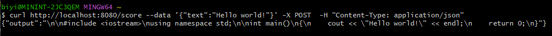
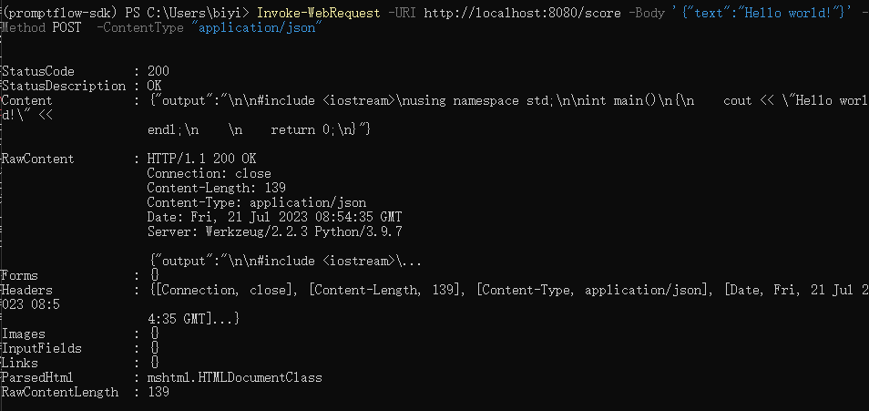

# Deploy and export a flow

:::{admonition} Experimental feature
This is an experimental feature, and may change at any time. Learn [more](https://aka.ms/azuremlexperimental).
:::

## Serve a flow
After build a flow and test it properly, the flow can be served as a http endpoint.

::::{tab-set}
:::{tab-item} CLI
:sync: CLI
We are going to use the [basic-with-connection flow](https://github.com/microsoft/promptflow/tree/main/examples/flows/standard/basic-with-connection) as
an example to show how to deploy a flow.

Please ensure you have [create the connection](manage-connections.md#create-a-connection) required by flow, if not, you could simply create it by running the follow command.
```bash
pf connection create -f .\custom.yml --set configs.api_base=https://<to-be-replaced>.openai.azure.com/ secrets.api_key=<to-be-replaced>
```

The following CLI commands allows you serve a flow folder as an endpoint. By running this command, a [flask](https://flask.palletsprojects.com/en/) app will start in the environment where command is executed, please ensure all prerequisites required by flow have been installed.
```bash
# Serve the flow at localhost:8080
pf flow serve --source <path-to-your-flow-folder> --port 8080 --host localhost
```

The expected result is as follows if the flow served successfully, and the process will keep alive until it be killed manually.


:::
:::{tab-item} VS Code Extension
:sync: VSC


:::
::::

### Test endpoint
::::{tab-set}
:::{tab-item} Bash
You could open another terminal to test the endpoint with the following command:
```bash
curl http://localhost:8080/score --data '{"text":"Hello world!"}' -X POST  -H "Content-Type: application/json"
```
Test result:


:::
:::{tab-item} PowerShell
You could open another terminal to test the endpoint with the following command:
```powershell
Invoke-WebRequest -URI http://localhost:8080/score -Body '{"text":"Hello world!"}' -Method POST  -ContentType "application/json"
```
Test result:


:::
:::{tab-item} VS Code Extension

:::
::::

## Export a flow

Besides starting the service directly, a flow can also be exported as a sharable folder with a Dockerfile and its dependencies.

::::{tab-set}
:::{tab-item} CLI
:sync: CLI
```bash
pf flow export --source <path-to-your-flow-folder> --output <your-output-dir> --format docker
```
:::
:::{tab-item} VS Code Extension
:sync: VSC

:::
::::

Exported Dockerfile & its dependencies are located in the same folder. The structure is as below:
- flow: the folder contains all the flow files
  - ...
- connections: the folder contains yaml files to create all related connections
  - ...
- Dockerfile: the dockerfile to build the image
- start.sh: the script used in `CMD` of `Dockerfile` to start the service
- deploy.sh & deploy.ps1: the script to deploy the docker image to Azure App Service
- settings.json: a json file to store the settings of the docker image
- README.md: the readme file to describe how to use the dockerfile

Note that all dependent connections must be created before exporting as docker.

More details about how to use the exported docker can be seen in `<your-output-dir>/README.md`. 

## Deploy a flow

### Deploy with Docker

#### Build Docker image

Like other Dockerfile, you need to build the image first. You can tag the image with any name you want. In this example, we use `promptflow-serve`.

After cd to the output directory, run the command below:

```bash
docker build . -t promptflow-serve
```

#### Run Docker image

Run the docker image will start a service to serve the flow inside the container. Service will listen on port 8080.
You can map the port to any port on the host machine as you want.

If the service involves connections, all related connections will be exported as yaml files and recreated in containers.

Secrets in connections won't be exported directly. Instead, we will export them as a reference to environment variables:

```yaml
configs:
  AZURE_OPENAI_API_BASE: xxx
  CHAT_DEPLOYMENT_NAME: xxx
module: promptflow.connections
name: custom_connection
secrets:
  AZURE_OPENAI_API_KEY: ${env:<connection-name>_<secret-key>}
type: custom
```

You'll need to set up the environment variables in the container to make the connections work.

#### Run with `docker run`

You can run the docker image directly set via below commands:

```bash
docker run -p 8080:8080 -e <connection-name>_<secret-key>=<secret-value> promptflow-serve
```

As explain in previously, secrets in connections will be passed to container via environment variables.
You can set up multiple environment variables for multiple connection secrets:

```bash
docker run -p 8080:8080 -e <connection-name-1>_<secret-key>=<secret-value-1> -e <connection-name-2>_<secret-key>=<secret-value-2> promptflow-serve
```

#### Test the endpoint
After start the service, you can use curl to test it:

```bash
curl http://localhost:8080/score --data '{"text":"Hello world!"}' -X POST  -H "Content-Type: application/json"
```

### Deploy with Azure App Service

[Azure App Service](https://learn.microsoft.com/azure/app-service/) is an HTTP-based service for hosting web applications, REST APIs, and mobile back ends.
Promptflow has provided scripts (`deploy.sh` for bash and `deploy.ps1` for powershell) to help deploy the docker image to Azure App Service.

Example command to use bash script:
```bash
bash deploy.sh -i <image_tag> -r "promptflow.azurecr.io" -g <resource_group>
```

Example command to use powershell script:
```powershell
.\deploy.ps1 -i <image_tag> -r "promptflow.azurecr.io" -g <resource_group>
```

See the full parameters by `bash deploy.sh -h` or `.\deploy.ps1 -h`.

After the app created, you will need to go to https://ms.portal.azure.com/ find the app and set up the environment variables
at (Settings>Configuration) or (Settings>Environment variables), then restart the app.

Tips:
- Reach deployment logs at (Deployment>Deployment Central) and app logs at (Monitoring>Log stream).
- Reach advanced deployment tools at https://$name.scm.azurewebsites.net/.
- Reach more details about app service at https://learn.microsoft.com/azure/app-service/.

