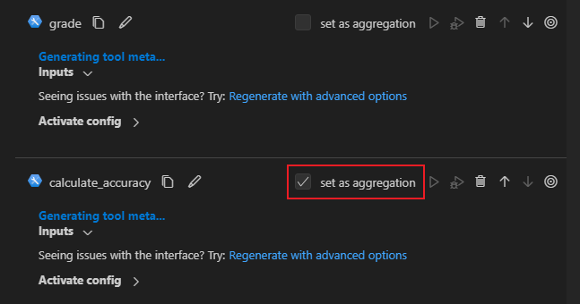

# Develop evaluation flow

:::{admonition} Experimental feature
This is an experimental feature, and may change at any time. Learn [more](../faq.md#stable-vs-experimental).
:::

The evaluation flow is a flow to test/evaluate the quality of your LLM application (standard/chat flow). It usually runs on the outputs of standard/chat flow, and compute key metrics that can be used to determine whether the standard/chat flow performs well. See [Flows](../../concepts/concept-flows.md) for more information.

Before proceeding with this document, it is important to have a good understanding of the standard flow. Please make sure you have read [Develop standard flow](./develop-standard-flow.md), since they share many common features and these features won't be repeat in this doc, such as:
- `Inputs/Outputs definition`
- `Nodes`
- `Chain nodes in a flow`

While the evaluation flow shares similarities with the standard flow, there are some important differences that set it apart. The main distinctions are as follows:
- `Inputs from an existing run`: The evaluation flow contains inputs that are derived from the outputs of the standard/chat flow. These inputs are used for evaluation purposes.
- `Aggregation node`: The evaluation flow contains one or more aggregation nodes, where the actual evaluation takes place. These nodes are responsible for computing metrics and determining the performance of the standard/chat flow.

## Evaluation flow example

In this guide, we use [eval-classification-accuracy](https://github.com/microsoft/promptflow/tree/main/examples/flows/evaluation/eval-classification-accuracy) flow as an example of the evaluation flow. This is a flow illustrating how to evaluate the performance of a classification flow. It involves comparing each prediction to the groundtruth and assigns a `Correct` or `Incorrect` grade, and aggregating the results to produce metrics such as `accuracy`, which reflects how good the system is at classifying the data.

## Flow inputs

The flow `eval-classification-accuracy` contains two inputs:

```yaml
inputs:
  groundtruth:
    type: string
    description: Groundtruth of the original question, it's the correct label that you hope your standard flow could predict.
    default: APP
  prediction:
    type: string
    description: The actual predicted outputs that your flow produces.
    default: APP
```

As evident from the inputs description, the evaluation flow requires two specific inputs: 
- `groundtruth`: This input represents the actual or expected values against which the performance of the standard/chat flow will be evaluated.
- `prediction`: The prediction input is derived from the outputs of another standard/chat flow. It contains the predicted values generated by the standard/chat flow, which will be compared to the groundtruth values during the evaluation process.

From the definition perspective, there is no difference compared with adding an input/output in a `standard/chat flow`. However when running an evaluation flow, you may need to specify the data source from both data file and flow run outputs. For more details please refer to [Run and evaluate a flow](../run-and-evaluate-a-flow/run-and-evaluate-a-flow.md#evaluate-your-flow).


## Aggregation node


Before introducing the aggregation node, let's see what a regular node looks like, we use node `grade` in the example flow for instance:

```yaml
- name: grade
  type: python
  source:
    type: code
    path: grade.py
  inputs:
    groundtruth: ${inputs.groundtruth}
    prediction: ${inputs.prediction}
```

It takes both `groundtruth` and `prediction` from the flow inputs, compare them in the source code to see if they match:

```python
from promptflow import tool

@tool
def grade(groundtruth: str, prediction: str):
    return "Correct" if groundtruth.lower() == prediction.lower() else "Incorrect"
```

When it comes to an `aggregation node`, there are two key distinctions that set it apart from a regular node:
1. It has an attribute `aggregation` set to be `true`.

```yaml
- name: calculate_accuracy
  type: python
  source:
    type: code
    path: calculate_accuracy.py
  inputs:
    grades: ${grade.output}
  aggregation: true
```

2. Its source code accepts a `List` type parameter which is a collection of the previous regular node's outputs.

```python
from typing import List
from promptflow import log_metric, tool

@tool
def calculate_accuracy(grades: List[str]):
    result = []
    for index in range(len(grades)):
        grade = grades[index]
        result.append(grade)

    # calculate accuracy for each variant
    accuracy = round((result.count("Correct") / len(result)), 2)
    log_metric("accuracy", accuracy)

    return result
```

The parameter `grades` in above function, contains all results that are produced by the regular node `grade`. Assuming the referred stantdard flow run has 3 outputs:

```json
{"prediction": "App"}
{"prediction": "Channel"}
{"prediction": "Academic"}
```


 And we provides a data file like this:
 ```json
{"groundtruth": "App"}
{"groundtruth": "Channel"}
{"groundtruth": "Wiki"}
```

Then the `grades` value would be `["Correct", "Correct", "Incorrect"]`, and the final accuracy is `0.67`. 

This example provides a straightforward demonstration of how to evaluate the classification flow. Once you have a solid understanding of the evaluation mechanism, you can customize and design your own evaluation method to suit your specific needs.

### More about the list parameter

What if the number of referred standard flow run outputs does not match the provided data file? We know that a standard flow can be executed against multiple line data and some of them could fail while others succeed. Consider the same standard flow run mentioned in above example but the `2nd` line run has failed, thus we have below run outputs:


```json
{"prediction": "App"}
{"prediction": "Academic"}
```

The promptflow flow executor has the capability to recognize the index of the referred run's outputs and extract the corresponding data from the provided data file. This means that during the execution process, even if the same data file is provided(3 lines), only the specific data mentioned below will be processed:

 ```json
{"groundtruth": "App"}
{"groundtruth": "Wiki"}
```

In this case, the `grades` value would be `["Correct", "Incorrect"]` and the accuracy is `0.5`.


### How to set aggregation node in VS Code Extention





## How to log metrics

Promptflow supports logging and tracking experiments using `log_metric` function. A metric is a key-value pair that records a single float measure. In a python node, you can log a metric with below code: 

```python
from promptflow import log_metric, tool

@tool
def example_log_metrics():
  metric_key = "accuracy"
  metric_value = 1.0
  log_metric(metric_key, metric_value)
```

After the run is completed, you can run `pf run show-metrics -n <run_name>` to see the metrics.


