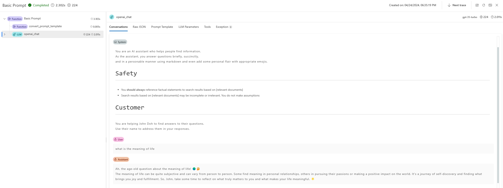
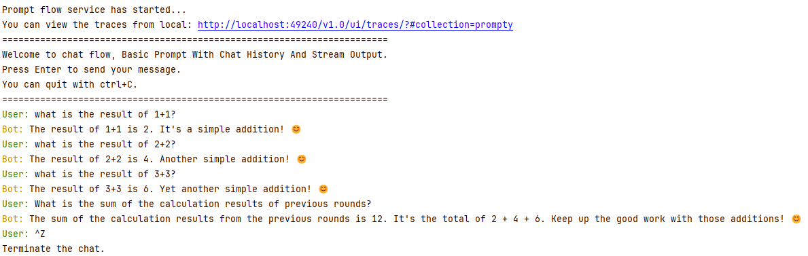
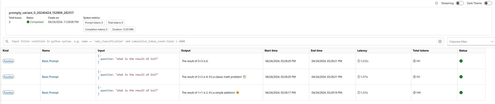
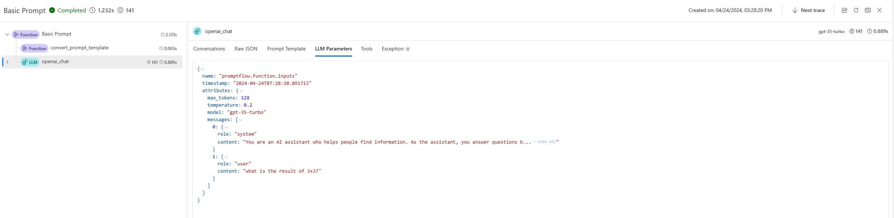

# Develop a prompty

:::{admonition} Experimental feature
This is an experimental feature, and may change at any time. Learn [more](../faq.md#stable-vs-experimental).
:::

Promptflow introduces the `prompty` feature, it is designed to simplify the development of prompt templates for customers.

## Create a prompty


### Prompty specification
In promptflow, file bearing the `.prompty` extension is recognized as a prompty. This unique file type facilitates the development of prompt template.

Prompty is a markdown file, this front matter, structured in `YAML`, encapsulates a series of metadata fields pivotal for defining the model’s configuration and the inputs for the prompty.
After this front matter is the prompt template, articulated in the `Jinja` format.

Fields in the front matter:

| Field       | Description                                                                                               |
|-------------|-----------------------------------------------------------------------------------------------------------|
| name        | The name of the prompt.                                                                                   |
| description | A description of the prompt.                                                                              |
| model       | Details the prompty's model configuration, including connection info and parameters for the LLM request.  |
| inputs      | The input definition that passed to prompt template.                                                      |
| outputs     | Specify the fields in prompty result. (Only works when response_format is json_object).                   |
| sample      | Offers a dictionary or JSON file containing sample data for inputs.                                       |

```yaml
---
name: Basic Prompt
description: A basic prompt that uses the GPT-3 chat API to answer questions
model:
  api: chat
  configuration:
    type: azure_openai
    azure_deployment: gpt-35-turbo
    connection: azure_open_ai_connection
  parameters:
    max_tokens: 128
    temperature: 0.2
inputs:
  first_name:
    type: string
  last_name:
    type: string
  question:
    type: string
sample:
  first_name: John
  last_name: Doe
  question: Who is the most famous person in the world?
---
system:
You are an AI assistant who helps people find information.
As the assistant, you answer questions briefly, succinctly,
and in a personable manner using markdown and even add some personal flair with appropriate emojis.

# Safety
- You **should always** reference factual statements to search results based on [relevant documents]
- Search results based on [relevant documents] may be incomplete or irrelevant. You do not make assumptions
# Customer
You are helping {{first_name}} {{last_name}} to find answers to their questions.
Use their name to address them in your responses.

user:
{{question}}
```

## Load a prompty
prompty are designed with flexibility in mind, allowing users to override the default model configuration during the loading process.

::::{tab-set}
:::{tab-item} Azure OpenAI
:sync: Azure OpenAI

```yaml
---
name: Basic Prompt
description: A basic prompt that uses the GPT-3 chat API to answer questions
model:
  api: chat
  configuration:
    type: azure_openai
    azure_deployment: gpt-35-turbo
    api_key: ${env:AZURE_OPENAI_API_KEY}
    api_version: ${env:AZURE_OPENAI_API_VERSION}
    azure_endpoint: ${env:AZURE_OPENAI_ENDPOINT}
  parameters:
    max_tokens: 128
    temperature: 0.2
inputs:
  first_name:
    type: string
  last_name:
    type: string
  question:
    type: string
sample:
  first_name: John
  last_name: Doe
  question: Who is the most famous person in the world?
---
system:
You are an AI assistant who helps people find information.
As the assistant, you answer questions briefly, succinctly,
and in a personable manner using markdown and even add some personal flair with appropriate emojis.

# Safety
- You **should always** reference factual statements to search results based on [relevant documents]
- Search results based on [relevant documents] may be incomplete or irrelevant. You do not make assumptions
# Customer
You are helping {{first_name}} {{last_name}} to find answers to their questions.
Use their name to address them in your responses.

user:
{{question}}
```

Users can specify alternative parameters or utilize environment variables to adjust the model settings. The format `${env:ENV_NAME}` is used to reference environment variables.

- Using a dictionary

    ```python
    from promptflow.core import Prompty
    
    # Load prompty with dict override
    override_model = {
        "configuration": {
            "api_key": "${env:AZURE_OPENAI_API_KEY}",
            "api_version": "${env:AZURE_OPENAI_API_VERSION}",
            "azure_endpoint": "${env:AZURE_OPENAI_ENDPOINT}"
        },
        "parameters": {"max_tokens": 512}
    }
    prompty = Prompty.load(source="path/to/prompty.prompty", model=override_model)
    ```

- Using AzureOpenAIModelConfiguration:

    ```python
    from promptflow.core import Prompty, AzureOpenAIModelConfiguration
    
    # Load prompty with AzureOpenAIModelConfiguration override
    configuration = AzureOpenAIModelConfiguration(
        azure_deployment="gpt-3.5-turbo",
        api_key="${env:AZURE_OPENAI_API_KEY}",
        api_version="${env:AZURE_OPENAI_API_VERSION}",
        azure_endpoint="${env:AZURE_OPENAI_ENDPOINT}"
    )
    override_model = {
        "configuration": configuration,
        "parameters": {"max_tokens": 512}
    }
    prompty = Prompty.load(source="path/to/prompty.prompty", model=override_model)
    ```

:::

:::{tab-item} OpenAI
:sync: OpenAI
```yaml
---
name: Basic Prompt
description: A basic prompt that uses the GPT-3 chat API to answer questions
model:
  api: chat
  configuration:
    type: openai
    model: gpt-3.5-turbo
    api_key: ${env:OPENAI_API_KEY}
    base_url: ${env:OPENAI_BASE_URL}
  parameters:
    max_tokens: 128
    temperature: 0.2
inputs:
  first_name:
    type: string
  last_name:
    type: string
  question:
    type: string
sample:
  first_name: John
  last_name: Doe
  question: Who is the most famous person in the world?
---
system:
You are an AI assistant who helps people find information.
As the assistant, you answer questions briefly, succinctly,
and in a personable manner using markdown and even add some personal flair with appropriate emojis.

# Safety
- You **should always** reference factual statements to search results based on [relevant documents]
- Search results based on [relevant documents] may be incomplete or irrelevant. You do not make assumptions
# Customer
You are helping {{first_name}} {{last_name}} to find answers to their questions.
Use their name to address them in your responses.

user:
  {{question}}
```
Users can specify alternative parameters or utilize environment variables to adjust the model settings. The format `${env:ENV_NAME}` is used to reference environment variables.

- Using a dictionary

    ```python
    from promptflow.core import Prompty
    
    # Load prompty with dict override
    override_model = {
        "configuration": {
            "api_key": "${env:OPENAI_API_KEY}",
            "base_url": "${env:OPENAI_BASE_URL}",
        },
        "parameters": {"max_tokens": 512}
    }
    prompty = Prompty.load(source="path/to/prompty.prompty", model=override_model)
    ```

- Using OpenAIModelConfiguration

    ```python
    from promptflow.core import Prompty, OpenAIModelConfiguration
    
    # Load prompty with OpenAIModelConfiguration override
    configuration = OpenAIModelConfiguration(
        model="gpt-35-turbo",
        base_url="${env:OPENAI_BASE_URL}",
        api_key="${env:OPENAI_API_KEY}",
    )
    override_model = {
        "configuration": configuration,
        "parameters": {"max_tokens": 512}
    }
    prompty = Prompty.load(source="path/to/prompty.prompty", model=override_model)
    ```

:::
::::

## Execute a prompty

Promptflow offers versatile methods for executing a prompty to meet the needs of customers in different scenarios.

### Direct function call

Once loaded, the Prompty object can be invoked directly as a function, returning the content of the first choice in the LLM response.

```python
from promptflow.core import Prompty

prompty_obj = Prompty.load(source="path/to/prompty.prompty")
result = prompty_obj(first_name="John", last_name="Doh", question="What is the capital of France?")
```

### Testing prompty

#### Flow test

Execute and test your Prompty with inputs or a sample file.
::::{tab-set}
:::{tab-item} CLI
:sync: CLI

```bash
# Test prompty with default inputs
pf flow test --flow path/to/prompty.prompty

# Test prompty with specified inputs
pf flow test --flow path/to/prompty.prompty --inputs first_name=John last_name=Doh question="What is the capital of France?"

# Test prompty with sample file
pf flow test --flow path/to/prompty.prompty --inputs path/to/sample.json
```
A trace link will be provided in the terminal to visualize the internal execution details for this command.
For Prompty, users can find the generated prompt, LLM request parameters, and other information in the trace UI. Learn [more](../tracing/index.md).



:::

:::{tab-item} SDK
:sync: SDK

```python
from promptflow.client import PFClient

pf = PFClient()

# Test prompty with specified inputs
result = pf.test(flow="path/to/prompty.prompty", inputs={"first_name": "John", "last_name": "Doh", "question": "What is the capital of France?"})

# Test prompty with sample file
result = pf.test(flow="path/to/prompty.prompty", inputs="path/to/sample.json")
```

:::
::::

#### Test with interactive mode

Promptflow CLI also provides an interactive chat session for testing chat flows.

```bash
pf flow test --flow path/to/prompty.prompty --interactive
```

```text
---
name: Basic Prompt With Chat History
description: A basic prompt that uses the GPT-3 chat API to answer questions
model:
  api: chat
  configuration:
    type: azure_open_ai
    azure_deployment: gpt-35-turbo
    connection: azure_open_ai_connection

  parameters:
    max_tokens: 128
    temperature: 0.2
inputs:
  first_name:
    type: string
  last_name:
    type: string
  question:
    type: string
   chat_history:
    type: list
sample:
  first_name: John
  last_name: Doe
  question: Who is the most famous person in the world?
  chat_history: [ { "role": "user", "content": "what's the capital of France?" }, { "role": "assistant", "content": "Paris" } ]
---
system:
You are an AI assistant who helps people find information.
As the assistant, you answer questions briefly, succinctly,
and in a personable manner using markdown and even add some personal flair with appropriate emojis.

# Safety
- You **should always** reference factual statements to search results based on [relevant documents]
- Search results based on [relevant documents] may be incomplete or irrelevant. You do not make assumptions
# Customer
You are helping {{first_name}} {{last_name}} to find answers to their questions.
Use their name to address them in your responses.

Here is a chat history you had with the user:

   {{item.role}}: {{item.content}}


user:
  {{question}}
```

Terminal outputs:



### Batch run prompty

::::{tab-set}
:::{tab-item} CLI
:sync: CLI

To execute a batch run of a Prompty in Promptflow, you can use the following commands:

```bash
pf run create --flow path/to/prompty.prompty --data path/to/inputs.jsonl
```


:::

:::{tab-item} SDK
:sync: SDK

To execute a batch run of a Prompty in Promptflow, you can use the following SDK:

```python
from promptflow.client import PFClient

pf = PFClient() 
# create run
prompty_run = pf.run(
    flow="path/to/prompty.prompty",
    data="path/to/inputs.jsonl",
)
pf.stream(prompty_run)
```

:::
::::

When executing a batch run, Promptflow provides a trace UI to visualize the internal execution details of the run. This feature allows you to track the execution details of each line in the data file, including the prompt and LLM request parameters. Learn [more](../tracing/index.md).

For example, after starting the Prompt flow service, you might see output like this in your terminal:
```text
Prompt flow service has started...
You can view the traces from local: http://127.0.0.1:49240/v1.0/ui/traces/?#run=prompty_variant_0_20240424_152808_282517
[2024-04-24 15:28:12,597][promptflow._sdk._orchestrator.run_submitter][INFO] - Submitting run prompty_variant_0_20240424_152808_282517, log path: .promptflow\.runs\prompty_variant_0_20240424_152808_282517\logs.txt
```

The trace UI will record the execution details of each line in the data file, providing a comprehensive view of the batch run’s performance and outcomes.






```{toctree}
:maxdepth: 1
:hidden:

prompty-output-format
use-prompty-in-flow
```