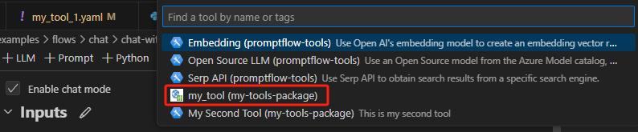

# Adding a Tool Icon
A tool icon serves as a graphical representation of your tool in the user interface (UI). Follow this guidance to add a custom tool icon when developing your own tool package.

Adding a custom tool icon is optional. If you do not provide one, the system uses a default icon.

## Prerequisites

- Please ensure that your [Prompt flow for VS Code](https://marketplace.visualstudio.com/items?itemName=prompt-flow.prompt-flow) is updated to version 1.4.2 or later.
- Create a tool package as described in [Create and Use Tool Package](create-and-use-tool-package.md).
- Prepare custom icon image that meets these requirements:

  - Use PNG, JPG or BMP format.
  - 16x16 pixels to prevent distortion when resizing.
  - Avoid complex images with lots of detail or contrast, as they may not resize well. 

  See [this example](https://github.com/microsoft/promptflow/blob/main/examples/tools/tool-package-quickstart/my_tool_package/icons/custom-tool-icon.png) as a reference.
- Install dependencies to generate icon data URI:

  ```
  pip install pillow
  ```

## Add tool icon with _icon_ parameter 
Run the command below in your tool project directory to automatically generate your tool YAML, use _-i_ or _--icon_ parameter to add a custom tool icon:
```
python <promptflow github repo>\scripts\tool\generate_package_tool_meta.py -m <tool_module> -o <tool_yaml_path> -i <tool-icon-path>
```
Here we use [an existing tool project](https://github.com/microsoft/promptflow/tree/main/examples/tools/tool-package-quickstart) as an example.
```
cd D:\proj\github\promptflow\examples\tools\tool-package-quickstart

python D:\proj\github\promptflow\scripts\tool\generate_package_tool_meta.py -m my_tool_package.tools.my_tool_1 -o my_tool_package\yamls\my_tool_1.yaml -i my_tool_package\icons\custom-tool-icon.png
```

In the auto-generated tool YAML file, the custom tool icon data URI is added in the `icon` field:
```yaml
my_tool_package.tools.my_tool_1.my_tool:
  function: my_tool
  icon: data:image/png;base64,iVBORw0KGgoAAAANSUhEUgAAABAAAAAQCAYAAAAf8/9hAAACR0lEQVR4nKWS3UuTcRTHP79nm9ujM+fccqFGI5viRRpjJgkJ3hiCENVN/QMWdBHUVRdBNwX9ARHd2FVEWFLRjaS9XPmSC/EFTNOWc3Pi48y9PHNzz68L7UXTCvreHM65+PA953uElFLyHzLvHMwsJrnzfJqFeAan3cKV9mr8XseeAOXX5vqjSS53jdF+tIz1nIFAMDCzwpvJ5b87+LSYYHw+gcWkEAwluXnOR2Q1R+9YjJ7BKJG4zoXmqr0ddL3+QnV5EeUOK821LsJammcjEeZiafJScrd3bm8H6zkDd4mVztZKAK49/Mj8is4Z/35GPq9R5VJ5GYztDtB1HT1vovGQSiqVAqDugI3I6jpP3i9x9VQVfu8+1N/OvbWCqqqoBSa6h1fQNA1N0xiYTWJSBCZF8HgwSjQapbRQ2RUg5NYj3O6ZochmYkFL03S4mImIzjFvCf2xS5gtCRYXWvBUvKXjyEVeTN/DXuDgxsnuzSMK4HTAw1Q0hZba4NXEKp0tbpq9VkxCwTAETrsVwxBIBIYhMPI7YqyrtONQzSznJXrO4H5/GJ9LUGg0YFYydJxoYnwpj1s9SEN5KzZz4fYYAW6dr+VsowdFgamlPE/Hs8SzQZYzg0S+zjIc6iOWDDEc6uND+N12B9/VVu+mrd79o38wFCCdTeBSK6hxBii1eahxBlAtRbsDdmoiHGRNj1NZ7GM0NISvzM9oaIhiqwOO/wMgl4FsRpLf2KxGXpLNSLLInzH+CWBIA6RECIGUEiEUpDRACBSh8A3pXfGWdXfMgAAAAABJRU5ErkJggg==
  inputs:
    connection:
      type:
      - CustomConnection
    input_text:
      type:
      - string
  module: my_tool_package.tools.my_tool_1
  name: my_tool
  type: python
```

## Verify the tool icon in VS Code extension
Follow [steps](create-and-use-tool-package.md#use-your-tool-from-vscode-extension) to use your tool from VS Code extension. Your tool displays with the custom icon:  


## FAQ
### Can I preview the tool icon image before adding it to a tool?
Yes, you could run below command under the root folder to generate a data URI for your custom tool icon. Make sure the output file has an `.html` extension.
```
python <path-to-scripts>\tool\convert_image_to_data_url.py --image-path <image_input_path> -o <html_output_path>
```
For example:
```
python D:\proj\github\promptflow\scripts\tool\convert_image_to_data_url.py --image-path D:\proj\github\promptflow\examples\tools\tool-package-quickstart\my_tool_package\icons\custom-tool-icon.png -o output.html
```
The content of `output.html` looks like the following, open it in a web browser to preview the icon.
```html
<html>
<body>

</body>
</html>
```

### Can I add a tool icon to an existing tool package?
Yes, you can refer to the [preview icon](add-a-tool-icon.md#can-i-preview-the-tool-icon-image-before-adding-it-to-a-tool) section to generate the data URI and manually add the data URI to the tool's YAML file.

### Can I add tool icons for dark and light mode separately?
Yes, you can add the tool icon data URIs manually or run the command below in your tool project directory to automatically generate your tool YAML, use _--icon-light_ to add a custom tool icon for the light mode and use _--icon-dark_ to add a custom tool icon for the dark mode:
```
python <promptflow github repo>\scripts\tool\generate_package_tool_meta.py -m <tool_module> -o <tool_yaml_path> --icon-light <light-tool-icon-path> --icon-dark <dark-tool-icon-path>
```
Here we use [an existing tool project](https://github.com/microsoft/promptflow/tree/main/examples/tools/tool-package-quickstart) as an example.
```
cd D:\proj\github\promptflow\examples\tools\tool-package-quickstart

python D:\proj\github\promptflow\scripts\tool\generate_package_tool_meta.py -m my_tool_package.tools.my_tool_1 -o my_tool_package\yamls\my_tool_1.yaml --icon-light my_tool_package\icons\custom-tool-icon-light.png --icon-dark my_tool_package\icons\custom-tool-icon-dark.png
```

In the auto-generated tool YAML file, the light and dark tool icon data URIs are added in the `icon` field:
```yaml
my_tool_package.tools.my_tool_1.my_tool:
  function: my_tool
  icon:
    dark: data:image/png;base64,iVBORw0KGgoAAAANSUhEUgAAABAAAAAQCAIAAACQkWg2AAAB00lEQVR4nI1SO2iTURT+7iNNb16a+Cg6iJWqRKwVRIrWV6GVUkrFdqiVShBaxIIi4iY4iouDoy4ODkKn4uQkDs5FfEzFYjEtJYQo5P/z35j/3uNw7Z80iHqHC/ec8z3OuQeMMcYYAHenU8n84YMAABw7mo93dEQpAIyBAyAiF1Kq8/Wrl5fHR1x6tjC9uPBcSrlZD4BxIgIgBCei+bnC6cGxSuWHEEIIUa58H7l0dWZqwlqSUjhq7oDWEoAL584Y6ymljDHGmM543BhvaPAsAKLfEjIyB6BeryPw796+EWidUInr16b5z6rWAYCmKXeEEADGRy+SLgXlFfLWbbWoyytULZ4f6Hee2yDgnAG4OVsoff20try08eX92vLSzJVJAJw3q7dISSnDMFx48UypeCa97cPHz7fu3Y/FYo1Go8nbCiAiIUStVus/eaKvN691IAQnsltI24wZY9Kp1Ju373K5bDKZNMa6gf5ZIWrG9/0g0K3W/wYIw3Dvnq6dO7KNMPwvgOf5x3uPHOrp9n3/HwBrLYCu3bv6Tg0PjU0d2L8PAEWfDKCtac6YIVrfKN2Zn8tkUqvfigBaR88Ya66uezMgl93+9Mmjxw8fJBIqWv7NAvwCHeuq7gEPU/QAAAAASUVORK5CYII=
    light: data:image/png;base64,iVBORw0KGgoAAAANSUhEUgAAABAAAAAQCAIAAACQkWg2AAAB2UlEQVR4nH1SO2hUQRQ9c18K33u72cXs7jOL8UeQCCJoJaIgKAiCWKilaGNlYREFDRGNjayVWKiFFmITECFKJKIokQRRsDFENoooUchHU5qdWZ2512KymxcNOcUwc5nDuefeA2FhZpGFU0S0Mf5S0zpdF2FhISgopUREKfXj59yhoycmPn4GAKDncuXa9VtKKWYGACgowHOdc9a6g0eOA7mx8apzzlp76vRZoGXw6XMRsdb6nwSAmYnoQ3Xi5fBIdk2SiSMiCoKgNZslteruvX4ASikvSwAEAGDqdYhAXO+VypevkwODQ4+HnlGcq2mDNLwtZq5pvWP3AYRJ0Lq2uG5rWNgYFjaBVt+8c19E/jRaWvQgImPj1e279ufaN8elzly5K1/u6r7QZ51zrjmoBqHJ+TU/39ax5cy5i53bdnb39KXtLpr28OMLgiCfz78YHpmemi0W2piZWdIWaMmDCIDWet/ePUlS0toQUWM8yxG8jrVuw/qOTBw19rUiQUQoCGZm50z9txf8By3/K0Rh+PDRk8lv3+MoWklBBACmpmdKxcKn96O3b1SqC6FSyxOUgohk4pjZ9T8YeDX6ptye+PoSpNIrfkGv3747fOzk+UtXjTE+BM14M8tfl7BQR9VzUXEAAAAASUVORK5CYII=
  inputs:
    connection:
      type:
      - CustomConnection
    input_text:
      type:
      - string
  module: my_tool_package.tools.my_tool_1
  name: my_tool
  type: python
```
Note: Both light and dark icons are optional. If you set either a light or dark icon, it will be used in its respective mode, and the system default icon will be used in the other mode.