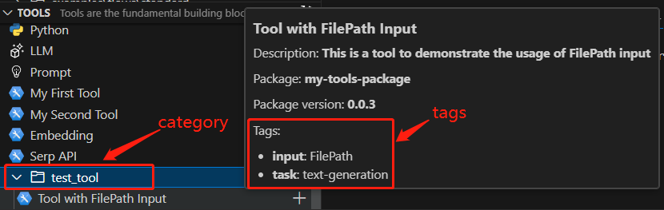
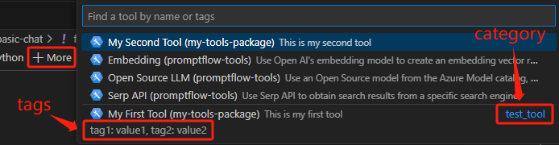
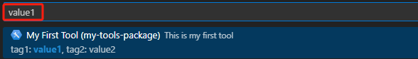

# Add Category and Tags for Tool
At times, users require their tools to be readily accessible. To facilitate this, we've implemented the `category` and `tags` features. The category helps to classify tools into distinct category folders, whereas the tags allow users to locate tools with corresponding tags.  

| name     | type | is_required | description |
| ---------| -----| ---------- | ----------- |
| category | str  | false      | A string that groups tools with similar characteristics. |
| tags     | dict | false      | A dictionary of key-value pairs to describe the different perspectives of the tool. |
> [!Note] If a tool isn't assigned a category, it will be displayed in the root folder. Similarly, if no tags are assigned, the tags field will remain empty.

## Prerequisites
- Please ensure that your [Prompt flow for VS Code](https://marketplace.visualstudio.com/items?itemName=prompt-flow.prompt-flow) is updated to version 1.1.0 or a more recent version.

## How to add category and tags for a tool
Here we use [an existing tool](https://github.com/microsoft/promptflow/tree/main/examples/tools/tool-package-quickstart/my_tool_package/yamls/tool_with_file_path_input.yaml) as an example. If you wish to create your own tool, kindly refer to the [create and use tool package](create-and-use-tool-package.md#create-custom-tool-package) guide. You can add the `category` and `tags` fields in the tool's YAML like this:
```yaml
my_tool_package.tools.tool_with_file_path_input.my_tool:
  function: my_tool
  inputs:
    input_file:
      type:
      - file_path
    input_text:
      type:
      - string
  module: my_tool_package.tools.tool_with_file_path_input
  name: Tool with FilePath Input
  description: This is a tool to demonstrate the usage of FilePath input
  type: python
  # Add a category and tags as shown below.
  category: test_tool
  tags:
    input: FilePath
    task: text-generation
```

## Tool with category and tags shown in VS Code extension
Follow the [steps](create-and-use-tool-package.md#use-your-tool-from-vscode-extension) to use your tool via the VS Code extension. 
- User experience in tool tree  
Your tool will be displayed along with its category and tags in tool tree like this:  
  

- User experience in tool list  
By clicking `More` in the visual editor, you can view your tools along with their category and tags:  
  
Furthermore, you have the option to search or filter tools based on tags:  
