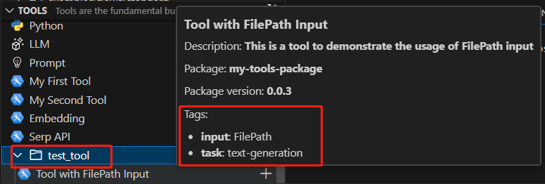

# Add Tool Category and Tags
Users sometimes need their tools to be easy to find. To achieve this, we've introduced the `category` and `tags`. The tool category helps organize tools into specific category folders, while tool tags can be used to search for tools with similar tags, even if they belong to different categories.   
Both category and tags are optional. If a tool doesn't have a category, it will be displayed in the root folder. If there are no tags, the tags field will be empty.

## Prerequisites
- Please ensure that your [Prompt flow for VS Code](https://marketplace.visualstudio.com/items?itemName=prompt-flow.prompt-flow) is updated to version 1.1.0 or a more recent version.

## How to create a tool with category and tags
Here we use [an existing tool](https://github.com/microsoft/promptflow/tree/main/examples/tools/tool-package-quickstart/my_tool_package/yamls/tool_with_file_path_input.yaml) as an example. If you want to create your own tool, please refer to [create and use tool package](create-and-use-tool-package.md#create-custom-tool-package), and you can add the _category_ and _tags_ fields in the tool's YAML, the YAML should like following:
```yaml
my_tool_package.tools.tool_with_file_path_input.my_tool:
  function: my_tool
  inputs:
    input_file:
      type:
      - file_path
    input_text:
      type:
      - string
  module: my_tool_package.tools.tool_with_file_path_input
  name: Tool with FilePath Input
  description: This is a tool to demonstrate the usage of FilePath input
  type: python
  # add category and tags like below
  category: test_tool
  tags:
    input: FilePath
    task: text-generation
```

## Use tool category and tags
### Tool category and tags in VS Code extension
Follow [steps](create-and-use-tool-package.md#use-your-tool-from-vscode-extension) to use your tool from VS Code extension. Your tool will display with category and tags:  


### Tool category and tags in tool list
You can see your tools with category and tags when clicking `More` in the visual editor:  
  
You can filter tools by tag:  
