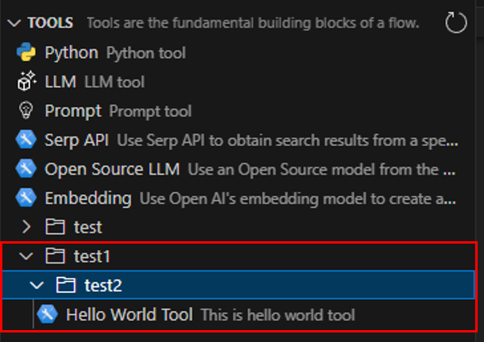
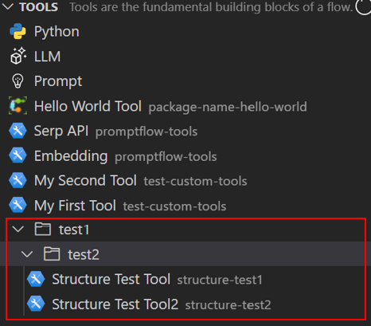

# Add Tool Hierarchy
The tool hierarchy path displays the tool's structure in the UI. If a hierarchy is not specified, the UI shows the tool at the root level.

## Prerequisites
Follow [Create and Use Tool Package](create-and-use-tool-package.md) to prepare prerequisites.  

## Use parameter to add tool hierarchy
Use the `tool-hierarchy` parameter to add a tool hierarchy when creating your tool project.  
```
python <path-to-scripts>\tool\generate_tool_package_template.py --destination <your-tool-project> --package-name <your-package-name> --tool-name <your-tool-name> --function-name <your-tool-function-name> --tool-hierarchy <your-tool-hierarchy>
```
For example:
```
python D:\proj\github\promptflow\scripts\tool\generate_tool_package_template.py --destination hello-world-proj --package-name hello-world --tool-name hello_world_tool --function-name get_greeting_message --tool-hierarchy test1/test2/test3
```

In the auto-generated tool YAML file, the tool hierarchy is in the `structure` field:
```yaml
hello_world.tools.hello_world_tool.get_greeting_message:
  function: get_greeting_message
  inputs:
    connection:
      type:
      - CustomConnection
    input_text:
      type:
      - string
  module: hello_world.tools.hello_world_tool
  name: Hello World Tool
  description: This is hello world tool
  type: python
  structure: test1/test2/test3
```

## Best practices
- Use characters from "a-zA-Z0-9-_" to generate the hierarchy string.
- Add a maximum of three hierarchy layers.

## Verify the tool hierarchy in VS Code extension
Follow [steps](create-and-use-tool-package.md#use-your-tool-from-vscode-extension) to use your tool from VS Code extension. Your tool displays under the hierarchy:  


## FAQ
### Why does my tool show at root level with single layer hierarchy?
The last hierarchy segment is ignored when displaying the tool. A single layer hierarchy results in displaying the tool under the root level.
### What happens with same hierarchy for different tools? 
If the same hierarchy is used for different tools, they will display under the shared hierarchy. Distinguish tools by their package name. For example, `Structure Test Tool` in `structure-test1` and `Structure Test Tool2` in `structure-test2` with hierarchy `test1/test2/test3` will display as:

