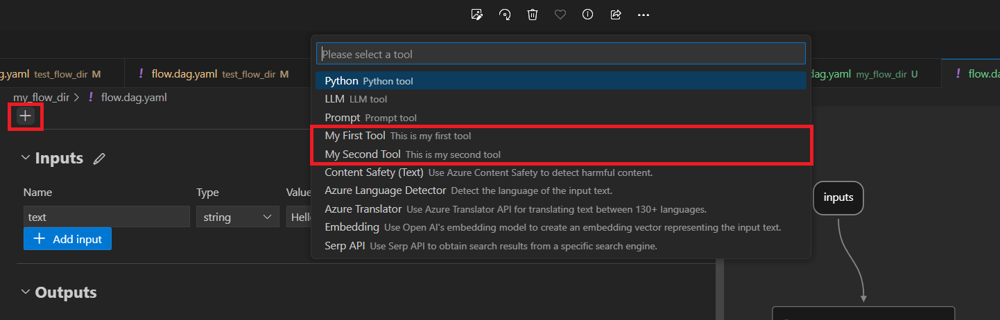

# Create and Use Tool Package
In this document, we will guide you through the process of developing your own tool package, offering detailed steps and advice on how to utilize your creation.

The custom tool is the prompt flow tool developed by yourself. If you find it useful, you can follow this guidance to make it a tool package. This will enable you to conveniently reuse it, share it with your team, or distribute it to anyone in the world.

After successful installation of the package, your custom "tool" will show up in VSCode extension as below: 


## Create your own tool package
Your tool package should be a python package. To try it quickly, just use [my-tools-package 0.0.1](https://pypi.org/project/my-tools-package/) and skip this section.

### Prerequisites
Create a new conda environment using python 3.9 or 3.10. Run below command to install PromptFlow dependencies:
```
pip install promptflow
```

### Create custom tool package
Run below command to initialize a package tool in current folder:
```
pf tool init --package <your-package-name> --tool <your-tool-name>
```
For example:
```
pf tool init --package hello_world --tool hello_world_tool
```
This auto-generated script will create one tool for you. The parameters _destination_ and _package-name_ are mandatory. The parameters _tool-name_ and _function-name_ are optional. If left unfilled, the _tool-name_ will default to _hello_world_tool_, and the _function-name_ will default to _tool-name_.

The command will generate the tool project as follows with one tool `hello_world_tool.py` in it:

```
hello_world/
│   MANIFEST.in
│   README.md
│   setup.py
│
└───hello_world/
        hello_world_tool.py
        utils.py
        __init__.py
```

```The points outlined below explain the purpose of each folder/file in the package. If your aim is to develop multiple tools within your package, please make sure to closely examine point 2 and 5.```

1. **hello_world**: This is the source directory. All of your project's source code should be placed in this directory.
2. **hello_world/hello_world**: This directory contains the individual tools for your project. Your tool package can contain either one tool or many tools. When adding a new tool, you should create another *.py under this folder.
3. **hello-world/hello_world/hello_world_tool.py**: Develop your tool within the def function. Use the `@tool` decorator to identify the function as a tool.
    > [!Note] There are two ways to write a tool. The default and recommended way is the function implemented way. You can also use the class implementation way, referring to [my_tool_2.py](https://github.com/microsoft/promptflow/blob/main/examples/tools/tool-package-quickstart/my_tool_package/tools/my_tool_2.py) as an example.
4. **hello-world/hello_world/utils.py**: This file implements the tool list method, which collects all the tools defined. It is required to have this tool list method, as it allows the User Interface (UI) to retrieve your tools and display them within the UI.
    > [!Note] There's no need to create your own list method if you maintain the existing folder structure. You can simply use the auto-generated list method provided in the `utils.py` file.
7. **MANIFEST.in**: This file is used to determine which files to include in the distribution of the project.
    > [!Note] There's no need to update this file if you maintain the existing folder structure.
8. **setup.py**: This file contains metadata about your project like the name, version, author, and more. Additionally, the entry point is automatically configured for you by `pf tool init`. In Python, configuring the entry point in `setup.py` helps establish the primary execution point for a package, streamlining its integration with other software. 

    The `package_tools` entry point together with the tool list method are used to retrieve all the tools and display them in the UI.
    ```python
    entry_points={
          "package_tools": ["<your_tool_name> = <list_module>:<list_method>"],
    },
    ```
    > [!Note] There's no need to update this file if you maintain the existing folder structure.

## Build and share the tool package
  Execute the following command in the tool package root directory to build your tool package:
  ```
  python setup.py sdist bdist_wheel
  ```
  This will generate a tool package `<your-package>-0.0.1.tar.gz` and corresponding `whl file` inside the `dist` folder.

  Create an account on PyPI if you don't already have one, and install `twine` package by running `pip install twine`.

  Upload your package to PyPI by running `twine upload dist/*`, this will prompt you for your Pypi username and password, and then upload your package on PyPI. Once your package is uploaded to PyPI, others can install it using pip by running `pip install your-package-name`. Make sure to replace `your-package-name` with the name of your package as it appears on PyPI.

  If you only want to put it on Test PyPI, upload your package by running `twine upload --repository-url https://test.pypi.org/legacy/ dist/*`. Once your package is uploaded to Test PyPI, others can install it using pip by running `pip install --index-url https://test.pypi.org/simple/ your-package-name`.

## Use your tool from VSCode Extension
* Step1: Install [Prompt flow for VS Code extension](https://marketplace.visualstudio.com/items?itemName=prompt-flow.prompt-flow). 

* Step2: Go to terminal and install your tool package in conda environment of the extension. Assume your conda env name is `prompt-flow`.
   ```
   (local_test) PS D:\projects\promptflow\tool-package-quickstart> conda activate prompt-flow
   (prompt-flow) PS D:\projects\promptflow\tool-package-quickstart> pip install .\dist\my_tools_package-0.0.1-py3-none-any.whl
   ``` 

* Step3: Go to the extension and open one flow folder. Click 'flow.dag.yaml' and preview the flow. Next, click `+` button and you will see your tools. You may need to reload the windows to clean previous cache if you don't see your tool in the list.


## FAQ
### Why is my custom tool not showing up in the UI?
Confirm that the tool YAML files are included in your custom tool package. You can add the YAML files to [MANIFEST.in](https://github.com/microsoft/promptflow/blob/main/examples/tools/tool-package-quickstart/MANIFEST.in) and include the package data in [setup.py](https://github.com/microsoft/promptflow/blob/main/examples/tools/tool-package-quickstart/setup.py).
Alternatively, you can test your tool package using the script below to ensure that you've packaged your tool YAML files and configured the package tool entry point correctly.

  1. Make sure to install the tool package in your conda environment before executing this script.
  2. Create a python file anywhere and copy the content below into it.
      ```python
      import pkg_resources
      import importlib

      def test():
          """List all package tools information using the `package-tools` entry point.

          This function iterates through all entry points registered under the group "package_tools."
          For each tool, it imports the associated module to ensure its validity and then prints
          information about the tool.

          Note:
          - Make sure your package is correctly packed to appear in the list.
          - The module is imported to validate its presence and correctness.

          Example of tool information printed:
          ----identifier
          {'module': 'module_name', 'package': 'package_name', 'package_version': 'package_version', ...}
          """
          for entry_point in pkg_resources.iter_entry_points(group="package_tools"):
              list_tool_func = entry_point.resolve()
              package_tools = list_tool_func()

              for identifier, tool in package_tools.items():
                  importlib.import_module(tool["module"])  # Import the module to ensure its validity
                  print(f"----{identifier}\n{tool}")

      if __name__ == "__main__":
          test()
      ```
  3. Run this script in your conda environment. This will return the metadata of all tools installed in your local environment, and you should verify that your tools are listed.

### Why am I unable to upload package to PyPI?
* Make sure that the entered username and password of your PyPI account are accurate.
* If you encounter a `403 Forbidden Error`, it's likely due to a naming conflict with an existing package. You will need to choose a different name. Package names must be unique on PyPI to avoid confusion and conflicts among users. Before creating a new package, it's recommended to search PyPI (https://pypi.org/) to verify that your chosen name is not already taken. If the name you want is unavailable, consider selecting an alternative name or a variation that clearly differentiates your package from the existing one.

## Advanced features
[Customize your tool icon](add-a-tool-icon.md)  
[Add category and tags for tool](add-category-and-tags-for-tool.md)  