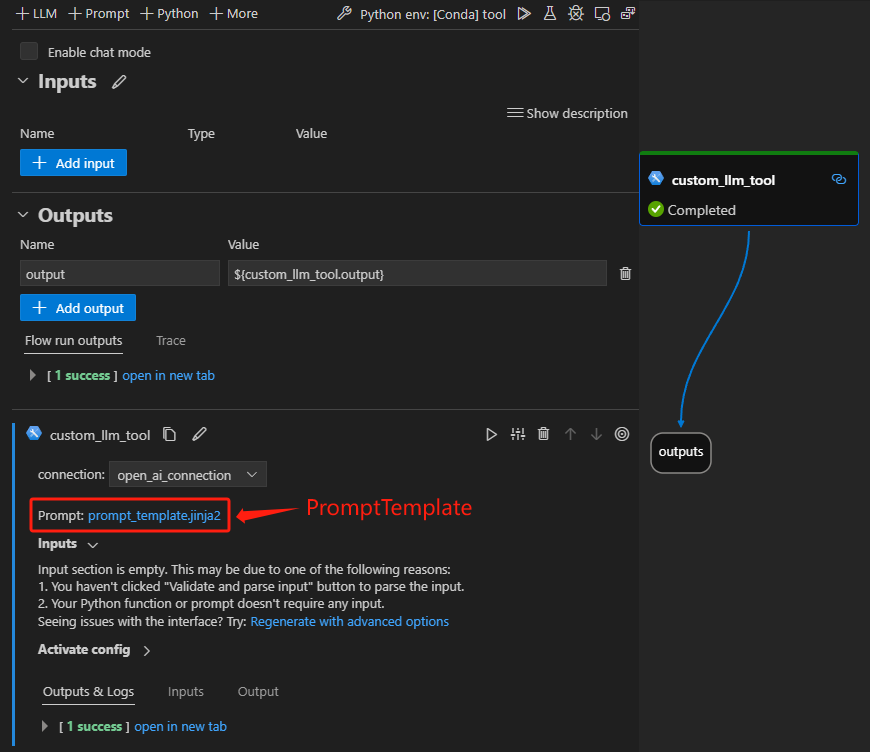

# Create Custom LLM Tool
In this document, we will guide you through the process of developing a tool with `custom_llm` type which can connect to a customized large language model with prompt.

Custom LLM is a large language model fine-tuned by yourself. If you find it has good performance and is useful, then you can follow this guidance to make it a tool so that it can be shared with other people to have more impact.

## Prerequisites
- Please ensure that your `Prompt flow` for VS Code is updated to version 1.2.0 or later.

## How to create a custom LLM tool
Here we use [an existing tool package](../../../examples/tools/tool-package-quickstart/my_tool_package) as an example. If you want to create your own tool, please refer to [create and use tool package](create-and-use-tool-package.md).  

### Add a `PromptTemplate` input to your tool, like in [this example](../../../examples/tools/tool-package-quickstart/my_tool_package/tools/tool_with_custom_llm_type.py)

```python
from jinja2 import Template
from promptflow import tool
from promptflow.connections import CustomConnection
# 1. Import the PromptTemplate type.
from promptflow.contracts.types import PromptTemplate


# 2. Add a PromptTemplate input for your tool method.
@tool
def my_tool(connection: CustomConnection, prompt: PromptTemplate, **kwargs) -> str:
    # 3. The prompt is used for your custom LLM to do inference, customize your own code to handle and use the prompt here.
    message = Template(prompt, trim_blocks=True, keep_trailing_newline=True).render(**kwargs)
    return message
```

### Generate custom LLM tool YAML

Run the command below in your tool project directory to automatically generate your tool YAML, use _-t "custom_llm"_ or _--tool-type "custom_llm"_ to indicate this is a custom LLM tool:
```
python <path-to-scripts>\tool\generate_package_tool_meta.py -m <tool_module> -o <tool_yaml_path> -t "custom_llm"
```
Here we use [an existing tool](../../../examples/tools/tool-package-quickstart/my_tool_package/yamls/tool_with_custom_llm_type.yaml) as an example.
```
cd D:\proj\github\promptflow\examples\tools\tool-package-quickstart

python D:\proj\github\promptflow\scripts\tool\generate_package_tool_meta.py -m my_tool_package.tools.tool_with_custom_llm_type -o my_tool_package\yamls\tool_with_custom_llm_type.yaml -n "My Custom LLM Tool" -d "This is a tool to demonstrate the custom_llm tool type" -t "custom_llm"
```
This command will generate a YAML file as follows:

```yaml
my_tool_package.tools.tool_with_custom_llm_type.my_tool:
name: My Custom LLM Tool
description: This is a tool to demonstrate the custom_llm tool type 
# The type is custom_llm.
type: custom_llm
module: my_tool_package.tools.tool_with_custom_llm_type
function: my_tool
inputs:
    connection:
    type:
        - CustomConnection
```

## Use custom LLM tool in VS Code extension
Follow the steps to [build and install your tool package](create-and-use-tool-package.md#build-and-share-the-tool-package) and [use your tool from VS Code extension](create-and-use-tool-package.md#use-your-tool-from-vscode-extension).  

Here we use an existing flow to demonstrate the experience, open [this flow](../../../examples/flows/standard/custom_llm_tool_showcase/flow.dag.yaml) in VS Code extension.  
- There is a node named "custom_llm_tool" with a prompt template file. You can either use an existing file or create a new one as the prompt template file.  

