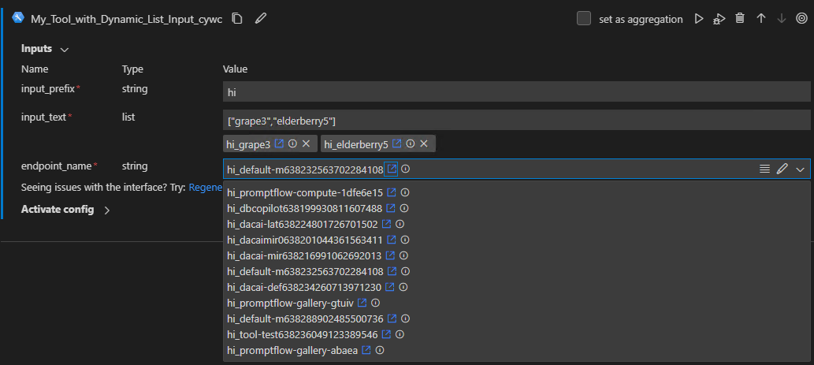

# Creating a Dynamic List Tool Input

Tool input options can be generated on the fly using a dynamic list. Instead of having predefined static options, the tool author defines a request function that queries backends like APIs to retrieve real-time options. This enables flexible integration with various data sources to populate dynamic options. For instance, the function could call a storage API to list current files. Rather than a hardcoded list, the user sees up-to-date options when running the tool.

## Prerequisites

- Please make sure you have the latest version of [Prompt flow for VS Code](https://marketplace.visualstudio.com/items?itemName=prompt-flow.prompt-flow) installed (v1.3.1+).
- Please install promptflow package and ensure that its version is 1.0.0 or later.
  ```
  pip install promptflow>=1.0.0
  ```

## Create a tool input with dynamic listing

### Create a list function

To enable dynamic listing, the tool author defines a request function with the following structure:

- Type: Regular Python function, can be in tool file or separate file
- Input: Accepts parameters needed to fetch options
- Output: Returns a list of option objects as `List[Dict[str, Union[str, int, float, list, Dict]]]`:
  - Required key:
    - `value`: Internal option value passed to tool function
  - Optional keys:
    - `display_value`: Display text shown in dropdown (defaults to `value`)
    - `hyperlink`: URL to open when option clicked
    - `description`: Tooltip text on hover

This function can make backend calls to retrieve the latest options, returning them in a standardized dictionary structure for the dynamic list. The required and optional keys enable configuring how each option appears and behaves in the tool input dropdown. See [my_list_func](https://github.com/microsoft/promptflow/blob/main/examples/tools/tool-package-quickstart/my_tool_package/tools/tool_with_dynamic_list_input.py) as an example.

```python
def my_list_func(prefix: str = "", size: int = 10, **kwargs) -> List[Dict[str, Union[str, int, float, list, Dict]]]:
    """This is a dummy function to generate a list of items.

    :param prefix: prefix to add to each item.
    :param size: number of items to generate.
    :param kwargs: other parameters.
    :return: a list of items. Each item is a dict with the following keys:
        - value: for backend use. Required.
        - display_value: for UI display. Optional.
        - hyperlink: external link. Optional.
        - description: information icon tip. Optional.
    """
    import random

    words = ["apple", "banana", "cherry", "date", "elderberry", "fig", "grape", "honeydew", "kiwi", "lemon"]
    result = []
    for i in range(size):
        random_word = f"{random.choice(words)}{i}"
        cur_item = {
            "value": random_word,
            "display_value": f"{prefix}_{random_word}",
            "hyperlink": f'https://www.bing.com/search?q={random_word}',
            "description": f"this is {i} item",
        }
        result.append(cur_item)

    return result
```

### Configure a tool input with the list function

In `inputs` section of tool YAML, add following properties to the input that you want to make dynamic:

- `dynamic_list`:
  - `func_path`: Path to the list function (module_name.function_name).
  - `func_kwargs`: Parameters to pass to the function, can reference other input values.
- `allow_manual_entry`: Allow user to enter input value manually. Default to false.
- `is_multi_select`: Allow user to select multiple values. Default to false.

See [tool_with_dynamic_list_input.yaml](https://github.com/microsoft/promptflow/blob/main/examples/tools/tool-package-quickstart/my_tool_package/yamls/tool_with_dynamic_list_input.yaml) as an example.

```yaml
my_tool_package.tools.tool_with_dynamic_list_input.my_tool:
  function: my_tool
  inputs:
    input_text:
      type:
      - list
      dynamic_list:
        func_path: my_tool_package.tools.tool_with_dynamic_list_input.my_list_func
        func_kwargs: 
        - name: prefix  # argument name to be passed to the function
          type: 
          - string
          # if optional is not specified, default to false.
          # this is for UX pre-validaton. If optional is false, but no input. UX can throw error in advanced.
          optional: true
          reference: ${inputs.input_prefix}  # dynamic reference to another input parameter
        - name: size  # another argument name to be passed to the function
          type: 
          - int
          optional: true
          default: 10
      # enum and dynamic list may need below setting.
      # allow user to enter input value manually, default false.
      allow_manual_entry: true
      # allow user to select multiple values, default false.
      is_multi_select: true
    # used to filter 
    input_prefix:
      type:
      - string
  module: my_tool_package.tools.tool_with_dynamic_list_input
  name: My Tool with Dynamic List Input
  description: This is my tool with dynamic list input
  type: python
```

## Use the tool in VS Code

Once you package and share your tool, you can use it in VS Code per the [tool package guide](create-and-use-tool-package.md#use-your-tool-from-vscode-extension). You could try `my-tools-package` for a quick test.

```sh
pip install my-tools-package>=0.0.8
```


> Note: If your dynamic list function call Azure APIs, you need to login to Azure and set default workspace. Otherwise, the tool input will be empty and you can't select anything. See [FAQs](#im-a-tool-author-and-want-to-dynamically-list-azure-resources-in-my-tool-input-what-should-i-pay-attention-to) for more details.

## FAQs

### I'm a tool author, and want to dynamically list Azure resources in my tool input. What should I pay attention to?
1. Clarify azure workspace triple "subscription_id", "resource_group_name", "workspace_name" in the list function signature. System helps append workspace triple to function input parameters if they are in function signature. See [list_endpoint_names](https://github.com/microsoft/promptflow/blob/main/examples/tools/tool-package-quickstart/my_tool_package/tools/tool_with_dynamic_list_input.py) as an example.
```python
def list_endpoint_names(subscription_id: str = None,
                        resource_group_name: str = None, 
                        workspace_name: str = None,
                        prefix: str = "") -> List[Dict[str, str]]:
    """This is an example to show how to get Azure ML resource in tool input list function.

    :param subscription_id: Azure subscription id.
    :param resource_group_name: Azure resource group name.
    :param workspace_name: Azure ML workspace name.
    :param prefix: prefix to add to each item.
    """
    # return an empty list if workspace triad is not available.
    if not subscription_id or not resource_group_name or not workspace_name:
        return []

    from azure.ai.ml import MLClient
    from azure.identity import DefaultAzureCredential

    credential = DefaultAzureCredential()
    credential.get_token("https://management.azure.com/.default")

    ml_client = MLClient(
        credential=credential,
        subscription_id=subscription_id,
        resource_group_name=resource_group_name,
        workspace_name=workspace_name)
    result = []
    for ep in ml_client.online_endpoints.list():
        hyperlink = (
            f"https://ml.azure.com/endpoints/realtime/{ep.name}/detail?wsid=/subscriptions/"
            f"{subscription_id}/resourceGroups/{resource_group_name}/providers/Microsoft."
            f"MachineLearningServices/workspaces/{workspace_name}"
        )
        cur_item = {
            "value": ep.name,
            "display_value": f"{prefix}_{ep.name}",
            # external link to jump to the endpoint page.
            "hyperlink": hyperlink,
            "description": f"this is endpoint: {ep.name}",
        }
        result.append(cur_item)
    return result
```
2. Note in your tool doc that if your tool user want to use the tool at local, they should login to azure and set ws triple as default. Or the tool input will be empty and user can't select anything.
```sh
az login
az account set --subscription <subscription_id>
az configure --defaults group=<resource_group_name> workspace=<workspace_name>
```
Install azure dependencies.
```sh
pip install azure-ai-ml
```
```sh
pip install my-tools-package[azure]>=0.0.8
```


### I'm a tool user, and cannot see any options in dynamic list tool input. What should I do?

If you are unable to see any options in a dynamic list tool input, you may see an error message below the input field stating:

"Unable to retrieve result due to XXX. Please contact the tool author/support team for troubleshooting assistance."

If this occurs, follow these troubleshooting steps:

- Note the exact error message shown. This provides details on why the dynamic list failed to populate.
- Check the tool documentation for any prerequisites or special instructions. For example, if the dynamic list function requires Azure credentials, ensure you have installed azure dependencies, logged in and set the default workspace.
  ```sh
  pip install azure-ai-ml
  ```
  ```sh
  az login
  az account set --subscription <subscription_id>
  az configure --defaults group=<resource_group_name> workspace=<workspace_name>
  ```
- Contact the tool author/support team and report the issue. Provide the error message so they can investigate the root cause. 
