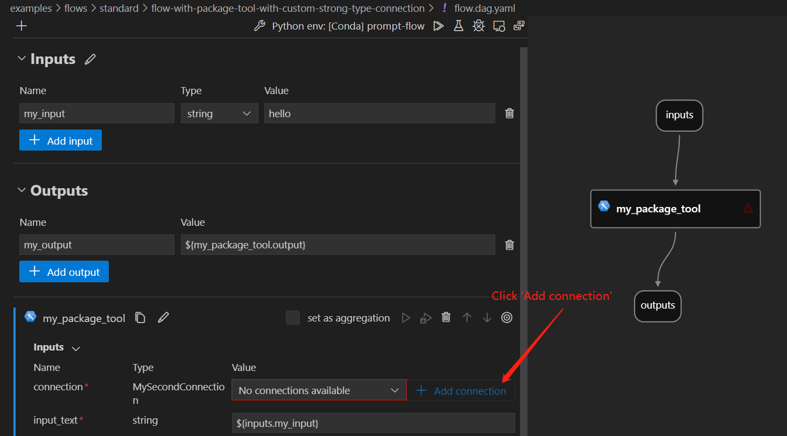
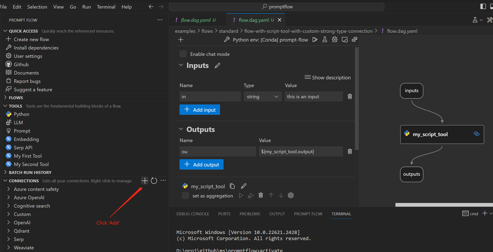
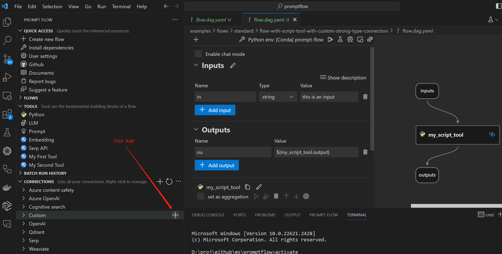
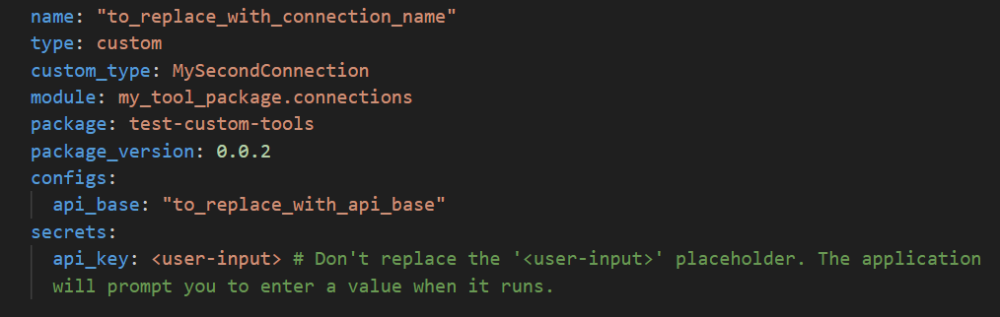
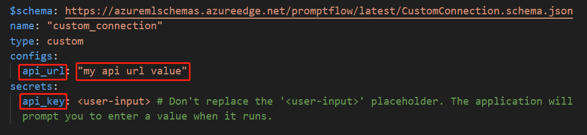
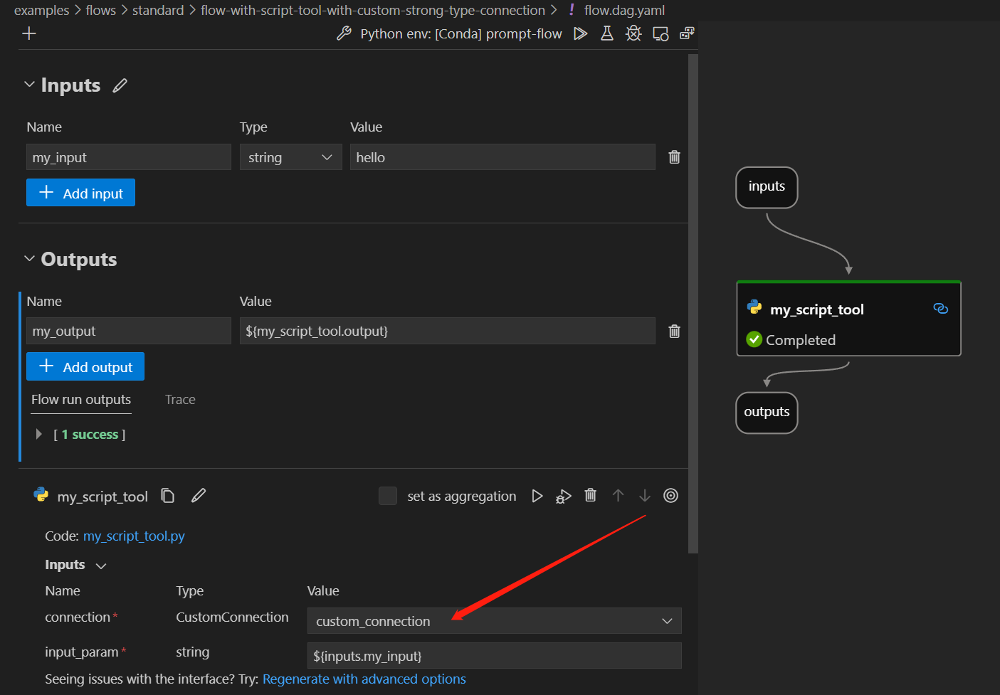

# Create and Use Your Own Custom Strong Type Connection
This document provides a step-by-step guide on how to create and use a custom strong type connection. The advantages of using a custom strong type connection are as follows:

* Enhanced User-Friendly Experience: Custom strong type connections offer an enhanced user-friendly experience compared to custom connections, as they eliminate the need to fill in connection keys. Only values are required.
* Improved IntelliSense Experience: By using a custom strong type connection, you can benefit from an enhanced IntelliSense experience, receiving real-time suggestions and auto-completion for available keys.
* Centralized Information: A custom strong type connection provides a centralized location to access and view all available keys and value types, making it easier to explore and create the connection.

Once the custom strong type connection is created, you can either use it in the package tool or script tool.

## Prerequisites
- Please ensure that your [Prompt flow for VS Code](https://marketplace.visualstudio.com/items?itemName=prompt-flow.prompt-flow) is updated to version 1.1.2 or a more recent version.
- Install promptflow package.

  ```bash
  # Eventually only need to pip install promptflow==0.1.0b8
  pip install "promptflow==0.0.108028960" --extra-index-url https://azuremlsdktestpypi.azureedge.net/promptflow
  ```

## Create your own custom strong type connection
You can take this [file](https://github.com/microsoft/promptflow/blob/main/examples/tools/tool-package-quickstart/my_tool_package/tools/tool_with_custom_strong_type_connection.py) as an example to have a better understanding of how to create a custom strong type connection and how a tool uses it.
Create your custom strong type connection as belows:
```python
from promptflow.connections import CustomStrongTypeConnection
from promptflow.contracts.types import Secret


class MyCustomConnection(CustomStrongTypeConnection):
    """My custom strong type connection.

    :param api_key: The api key.
    :type api_key: String
    :param api_base: The api base.
    :type api_base: String
    """
    api_key: Secret
    api_url: str = "This is a fake api url."

```
Make sure that you adhere to the following guidelines:

* You can define your own custom connection using any desired name. But ensure that it inherits the class `CustomStrongTypeConnection`.
  > [!Note] Avoid using the `CustomStrongTypeConnection` class directly.
* When specifying connection API keys, please use the `Secret` type to indicate that the key should be treated as a secret. Secret keys will be scrubbed to enhance security.
* You can either have your custom connection class with your custom tool or separate it into a distinct Python file.
* Document your custom strong type connection by using docstrings.  Follow the format of docstring like this. Use `param` and `type` to provide explanations for each key.
  
  ```python
  """My custom strong type connection.

  :param api_key: The api key get from "https://xxx.com".
  :type api_key: String
  :param api_base: The api base.
  :type api_base: String
  """
  ```
  The purpose of parsing the docstring into a connection template is to enhance the clarity and understanding for users when creating a custom strong type connection. By providing detailed explanations for each key, users can easily grasp the meaning and purpose of each key, allowing them to accurately fill in the corresponding values.
  
  ```yaml
  name: "to_replace_with_connection_name"
  type: custom
  custom_type: MyCustomConnection
  module: my_tool_package.tools.my_tool_with_custom_strong_type_connection
  package: test-custom-tools
  package_version: 0.0.2
  configs:
    api_url: "This is a fake api url." # String, The api key get from "https://xxx.com".
  secrets:
    api_key: <user-input> # Don't replace the '<user-input>' placeholder. The application will prompt you to enter a value when it runs.
  ```

## Develop a flow with a package tool with custom strong type connection
To develop a flow with a package tool that uses a custom strong type connection, follow these steps:
* Step1: Refer to the [create and use tool package](create-and-use-tool-package.md#create-custom-tool-package) documentation to build and install your tool package in your local environment.
  > [!Note] After installing the new tool package in your local environment, you will need to reload the window for the changes to take effect.
* Step2: Develop a flow with custom tools. Please take this [folder](https://github.com/microsoft/promptflow/blob/431f58ba5f16aaab90768f43a4d9655c4984c0cc/examples/flows/standard/flow-with-package-tool-using-custom-strong-type-connection/) as an example.
* Step3: Create a custom strong type connection using one of the following methods:
  - Click the 'Add connection' button in the node interface.
    
  - Click 'Create connection' add sign in the CONNECTIONS section.
    
  - Click 'Create connection' add sign in the Custom category.
    

  Fill in the `values` starting with `to-replace-with` in the connection template.
  

* Step4: Use the created custom strong type connection in your flow and run.
  

## Develop a flow with a script tool with custom strong type connection
To develop a flow with a script tool that uses a custom strong type connection, follow these steps:
* Step1: Develop a flow with custom tools. Please take this [folder](https://github.com/microsoft/promptflow/blob/431f58ba5f16aaab90768f43a4d9655c4984c0cc/examples/flows/standard/flow-with-script-tool-using-custom-strong-type-connection/) as an example.
* Step2: Using a custom strong type connection in a script tool is slightly different from using it in a package tool. When creating the connection, you will create a `CustomConnection`. Fill in the `keys` and `values` in the connection template.
  
* Step3: Use the created custom connection in your flow.
  

## Local to cloud
Whether you are using a custom strong type connection in a package tool or a script tool, when creating the necessary connections in Azure AI, you will need to create a `CustomConnection`. In the node interface of the flow, the input type would be displayed as `CustomConnection` type.

For more details on running PromptFlow in Azure AI, please refer to this [documentation](https://microsoft.github.io/promptflow/cloud/azureai/quick-start.html).

Here are some example commands:
```
pfazure run create --subscription 96aede12-2f73-41cb-b983-6d11a904839b -g promptflow -w my-pf-eus --flow D:\proj\github\ms\promptflow\examples\flows\standard\flow-with-package-tool-using-custom-strong-type-connection --data D:\proj\github\ms\promptflow\examples\flows\standard\flow-with-package-tool-using-custom-strong-type-connection\data.jsonl --runtime test-compute
```