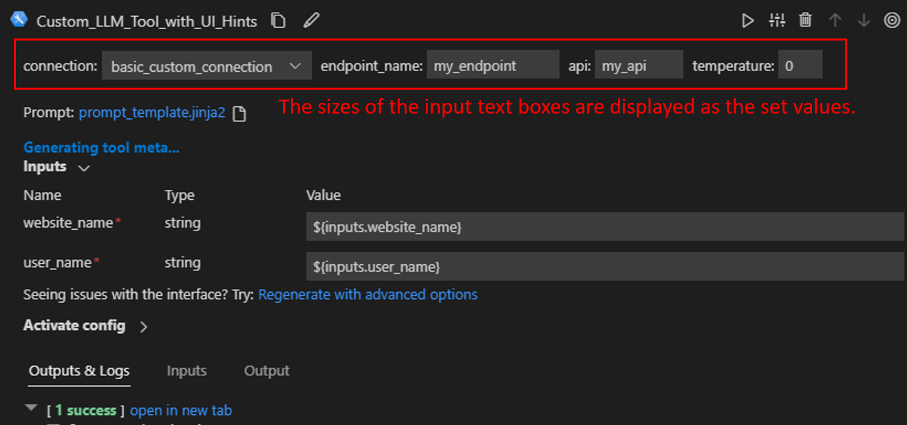

# Customizing an LLM tool
In this document, we will guide you through the process of customizing an LLM tool, allowing users to seamlessly connect to a large language model with prompt tuning experience using a `PromptTemplate`.

## Prerequisites
- Please ensure that your [Prompt flow for VS Code](https://marketplace.visualstudio.com/items?itemName=prompt-flow.prompt-flow) is updated to version 1.8.0 or later.

## How to customize an LLM tool
Here we use [an existing tool package](https://github.com/microsoft/promptflow/tree/main/examples/tools/tool-package-quickstart/my_tool_package) as an example. If you want to create your own tool, please refer to [create and use tool package](create-and-use-tool-package.md).  

Develop the tool code as in [this example](https://github.com/microsoft/promptflow/blob/main/examples/tools/tool-package-quickstart/my_tool_package/tools/tool_with_custom_llm_type.py).
- Add a `CustomConnection` input to the tool, which is used to authenticate and establish a connection to the large language model.
- Add a `PromptTemplate` input to the tool, which serves as an argument to be passed into the large language model.

    ```python
    from jinja2 import Template
    from promptflow import tool
    from promptflow.connections import CustomConnection
    from promptflow.contracts.types import PromptTemplate


    @tool
    def my_tool(connection: CustomConnection, prompt: PromptTemplate, **kwargs) -> str:
        # Customize your own code to use the connection and prompt here.
        rendered_prompt = Template(prompt, trim_blocks=True, keep_trailing_newline=True).render(**kwargs)
        return rendered_prompt
    ```

## Use the tool in VS Code
Follow the steps to [build and install your tool package](create-and-use-tool-package.md#build-and-share-the-tool-package) and [use your tool from VS Code extension](create-and-use-tool-package.md#use-your-tool-from-vscode-extension).  

Here we use an existing flow to demonstrate the experience, open [this flow](https://github.com/microsoft/promptflow/blob/main/examples/tools/use-cases/custom_llm_tool_showcase/flow.dag.yaml) in VS Code extension.  
- There is a node named "my_custom_llm_tool" with a prompt template file. You can either use an existing file or create a new one as the prompt template file.  


## FAQs
### Can I customize text box size for my tool inputs?
Yes, you can refer [this tool example] add `ui_hints={"text_box_size": <size>}` in InputSetting in your tool interface as below. There are 4 sizes available, arranged from smallest to largest as `xs`, `sm`, `md`, `lg`.  
```python
input_settings = {
    "connection": InputSetting(ui_hints={"text_box_size": "lg"}),
    "endpoint_name": InputSetting(ui_hints={"text_box_size": "md"}),
    "api": InputSetting(ui_hints={"text_box_size": "sm"}),
    "temperature": InputSetting(ui_hints={"text_box_size": "xs"})
}

@tool(
    name="Custom LLM Tool with UI Hints",
    description="This is a custom LLM tool with UI hints.",
    type="custom_llm",
    input_settings=input_settings
)
def my_tool(
    connection: CustomConnection,
    endpoint_name: str,
    api: str,
    temperature: float,
    prompt: PromptTemplate,
    **kwargs
) -> str:
    rendered_prompt = Template(prompt, trim_blocks=True, keep_trailing_newline=True).render(**kwargs)
    return rendered_prompt
```
When you use the tool in [this example flow], you could see the sizes of the input text boxes are displayed as the set values.  

