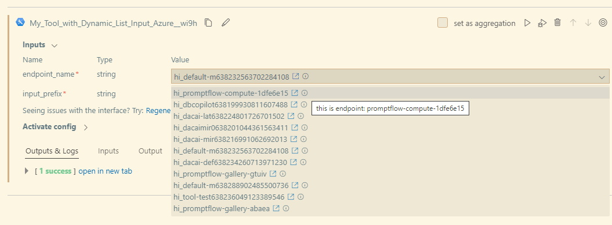
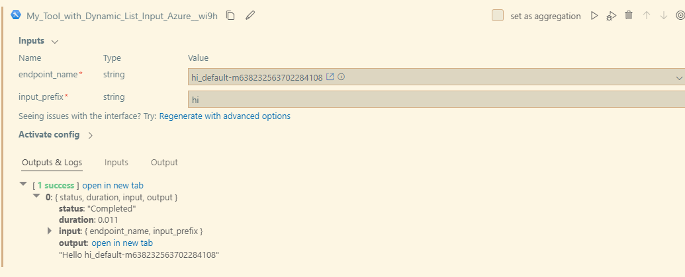

# [Draft] Dynamic list

Tool can define the listing experience and the corresponding request to enable the dynamic listing of a tool input.

## Prerequisites

- Download private [Prompt flow for VS Code](https://aka.ms/pfvsctest) version "1.2.0-test1025", and install from VSIX file.
- Install dependencies.
```sh
pip install promptflow==0.1.0b8.dev5 --extra-index-url https://azuremlsdktestpypi.azureedge.net/promptflow
```

## How to create a tool input that can dynamic list

### Code

For tool authors who want to dynamically list azure resources in tool input, they should clarify azure workspace triple "subscription_id", "resource_group_name", "workspace_name" in list function signature, then system will help append ws triple to function input params. For example

```python
from promptflow import tool
from typing import List, Union, Dict


def list_endpoint_names(subscription_id, resource_group_name, workspace_name, prefix: str = "") -> List[Dict[str, Union[str, int, float, list, Dict]]]:
    from azure.ai.ml import MLClient
    from azure.identity import DefaultAzureCredential

    credential = DefaultAzureCredential()
    credential.get_token("https://management.azure.com/.default")

    ml_client = MLClient(
        credential=credential,
        subscription_id=subscription_id,
        resource_group_name=resource_group_name,
        workspace_name=workspace_name)
    result = []
    for ep in ml_client.online_endpoints.list():
        cur_item = {
            "value": ep.name,
            "display_value": f"{prefix}_{ep.name}",
            # external link to jump to the endpoint page.
            "hyperlink": f"https://ml.azure.com/endpoints/realtime/{ep.name}/detail?wsid=/subscriptions/{subscription_id}/resourceGroups/{resource_group_name}/providers/Microsoft.MachineLearningServices/workspaces/{workspace_name}",
            "description": f"this is endpoint: {ep.name}",
        }
        result.append(cur_item)
    return result


@tool
def my_tool(endpoint_name: str, input_prefix: str) -> str:
    return f"Hello {input_prefix}_{endpoint_name}"
```

### Spec
```yaml
my_tool_package.tools.tool_with_dynamic_list_input_azure.my_tool:
  function: my_tool
  inputs:
    endpoint_name:
      type:
      - string
      dynamic_list:
        # UX send dynamic_list content to backend.
        # specifies the function to generate dynamic list. format: <module>.<func>
        func_path: my_tool_package.tools.tool_with_dynamic_list_input_azure.list_endpoint_names
        func_kwargs: 
        - name: prefix  # Argument name to be passed to the function
          type: 
          - string
          # if optional is not specified, default to false.
          # this is for UX pre-validaton. If optional is false, but no input. UX can throw error in advanced.
          optional: true
          reference: ${inputs.input_prefix}  # Dynamic reference to another input parameter
      # enum and dynamic list may need below setting, default false.
      # allow user to enter input value manually.
      allow_manual_entry: false
      # allow user to select multiple values, default false.
      is_multi_select: false
    # used to filter 
    input_prefix:
      type:
      - string
  module: my_tool_package.tools.tool_with_dynamic_list_input_azure
  name: My Tool with Dynamic List Input (Azure)
  description: This is my tool with dynamic list input azure version
  type: python
```

## Use tool in VS Code extension

Note in your tool doc that if your tool user want to use the tool at local, they should

- Login to azure and set ws triple as default. Or the tool input will be empty and user can't select anything.

```sh
az login
az account set --subscription <subscription_id>
az configure --defaults group=<resource_group_name> workspace=<workspace_name>
```
- Install azure dependencies.
```sh
pip install azure-ai-ml
```
- Install test tool package.
```sh
pip install -i https://test.pypi.org/simple/ chjinche-test-tools-package==0.0.5
```





## FAQ
