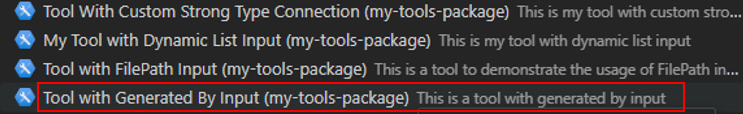
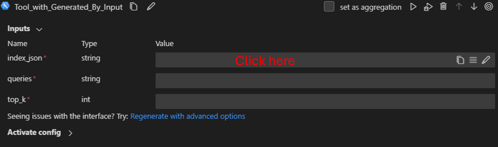
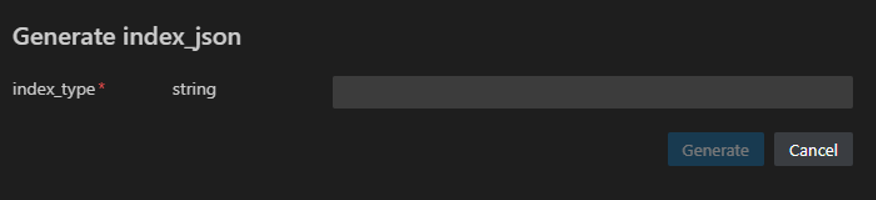
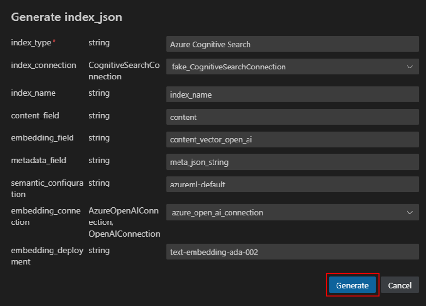
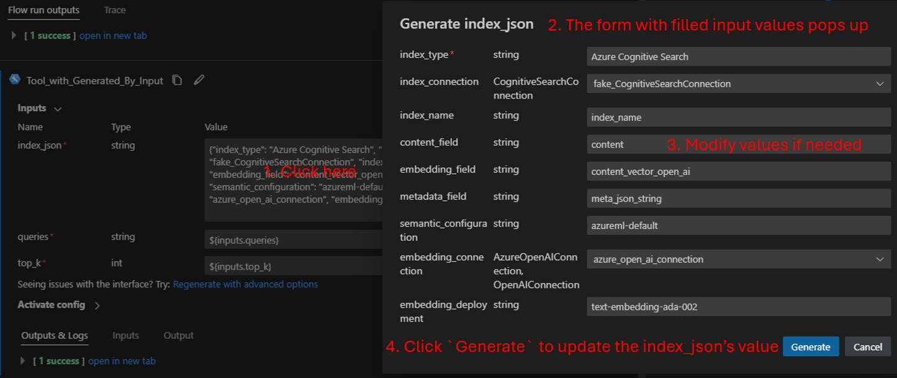

# Generate a Tool Input by a Function
The content of a tool's input can be automatically generated by a function, eliminating the need for manual user input. This approach offers several advantages. Firstly, when dealing with complex input requirements, users only need to provide values for the function's parameters to generate the tool's input, improving efficiency. Secondly, it allows the separation of tool inputs from the function's parameters, with the latter being displayed in a convenient pop-up window, streamlining the tool inputs.

## Prerequisites

- Please make sure you have the latest version of [Prompt flow for VS Code](https://marketplace.visualstudio.com/items?itemName=prompt-flow.prompt-flow) installed (v1.8.0+).
- Please install promptflow package and ensure that its version is 1.3.0 or later.
  ```
  pip install promptflow>=1.3.0
  ```

## Create a tool with an input generated by a function

### Define input-generating and input-reversing functions
To enable the generation of a tool input by a function, the tool author must define a pair of functions with the following structure:  
- Input-generating function：This function generates the content of the tool's input.
  - Type: Regular Python function, which can be located in the tool file or a separate file.
  - Input: Parameters required for generating the tool input content.
  - Output: The tool input content, with the type and format specified by the tool author.  

  See [generate_index_json](https://github.com/microsoft/promptflow/blob/main/examples/tools/tool-package-quickstart/my_tool_package/tools/tool_with_generated_by_input.py) as an example.

  ```python
  def generate_index_json(
      index_type: str,
      index: str = "",
      index_connection: CognitiveSearchConnection = "",
      index_name: str = "",
      content_field: str = "",
      embedding_field: str = "",
      metadata_field: str = "",
      semantic_configuration: str = "",
      embedding_connection: Union[AzureOpenAIConnection, OpenAIConnection] = "",
      embedding_deployment: str = ""
  ) -> str:
      """This is a dummy function to generate an index json based on the inputs.
      """

      import json
      inputs = ""
      if index_type == "Azure Cognitive Search":
          # 1. Call to create a new index
          # 2. Call to get the index yaml and return as a json
          inputs = {
              "index_type": index_type,
              "index": "retrieved_index",
              "index_connection": index_connection,
              "index_name": index_name,
              "content_field": content_field,
              "embedding_field": embedding_field,
              "metadata_field": metadata_field,
              "semantic_configuration": semantic_configuration,
              "embedding_connection": embedding_connection,
              "embedding_deployment": embedding_deployment
          }
      elif index_type == "Workspace MLIndex":
          # Call to get the index yaml and return as a json
          inputs = {
              "index_type": index_type,
              "index": index,
              "index_connection": "retrieved_index_connection",
              "index_name": "retrieved_index_name",
              "content_field": "retrieved_content_field",
              "embedding_field": "retrieved_embedding_field",
              "metadata_field": "retrieved_metadata_field",
              "semantic_configuration": "retrieved_semantic_configuration",
              "embedding_connection": "retrieved_embedding_connection",
              "embedding_deployment": "retrieved_embedding_deployment"
          }

      result = json.dumps(inputs)
      return result
  ```

- Input-reversing function: This function reverses the tool input content back into the parameter values for the input-generating function.
  - Type: Regular Python function, which can be located in the tool file or a separate file.
  - Input: The tool's input content, which is the output of the input-generating function.
  - Output: Returns a dict as `Dict[str, object]`.
    - Keys: The keys correspond to the parameter names of the input-generating function.
    - Values: The values and their types correspond to the input-generating function parameters.

  See [reverse_generate_index_json](https://github.com/microsoft/promptflow/blob/main/examples/tools/tool-package-quickstart/my_tool_package/tools/tool_with_generated_by_input.py) as an example.
  ```python
  def reverse_generate_index_json(index_json: str) -> Dict:
      """This is a dummy function to generate origin inputs from index_json.
      """
      import json

      # Calculate the UI inputs based on the index_json
      result = json.loads(index_json)
      return result
  ```

### Configure a tool input generated by a function

In the `inputs` section of the tool YAML, add the following properties to the input that you want to generate by a function:  
- `generated_by`:
  - `func_path`: Path to the input-generating function.
  - `func_kwargs`: Parameters passed to the function, which can reference other input values.
  - `reverse_func_path`: Path to the input-reversing function.

To distinguish the inputs referenced by the input-generating function from the tool's inputs, you can include the `input_type: uionly_hidden` property for these specific inputs. The `uionly_hidden` signifies that these inputs are not part of the tool's primary inputs and will not be visible on the tool's main interface. Instead, they will be presented in a separate pop-up window.  

See [tool_with_generated_by_input.yaml](https://github.com/microsoft/promptflow/blob/main/examples/tools/tool-package-quickstart/my_tool_package/yamls/tool_with_generated_by_input.yaml) as an example.

```yaml
my_tool_package.tools.tool_with_generated_by_input.my_tool:
  function: my_tool
  inputs:
    # Assuming this is the input you want to generate by a function.
    index_json:
      type:
        - string
      # Add the `generated_by` property for the input.
      generated_by:
        # Add the input-generating function path in the `func_path` field.
        func_path: my_tool_package.tools.tool_with_generated_by_input.generate_index_json
        func_kwargs: 
        - name: index_type
          type: 
            - string
          reference: ${inputs.index_type}
        - name: index
          type:
            - string
          optional: true
          reference: ${inputs.index}
        # ...
        # Add the input-reversing function path in the `reverse_func_path` field.
        reverse_func_path: my_tool_package.tools.tool_with_generated_by_input.reverse_generate_index_json
    queries:
      type:
        - string
    top_k:
      type:
        - int
    index_type:
      type:
        - string
      dynamic_list:
        func_path: my_tool_package.tools.tool_with_generated_by_input.list_index_types
      # Add `uionly_hidden` to the `index_type` input, as it is referenced by the input-generating function.
      input_type: uionly_hidden
    # ...
  module: my_tool_package.tools.tool_with_generated_by_input
  name: Tool with Generated By Input
  description: This is a tool with generated by input
  type: python
```

## Use the tool in VS Code

Once you package and share your tool, you can use it in VS Code per the [tool package guide](create-and-use-tool-package.md#use-your-tool-from-vscode-extension). You could try `my-tools-package` for a quick test.

```sh
pip install my-tools-package>=0.0.12
```

- Select the `Tool with Generated By Input` from `my-tools-package` in a prompt flow.  
  

- When you click on the value input box for `index_json`, a form will pop up. In this form, you need to fill in the parameters required by the input-generating function corresponding to `index_json`. This function is defined under the path specified in the tool's YAML file in the `index_json` input's `generated_by: func_path` field.  
  
Popped-up form:  
  

- After completing the form, you can click the `Generate` button to produce the input content for `index_json`. This process will invoke the input-generating function of `index_json`.  
  

- If you want to modify the contents of `index_json`, you can click on the value input box for `index_json` again. The form that pops up will have all the parameters you previously filled (This process will invoke the `index_json`'s input-reversing function, which is defined under the path specified in the tool's YAML file in the `index_json` input's `generated_by: func_path` field). After making changes to the parameters, click the `Generate` button again to create new content for `index_json`.  
  
