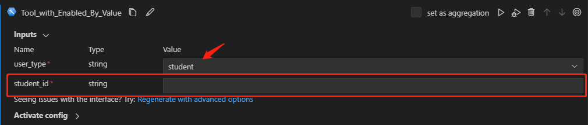

# Use "enabled_by_value" to Support Cascading Settings between Inputs for Tool

This guide will instruct you on how to use the "enabled_by_value" to support cascading settings between inputs for tool.
Cascading settings between inputs are frequently used in situations where the selection in one input field determines what subsequent inputs should be shown.
This approach help in creating a more efficient, user-friendly, and error-free input process.
To support cascading settings between tool inputs, we've introduced "enabled_by" and "enabled_by_value" to enable the current input based on the actual value of the input shown in "enabled_by" field.

> Note: The "enabled_by_value" in the tool yaml is of list type, implying that a single input can be enabled by multiple values from the dependent input.

## Prerequisites
To proceed, it's crucial for you to understand the process of developing a tool and generating a tool yaml. For thorough insights and instructions, please refer to [Create and Use Tool Package](create-and-use-tool-package.md).

## Use "enabled_by + enabled_by_value" in tool
Here we take [this tool](https://github.com/microsoft/promptflow/blob/main/examples/tools/tool-package-quickstart/my_tool_package/tools/tool_with_enabled_by_value.py) as example, this tool has three inputs:
"user_type", "student_id", and "teacher_id".
The "student_id" and "teacher_id" are enabled by the value of input "user_type". When the value of "user_type" input is "student", the "student_id" input is enabled and displayed.
When the type of "user_type" input is "teacher", the "teacher_id" input is enabled and displayed.
Below shows how to support this cascading setting in both tool code and tool yaml.

### Step 1: How to define the rules in the tool
All inputs will be defined in the tool, allowing you to define your own set of rules to determine which input to use. You need to pay attention to some key points:
* When an input has the potential to have multiple values, an Enum class such as "UserType" as shown in the following example can be created.
* Within the tool's logic, various inputs may be used depending on the respective "user_type" values.

Here is an example of how you define the rules in your tool:


```python
from enum import Enum

from promptflow import tool


class UserType(str, Enum):
    STUDENT = "student"
    TEACHER = "teacher"


@tool
def my_tool(user_type: Enum, student_id: str = "", teacher_id: str = "") -> str:
    """This is a dummy function to support enabled by feature.

    :param user_type: user type, student or teacher.
    :param student_id: student id.
    :param teacher_id: teacher id.
    :return: id of the user.
    If user_type is student, return student_id.
    If user_type is teacher, return teacher_id.
    """
    if user_type == UserType.STUDENT:
        return student_id
    elif user_type == UserType.TEACHER:
        return teacher_id
    else:
        raise Exception("Invalid user.")
```

### Step 2: Support "enabled_by_value" in the tool yaml
Once you have generated a tool yaml, you can incorporate the "enabled_by_value" into it. Here is an example showcasing the use of "enabled_by_value" in the tool yaml:

```yaml
my_tool_package.tools.tool_with_enabled_by_value.my_tool:
  function: my_tool
  inputs:
    user_type:
      type:
      - string
      enum:
        - student
        - teacher
    student_id:
      type:
      - string
      enabled_by: user_type
      enabled_by_value: [student]
    teacher_id:
      type:
        - string
      enabled_by: user_type
      enabled_by_value: [teacher]
  module: my_tool_package.tools.tool_with_enabled_by_value
  name: My Tool with Enabled By Value
  description: This is my tool with enabled by value
  type: python
```

## Use the tool from VSCode Extension
After you build and share the tool package, you can use your tool from VSCode Extension according to [Create and Use Tool Package](create-and-use-tool-package.md). For instance, when you select a "user_type" with "student" value, only "student_id" input is enabled and displayed for "enabled_by_value" example.

