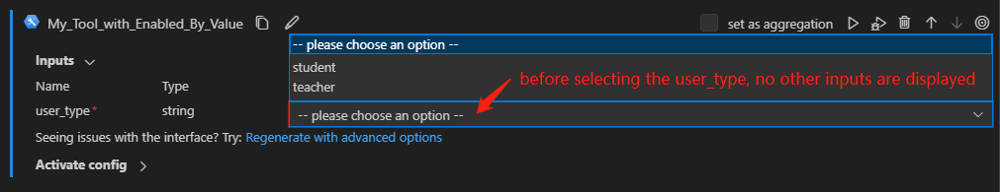

# Implementing Cascading Settings for Tool Inputs

Cascading settings between inputs are frequently used in situations where the selection in one input field determines what subsequent inputs should be shown.
This approach help in creating a more efficient, user-friendly, and error-free input process.
This article will guide you through the process of implementing cascading settings for tool inputs.

## Prerequisites
* Please ensure that your Prompt flow for VS Code is updated to version 1.2.0 or later.
* It's crucial for you to understand the process of creating your own tool package. For thorough insights and instructions, please refer to [Create and Use Tool Package](create-and-use-tool-package.md).

## Create custom tool package with cascading settings
We will provide a hands-on tool example to showcase the implementation of cascading settings between inputs within a tool. 
The availability of "student_id" and "teacher_id" inputs is determined by the value of the "user_type" input in this tool .
Below shows how to support this cascading setting in both tool code and tool yaml.

1. Develop your tool within the def function, referring to [tool_with_enabled_by_value.py](https://github.com/microsoft/promptflow/blob/main/examples/tools/tool-package-quickstart/my_tool_package/tools/tool_with_enabled_by_value.py) as an example. You need to pay attention to some key points:
    * Use the @tool decorator to identify the function as a tool.
    * When an input should only take on a certain set of fixed values, an Enum class such as "UserType" as shown in the following example can be created.
    * Within the tool's logic, various inputs may be used depending on the value of input "user_type".

```python
from enum import Enum

from promptflow import tool


class UserType(str, Enum):
    STUDENT = "student"
    TEACHER = "teacher"


@tool
def my_tool(user_type: Enum, student_id: str = "", teacher_id: str = "") -> str:
    """This is a dummy function to support enabled by feature.

    :param user_type: user type, student or teacher.
    :param student_id: student id.
    :param teacher_id: teacher id.
    :return: id of the user.
    If user_type is student, return student_id.
    If user_type is teacher, return teacher_id.
    """
    if user_type == UserType.STUDENT:
        return student_id
    elif user_type == UserType.TEACHER:
        return teacher_id
    else:
        raise Exception("Invalid user.")
```

2. Generate a tool yaml for your tool, referring to [tool_with_enabled_by_value.yaml](https://github.com/microsoft/promptflow/blob/main/examples/tools/tool-package-quickstart/my_tool_package/yamls/tool_with_enabled_by_value.yaml) as an example. The "enabled_by_value" in one input means that this input is enabled by the value of the input referred to in the "enabled_by" attribute.

```yaml
my_tool_package.tools.tool_with_enabled_by_value.my_tool:
  function: my_tool
  inputs:
    user_type:
      type:
      - string
      enum:
        - student
        - teacher
    student_id:
      type:
      - string
      # This input is enabled by the input "user_type".
      enabled_by: user_type
      # This input is enabled when "user_type" is "student".
      enabled_by_value: [student]
    teacher_id:
      type:
        - string
      enabled_by: user_type
      enabled_by_value: [teacher]
  module: my_tool_package.tools.tool_with_enabled_by_value
  name: My Tool with Enabled By Value
  description: This is my tool with enabled by value
  type: python
```
> Note: The "enabled_by_value" in the tool yaml is of list type, implying that a single input can be enabled by multiple values from the dependent input.

## Use your tool from VSCode Extension
After you build and share the tool package, you can use your tool from VSCode Extension according to [Create and Use Tool Package](create-and-use-tool-package.md).
Here we use an existing flow to demonstrate the experience, open [this flow](https://github.com/microsoft/promptflow/tree/main/examples/flows/standard/flow-with-enabled-by-value) in VS Code extension. 

Before you select the "user_type" input, both "student_id" and "teacher_id" inputs are disabled and hidden.


However, after you select the "user_type" input, the corresponding input is enabled and shown.


## FAQ
