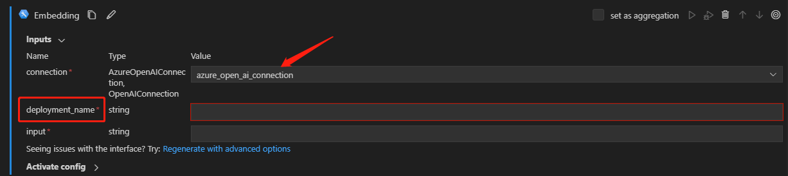

# How to use enabled by in the tool package

This guide will instruct you on how to use the "enabled by" feature in the tool package. The "enabled by" feature is designed to display which inputs are enabled when a customer uses a specific input type or input value. This feature is particularly useful if you need to adapt your inputs based on varying requirements.

We introduce parameter "enabled_by" in the tool yaml to determine which input is enabled by which other input.
Concurrently, we support enabling an input by another input type or input value, Hence, we introduce two additional parameters: "enabled_by_type" and "enabled_by_value".

> Note: We do not recommend using "enabled_by_type" and "enabled_by_value" simultaneously. If both are used, "enabled_by_type" will be ignored.

## Prerequisites
To proceed, it's crucial for you to understand the process of developing a tool and generating a tool yaml. For thorough insights and instructions, please refer to [Create and Use Tool Package](create-and-use-tool-package.md). 

## How to use 'enabled_by_type'
Assume you want to develop a tool with four inputs: "connection", "input", "deployment_name", and "model". The "deployment_name" and "model" are enabled by "connection" type. When the "connection" type is AzureOpenAIConnection, the "deployment_name" input is enabled and displayed. When the "connection" type is OpenAIConnection, the "model" input is enabled and displayed. You need to support enable by in two part: tool and tool yaml. Here is an example of how you can support the "enabled by" feature in your tool and tool yaml.


### Step 1: How to define the rules in the tool
All inputs will be passed to the tool, allowing you to define your own set of rules to determine which input to use. You need to pay attention to some key points:
* When an input can be selected as multiple types, using Union can combine the types. For example, "Union[AzureOpenAIConnection, OpenAIConnection]".
* In tool logic, "isinstance" can be used to determine the input type. Different inputs can be used according to the different types.

Here is an example of how you can support the "enabled by" feature in your tool:


```python
from enum import Enum
from typing import Union

import openai

from promptflow.connections import AzureOpenAIConnection, OpenAIConnection
from promptflow._internal import tool
from promptflow.tools.exception import InvalidConnectionType


class EmbeddingModel(str, Enum):
    TEXT_EMBEDDING_ADA_002 = "text-embedding-ada-002"
    TEXT_SEARCH_ADA_DOC_001 = "text-search-ada-doc-001"
    TEXT_SEARCH_ADA_QUERY_001 = "text-search-ada-query-001"


@tool
def embedding(connection: Union[AzureOpenAIConnection, OpenAIConnection], input: str, deployment_name: str = "", model: EmbeddingModel = EmbeddingModel.TEXT_EMBEDDING_ADA_002):
    connection_dict = dict(connection)
    # If the connection type is AzureOpenAIConnection, use the deployment_name input.
    if isinstance(connection, AzureOpenAIConnection):
        return openai.Embedding.create(
            input=input,
            engine=deployment_name,
            **connection_dict,
        )["data"][0]["embedding"]
    # If the connection type is OpenAIConnection, use the model input.
    elif isinstance(connection, OpenAIConnection):
        return openai.Embedding.create(
            input=input,
            model=model,
            **connection_dict,
        )["data"][0]["embedding"]
    else:
        error_message = f"Not Support connection type '{type(connection).__name__}' for embedding api. " \
                        f"Connection type should be in [AzureOpenAIConnection, OpenAIConnection]."
        raise InvalidConnectionType(message=error_message)
```

### Step 2: Support "enabled_by_type" in the tool yaml
Once you have generated a tool yaml, you can incorporate the 'enabled by' feature into it. Here is an example showcasing the use of 'enabled_by_type' in the tool yaml:

```yaml
promptflow.tools.embedding.embedding:
  name: Embedding
  description: Use Open AI's embedding model to create an embedding vector representing the input text.
  type: python
  module: promptflow.tools.embedding
  function: embedding
  inputs:
    connection:
      type: [AzureOpenAIConnection, OpenAIConnection]
    deployment_name:
      type:
      - string
      # The input deployment_name is enabled by connection
      enabled_by: connection
      # When the connection type is AzureOpenAIConnection, deployment_name is enabled and displayed.
      enabled_by_type: [AzureOpenAIConnection]
      capabilities:
        completion: false
        chat_completion: false
        embeddings: true
      model_list:
      - text-embedding-ada-002
      - text-search-ada-doc-001
      - text-search-ada-query-001
    model:
      type:
      - string
      # The input model is enabled by connection
      enabled_by: connection
      # When the connection type is OpenAIConnection, model is enabled and displayed.
      enabled_by_type: [OpenAIConnection]
      enum:
      - text-embedding-ada-002
      - text-search-ada-doc-001
      - text-search-ada-query-001
    input:
      type:
      - string
```


## How to use 'enabled_by_value'
Assume you want to develop a tool with four inputs: "connection", "input", "deployment_name", and "model". The "deployment_name" and "model" are enabled by "connection" value. When the "connection" value is "azure-open-ai-connection", the "deployment_name" input is enabled and displayed. When the "connection" value is "open-ai-connection", the "model" input is enabled and displayed. You need to support enable by in two part: tool and tool yaml. Here is an example of how you can support the "enabled by" feature in your tool and tool yaml.


### Step 1: How to define the rules in the tool
All inputs will be passed to the tool, allowing you to define your own set of rules to determine which input to use. You need to pay attention to some key points:
* When an input has the potential to have multiple values, an Enum class such as "ConnectionName" as shown in the following example can be created.
* Within the tool's logic, various inputs may be used depending on the respective connection values.


```python
from enum import Enum
from typing import Union

import openai

from promptflow.connections import AzureOpenAIConnection, OpenAIConnection
from promptflow._internal import tool


class EmbeddingModel(str, Enum):
    TEXT_EMBEDDING_ADA_002 = "text-embedding-ada-002"
    TEXT_SEARCH_ADA_DOC_001 = "text-search-ada-doc-001"
    TEXT_SEARCH_ADA_QUERY_001 = "text-search-ada-query-001"

class ConnectionName(str, Enum):
    Azure_Open_AI_CONNECTION = "azure-open-ai-connection"
    Open_AI_CONNECTION = "open-ai-connection"

@tool
def embedding(connection: Enum, input: str, deployment_name: str = "", model: EmbeddingModel = EmbeddingModel.TEXT_EMBEDDING_ADA_002):
    connection_dict = dict(connection)
    # If the connection type is AzureOpenAIConnection, use the deployment_name input.
    if connection == ConnectionName.Azure_Open_AI_CONNECTION:
        return openai.Embedding.create(
            input=input,
            engine=deployment_name,
            **connection_dict,
        )["data"][0]["embedding"]
    # If the connection type is OpenAIConnection, use the model input.
    elif connection == ConnectionName.OPEN_AI_CONNECTION:
        return openai.Embedding.create(
            input=input,
            model=model,
            **connection_dict,
        )["data"][0]["embedding"]
    else:
        error_message = f"Not Support connection value '{connection}' for embedding api. " \
                        f"Connection value should be in [{ConnectionName.Azure_Open_AI_CONNECTION}, {ConnectionName.Open_AI_CONNECTION}]."
        raise Exception(error_message)
```

### Step 2: Support "enabled_by_value" in the tool yaml
Once you have generated a tool yaml, you can incorporate the "enabled_by_value" feature into it. Here is an example showcasing the use of "enabled_by_value" in the tool yaml:

```yaml
promptflow.tools.embedding.embedding:
  name: Embedding
  description: Use Open AI's embedding model to create an embedding vector representing the input text.
  type: python
  module: promptflow.tools.embedding
  function: embedding
  inputs:
    connection:
      type:
      - string
      enum:
      - azure-open-ai-connection
      - open-ai-connection
    deployment_name:
      type:
      - string
      # The input deployment_name is enabled by connection
      enabled_by: connection
      # When the connection type is AzureOpenAIConnection, deployment_name is enabled and displayed.
      enabled_by_value: [azure-open-ai-connection]
      capabilities:
        completion: false
        chat_completion: false
        embeddings: true
      model_list:
      - text-embedding-ada-002
      - text-search-ada-doc-001
      - text-search-ada-query-001
    model:
      type:
      - string
      # The input model is enabled by connection
      enabled_by: connection
      # When the connection type is OpenAIConnection, model is enabled and displayed.
      enabled_by_value: [open-ai-connection]
      enum:
      - text-embedding-ada-002
      - text-search-ada-doc-001
      - text-search-ada-query-001
    input:
      type:
      - string
```

> Note: Both "enabled_by_type" and "enabled_by_value" in tool yaml are list types, which means you can use multiple inputs to enable a single input. For instance, if "enabled_by_type" is [AzureOpenAIConnection, OpenAIConnection], the input will be enabled when the connection type is either AzureOpenAIConnection or OpenAIConnection.

## Use the tool from VSCode Extension
After you build and share the tool package with "enabled_by" feature, you can use your tool from VSCode Extension according to [Create and Use Tool Package](create-and-use-tool-package.md). For instance, when you select a connection with "AzureOpenAIConnection" type, only "deployment_name" input is enabled and displayed for "enabled_by_type" example.




