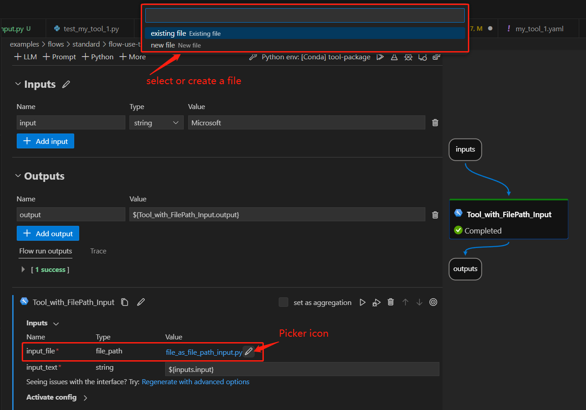

# Using File Path as Tool Input

Users sometimes need to reference local files within a tool to implement specific logic. To simplify this, we've introduced the `FilePath` input type. This input type enables users to either select an existing file or create a new one, then pass it to a tool, allowing the tool to access the file's content.

In this guide, we will provide a detailed walkthrough on how to use `FilePath` as a tool input. We will also demostrate the user experience when utilizing this type of tool within a flow.

## Prerequisites

As file path is currently in its preview phase, it is necessary for you to install the test version of the PromptFlow package:

    ```bash
    pip install "promptflow==0.1.0b8.dev2" --extra-index-url https://azuremlsdktestpypi.azureedge.net/promptflow
    ```

## How to create a tool with file path input

Here we use [an existing tool package](https://github.com/microsoft/promptflow/tree/main/examples/tools/tool-package-quickstart/my_tool_package) as an example. If you want to create your owner tool, please refer to [create and use tool package](https://github.com/microsoft/promptflow/blob/main/docs/how-to-guides/develop-a-tool/create-and-use-tool-package.md#create-custom-tool-package).

1. Add a `FilePath` input for your tool, like in [this example](../../../examples/tools/tool-package-quickstart/my_tool_package/tools/tool_with_file_path_input.py).

    ```python
    import importlib
    from pathlib import Path
    from promptflow import tool
    # 1. import the FilePath type
    from promptflow.contracts.types import FilePath

    # 2. add a FilePath input for your tool method
    @tool
    def my_tool(input_file: FilePath, input_text: str) -> str:
        # 3. customise your own code to handle and use the input_file here
        new_module = importlib.import_module(Path(input_file).stem)
    
        return new_module.hello(input_text)   
    ```

2. `FilePath` input format in a tool YAML, like in [this example](../../../examples/tools/tool-package-quickstart/my_tool_package/yamls/tool_with_file_path_input.yaml).

   ```yaml
    my_tool_package.tools.tool_with_file_path_input.my_tool:
      function: my_tool
        inputs:
          # yaml format for FilePath input
          input_file:
            type:
            - file_path
          input_text:
            type:
            - string
      module: my_tool_package.tools.tool_with_file_path_input
      name: Tool with FilePath Input
      description: This is a tool to demonstrate the usage of FilePath input
      type: python   
    ```

    > [!Note] tool yaml file can be generated using a python script. For further details, please refer to [create custom tool package](https://github.com/microsoft/promptflow/blob/main/docs/how-to-guides/develop-a-tool/create-and-use-tool-package.md#create-custom-tool-package).


## Use tool with a file path input in VS Code extension
Follow steps to [build and install your tool package](https://github.com/microsoft/promptflow/blob/main/docs/how-to-guides/develop-a-tool/create-and-use-tool-package.md#build-and-share-the-tool-package) and [use your tool from VS Code extension](https://github.com/microsoft/promptflow/blob/main/docs/how-to-guides/develop-a-tool/create-and-use-tool-package.md#use-your-tool-from-vscode-extension).

Here we use an existing flow to demonstrate the experience, open [this flow](../../../examples/flows/standard/filepath-input-tool-showcase/flow.dag.yaml) in VS Code extension:
- There is a node named "Tool_with_FilePath_Input" with a `file_path` type input called `input_file`.
- Click the picker icon to open the UI for selecting an existing file or creating a new file to use as input.

   

## FAQ

### What are some practical use cases for this feature?
The `FilePath` input enables several useful workflows:

1. **Dynamically load modules** - As shown in the demo, you can load a Python module from a specific script file selected by the user. This allows flexible custom logic.
2. **Load arbitrary data files** - The tool can load data from files like .csv, .txt, .json, etc. This provides an easy way to inject external data into a tool.

So in summary, `FilePath` input gives tools flexible access to external files provided by users at runtime. This unlocks many useful scenarios like the ones above.
