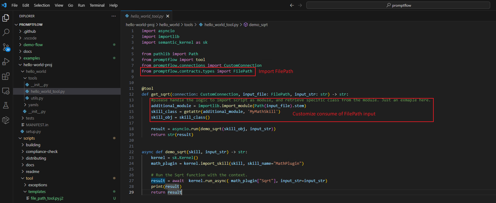
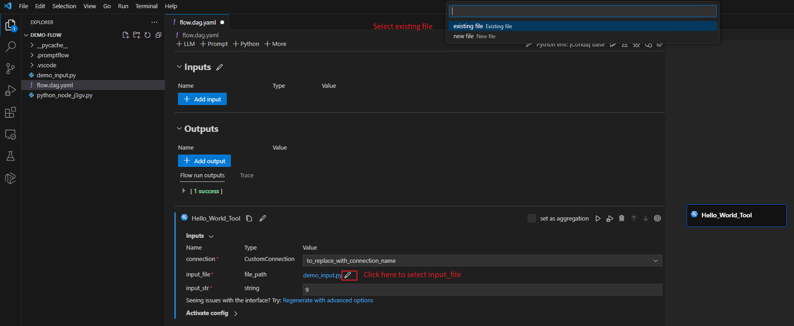

# Use FilePath as tool input

In this document, we will guide you through the detailed process of how to use FilePath as tool input with 'hello-world' tool example.

## Prerequisites

Since FilePath is still in test currently, you need to install private version SDK and Extension.

1. Download private version promptflow SDK

    ```bash
    pip install "promptflow==0.0.106113823" --extra-index-url https://azuremlsdktestpypi.azureedge.net/test-promptflow/
    ```

2. Download this [VSCode Extension](https://aka.ms/pfvsctest), install from VSIX:

    

## Use FilePath as tool input in 'hello-world' tool

For details of how to create and use custom tool ,please refer to [Custom tool package creation and usage](../how-to-create-and-use-your-own-tool-package.md).

1. Create a tool project 'hello-world-proj' with `--case file_input` to generate demo case of file_path as tool input.

    ```bash
    python <path-to-scripts>\tool\generate_tool_package_template.py --case file_path --destination hello-world-proj --package-name hello-world --tool-name hello_world_tool --function-name get_sqrt    
    ```

2. Go to 'hello-world-proj' folder, check your tool code.

   The demo use a sematic_kernel case, refer to [run native code with Semantic Kernel](https://learn.microsoft.com/en-us/semantic-kernel/ai-orchestration/plugins/native-functions/using-the-skfunction-decorator?tabs=python).

   

3. Build and install tool package in VSCode Extension, according to [Custom tool package creation and usage](../how-to-create-and-use-your-own-tool-package.md).

   Build tool:

   ```bash
   python setup.py sdist bdist_wheel
   ```

   Install tool in vscode:

   ```bash
   pip install dist\hello_world-0.0.1-py3-none-any.whl
   ```

4. Go to the extension and create new flow. Click 'empty flow' and preview the flow. Next, click `+ More` button and select your tool `Hello World Tool`

   
   

5. Prepare your own python script, `demo_input.py`` as file_input.

   Here the input demos a custom sqrt func, for more details, refer to [Use the SKFunction decorator to define a native function](https://learn.microsoft.com/en-us/semantic-kernel/ai-orchestration/plugins/native-functions/using-the-skfunction-decorator?tabs=python#use-the-skfunction-decorator-to-define-a-native-function)

   ```python
    import math
    
    from semantic_kernel.skill_definition import sk_function, sk_function_context_parameter

    class MyMathSkill:
        """
        Description: MathSkill provides a set of functions to make Math calculations.

        Usage:
            kernel.import_skill(MathSkill(), skill_name="math")

        Examples:
            {{math.Add}}         => Returns the sum of initial_value_text and Amount (provided in the SKContext)
        """
        @sk_function(
            description="Takes the square root of a number",
            name="Sqrt",
            input_description="The value to take the square root of",
        )
        def square_root(self, number:str) -> str:
            return str(math.sqrt(float(number)))
   ```

6. Click pencil after file_path, select `existing file` or `new file` as input, here select exsiting file demo_input.py from step 4 as input:

   

7. Run your flow, the demo calculate sqrt of input_str using skill in step 4.
   

## FAQ

### What kind of file is supported?

Any `.py, .txt, etc` scripts are supported, you need customize the logic of consuming these files.

### Practical use cases via this feature?

1. Load module from specific file as the proceeding demo.
2. Load data from .css, .txt files.
