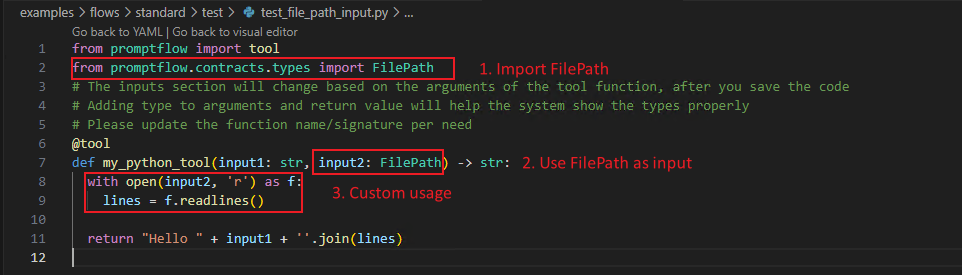
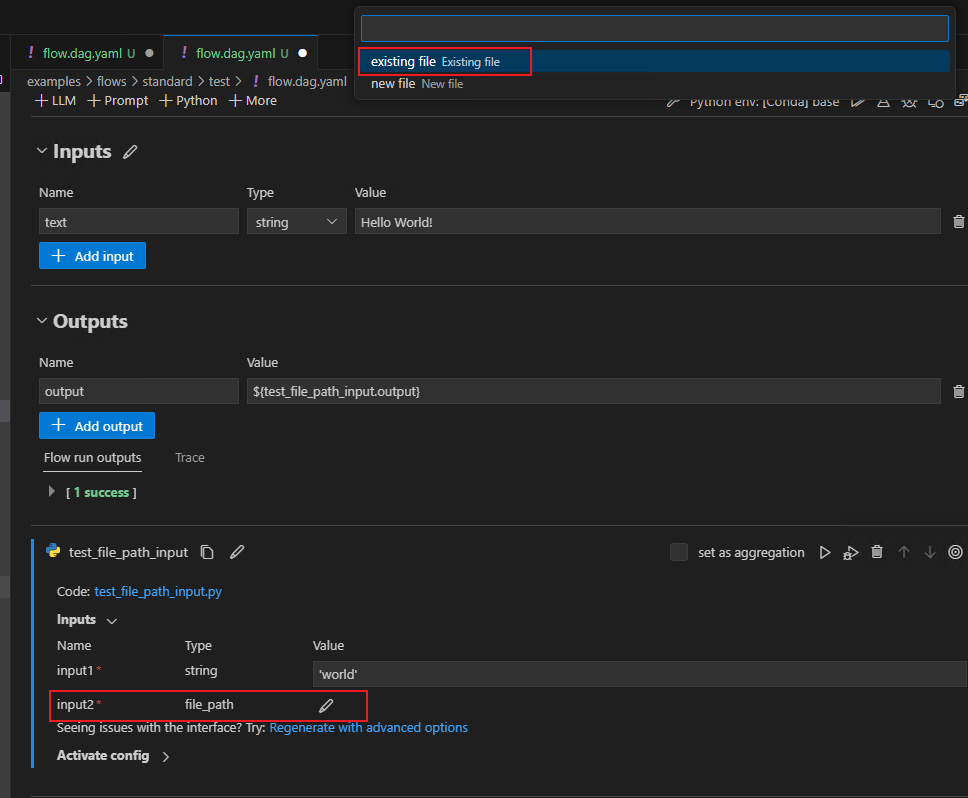
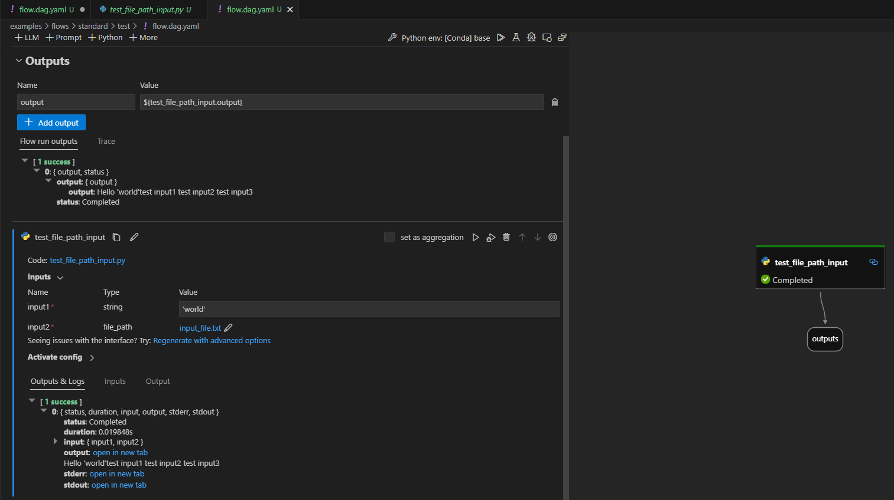
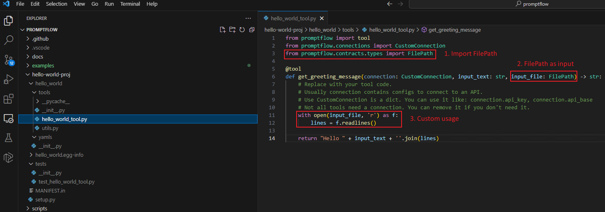
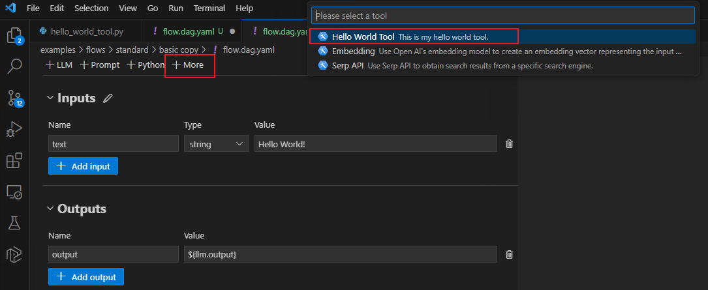
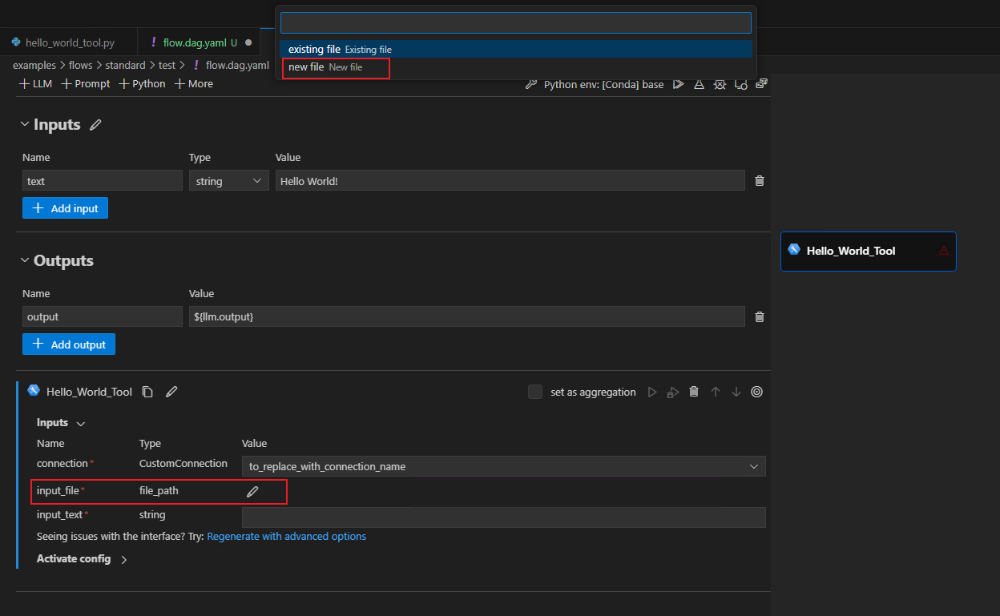
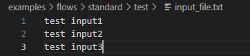
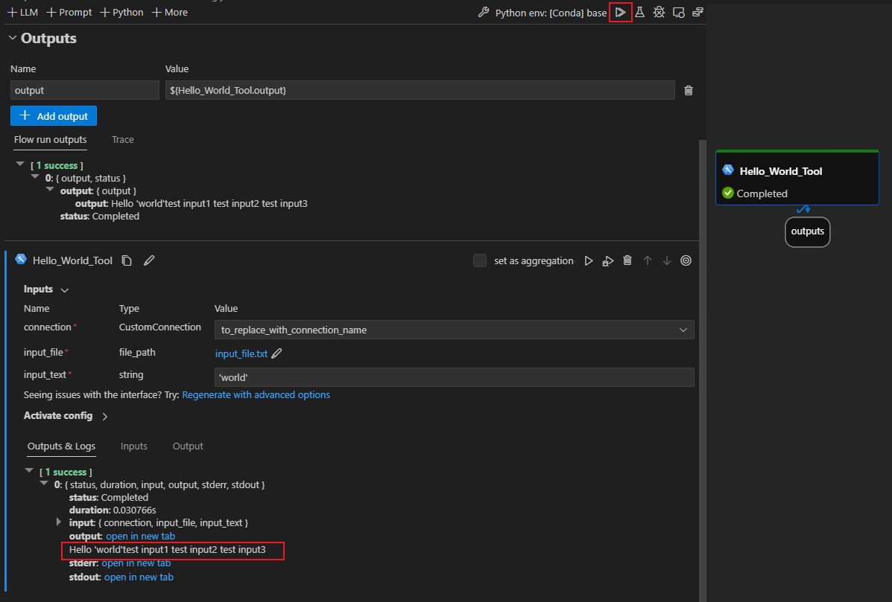

# Use FilePath as input in python tool and custom tool

In this document, we will guide you through the detailed process of how to use FilePath as input in python tool or custom tool.

## Prerequisites

Since FilePath is still in test currently, you need to install private version SDK and Extension.

1. Download promptflow SDK from [promptflow-0.0.106101544-py3-none-any.whl](https://msdata.visualstudio.com/_apis/resources/Containers/212274629/promptflow?itemPath=promptflow%2Fpromptflow-0.0.106101544-py3-none-any.whl), install locally:
    ```
    pip install <path-to-promptflow-0.0.106101544-py3-none-any.whl>
    ```

2. Download this [VSCode Extension](https://aka.ms/pfvsctest), install from VSIX: 
    

## Use FilePath in python tool

1. Go to the extension and open one flow folder. Click 'flow.dag.yaml' and preview the flow. Next, click `+ Python`.
2. Edit python tool code with:
   1. Import FilePath
   2. Use FilePath as Input
   3. Consume Input

   
3. Save python code, go back to visual editor, click pencil after file_path, select `existing file`: 
   
4. Run your flow: 
   

## Use FilePath in custom tool

For how to create and use custom tool ,please refer to [Custom tool package creation and usage](../how-to-create-and-use-your-own-tool-package.md).

1. Create a tool project `hello world-proj`.
    ```
    python D:\proj\github\promptflow\scripts\tool\generate_tool_package_template.py --destination hello-world-proj --package-name hello-world --tool-name hello_world_tool --function-name get_greeting_message
    ```
2. Before generate metadata of the tool, modify your tool code with:
   1. Import FilePath
   2. Use FilePath as Input
   3. Consume Input

   
3. Generate tool metadata, build and install tool package in VSCode Extension
4. Go to the extension and open one flow folder. Click 'flow.dag.yaml' and preview the flow. Next, click `+ More` button and select your tool `Hello World Tool` 
   
5. Click pencil after file_path, select `existing file` or `new file` as input, here select new file 
   
   input_file.txt as input:

   
6. Run your flow: 
   