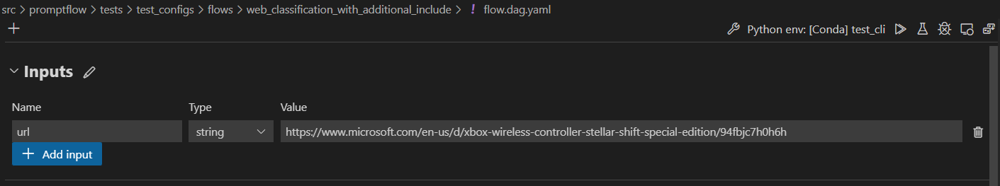
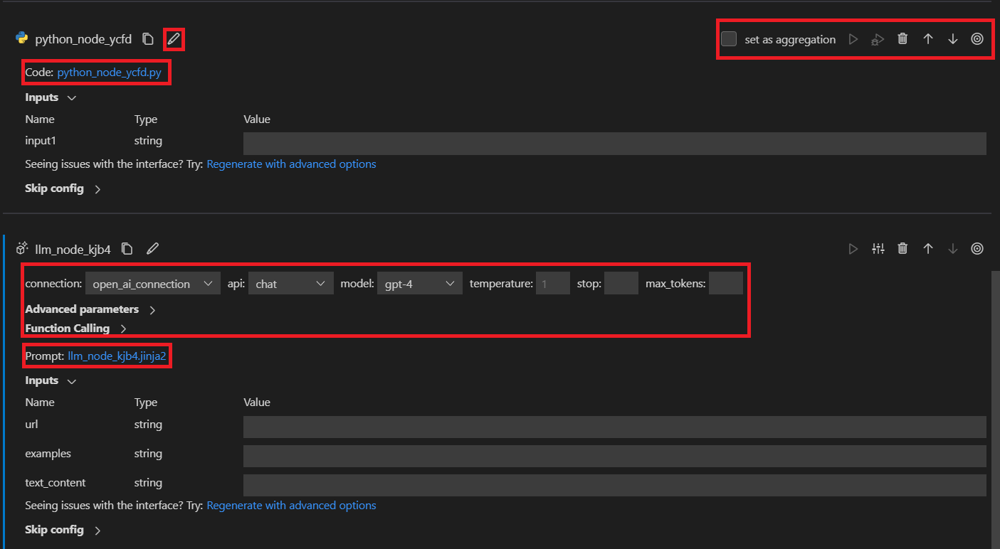

# Develop standard flow

:::{admonition} Experimental feature
This is an experimental feature, and may change at any time. Learn [more](faq.md#stable-vs-experimental).
:::

From this document, customer can learn how to develop the standard flow by writing a flow yaml from scratch.

## Flow input data
The flow input data is the data that you want to process in your flow. 
::::{tab-set}
:::{tab-item} CLI
:sync: CLI
You can add a flow input in inputs section of flow yaml.
```yaml
inputs:
  url:
    type: string
    default: https://www.microsoft.com/en-us/d/xbox-wireless-controller-stellar-shift-special-edition/94fbjc7h0h6h
```
:::

:::{tab-item} VS Code Extension
:sync: VS Code Extension
When unfolding Inputs section in the authoring page, you can set and view your flow inputs, including input schema (name and type), 
and the input value.


:::

::::
For Web Classification sample as shown the screenshot above, the flow input is a url of string type. We also support 
the input type of int, bool, double, list and object.

## Develop the flow using different tools
In one flow, you can consume different kinds of tools. We now support built-in tool like LLM, Python and Prompt and 
third-party tool like Serp API, Content Safety, Vector Search, etc.

### Add tool as your need
::::{tab-set}
:::{tab-item} CLI
:sync: CLI
You can add a tool node in nodes section of flow yaml. For example, yaml below shows how to add a Python tool node in the flow.

```yaml
nodes:
- name: fetch_text_content_from_url
  type: python
  source:
    type: code
    path: fetch_text_content_from_url.py
  inputs:
    url: ${inputs.url}
```
:::

:::{tab-item} VS Code Extension
:sync: VS Code Extension
By selecting the tool card on the very top, you'll add a new tool node to flow.


:::

::::

### Edit tool
::::{tab-set}
:::{tab-item} CLI
:sync: CLI
You can edit the tool by simply open the source file and edit it. For example, we show simple Python tool code and LLM tool prompt below.

```python
from promptflow import tool

# The inputs section will change based on the arguments of the tool function, after you save the code
# Adding type to arguments and return value will help the system show the types properly
# Please update the function name/signature per need
@tool
def my_python_tool(input1: str) -> str:
  return 'hello ' + input1
```

```jinja
Please summarize the following text in one paragraph. 100 words.
Do not add any information that is not in the text.
Text: {{text}}
Summary:
```
:::

:::{tab-item} VS Code Extension
:sync: VS Code Extension
When a new tool node is added to flow, it will be appended at the bottom of flatten view with a random name by default. 
At the top of each tool node card, there's a toolbar for adjusting the tool node. You can move it up or down, you can delete or rename it too.
For a python tool node, you can edit the tool code by clicking the code file. For a LLM tool node, you can edit the 
tool prompt by clicking the prompt file and adjust input parameters like connection, api and etc.

:::

::::

### Create connection
Please refer to the [Create necessary connections](./quick-start.md#create-necessary-connections) for details.

## Chain your flow - link nodes together
Before linking nodes together, you need to define and expose an interface.

### Define LLM node interface
LLM node has only one output, the completion given by LLM provider.

As for inputs, we offer a templating strategy that can help you create parametric prompts that accept different input 
values. Instead of fixed text, enclose your input name in `{{}}`, so it can be replaced on the fly. We use Jinja as our 
templating language. For example:

```jinja
Your task is to classify a given url into one of the following types:
Movie, App, Academic, Channel, Profile, PDF or None based on the text content information.
The classification will be based on the url, the webpage text content summary, or both.

Here are a few examples:

URL: {{ex.url}}
Text content: {{ex.text_content}}
OUTPUT:
{"category": "{{ex.category}}", "evidence": "{{ex.evidence}}"}



For a given URL : {{url}}, and text content: {{text_content}}.
Classify above url to complete the category and indicate evidence.
OUTPUT:
```

### Define Python node interface
Python node might have multiple inputs and outputs. Define inputs and outputs as shown below. 
If you have multiple outputs, remember to make it a dictionary so that the downstream node can call each key separately.
For example:

```python
import json
from promptflow import tool

@tool
def convert_to_dict(input_str: str, input_str2: str) -> dict:
    try:
        print(input_str2)
        return json.loads(input_str)
    except Exception as e:
        print("input is not valid, error: {}".format(e))
        return {"category": "None", "evidence": "None"}
```

### Link nodes together
After the interface is defined, you can use:

- ${inputs.key} to link with flow input.
- ${upstream_node_name.output} to link with single-output upstream node.
- ${upstream_node_name.output.key} to link with multi-output upstream node.

Below are common scenarios for linking nodes together.

### Scenario 1 - Link LLM node with flow input and single-output upstream node
After you add a new LLM node and edit the prompt file like [Define LLM node interface](#define-llm-node-interface), 
three inputs called `url`, `examples` and `text_content` are created in inputs section.

::::{tab-set}
:::{tab-item} CLI
:sync: CLI
You can link the LLM node input with flow input by `${inputs.url}`. 
And you can link `examples` to the upstream `prepare_examples` node and `text_content` to the `summarize_text_content` node 
by `${prepare_examples.output}` and `${summarize_text_content.output}`. 
```yaml
- name: classify_with_llm
  type: llm
  source:
    type: code
    path: classify_with_llm.jinja2
  inputs:
    deployment_name: text-davinci-003
    suffix: ""
    max_tokens: 128
    temperature: 0.2
    top_p: 1
    echo: false
    presence_penalty: 0
    frequency_penalty: 0
    best_of: 1
    url: ${inputs.url}    # Link with flow input
    examples: ${prepare_examples.output} # Link LLM node with single-output upstream node
    text_content: ${summarize_text_content.output} # Link LLM node with single-output upstream node
```
:::

:::{tab-item} VS Code Extension
:sync: VS Code Extension
In the value drop-down, select `${inputs.url}`, `${prepare_examples.output}` and `${summarize_text_content.output}`, then 
you'll see in the graph view that the newly created LLM node is linked to the flow input, upstream `prepare_examples` and `summarize_text_content` node. 


:::

::::
When running the flow, the `url` input of the node will be replaced by flow input on the fly, and the `examples` and 
`text_content` input of the node will be replaced by `prepare_examples` and `summarize_text_content` node output on the fly.

### Scenario 2 - Link LLM node with multi-output upstream node
Suppose we want to link the newly created LLM node with `covert_to_dict` Python node whose output is a dictionary with two keys: `category` and `evidence`.
::::{tab-set}
:::{tab-item} CLI
:sync: CLI
You can link `examples` to the `evidence` output of upstream `covert_to_dict` node by `${convert_to_dict.output.evidence}` like below: 
```yaml
- name: classify_with_llm
  type: llm
  source:
    type: code
    path: classify_with_llm.jinja2
  inputs:
    deployment_name: text-davinci-003
    suffix: ""
    max_tokens: 128
    temperature: 0.2
    top_p: 1
    echo: false
    presence_penalty: 0
    frequency_penalty: 0
    best_of: 1
    text_content: ${convert_to_dict.output.evidence} # Link LLM node with multi-output upstream node
```
:::

:::{tab-item} VS Code Extension
:sync: VS Code Extension
In the value drop-down, select `${convert_to_dict.output}`, then manually append `evidence`, then you'll see in the graph 
view that the newly created LLM node is linked to the upstream `convert_to_dict node`.


:::
::::
When running the flow, the `text_content` input of the node will be replaced by `evidence` value from `convert_to_dict node` output dictionary on the fly.

### Scenario 3 - Link Python node with upstream node/flow input
After you add a new Python node and edit the code file like [Define Python node interface](#define-python-node-interface)], 
two inputs called `input_str` and `input_str2` are created in inputs section. The linkage is the same as LLM node, 
using `${flow.input_name}` to link with flow input or `${upstream_node_name.output}` to link with upstream node.

::::{tab-set}
:::{tab-item} CLI
:sync: CLI
```yaml
- name: prepare_examples
  type: python
  source:
    type: code
    path: prepare_examples.py
  inputs:
    input_str: ${inputs.url}  # Link Python node with flow input
    input_str2: ${fetch_text_content_from_url.output} # Link Python node with single-output upstream node
```
:::

:::{tab-item} VS Code Extension
:sync: VS Code Extension


:::

::::
When running the flow, the `input_str` input of the node will be replaced by flow input on the fly and the `input_str2` 
input of the node will be replaced by `fetch_text_content_from_url` node output dictionary on the fly.

## Set and check flow output
When the flow is complicated, instead of checking outputs on each node, you can set flow output and check outputs of 
multiple nodes in one place. Moreover, flow output helps:

- Check bulk test results in one single table.
- Define evaluation interface mapping.
- Set deployment response schema.

::::{tab-set}
:::{tab-item} CLI
:sync: CLI
You can add flow outputs in outputs section of flow yaml . The linkage is the same as LLM node, 
using `${convert_to_dict.output.category}` to link `category` flow output with with `category` value of upstream node 
`convert_to_dict`.

```yaml
outputs:
  category:
    type: string
    reference: ${convert_to_dict.output.category}
  evidence:
    type: string
    reference: ${convert_to_dict.output.evidence}
```
:::

:::{tab-item} VS Code Extension
:sync: VS Code Extension
First define flow output schema, then select in drop-down the node whose output you want to set as flow output. 
Since `convert_to_dict` has a dictionary output with two keys: `category` and `evidence`, you need to manually append 
`category` and `evidence` to each. Then run flow, after a while, you can check flow output in a table.


:::

::::

## Next steps

- [Initialize and test a flow](./init-and-test-a-flow.md)