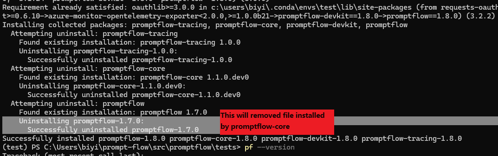
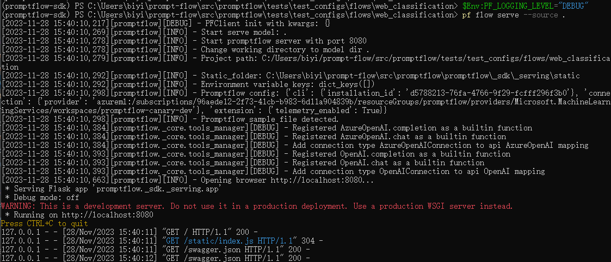
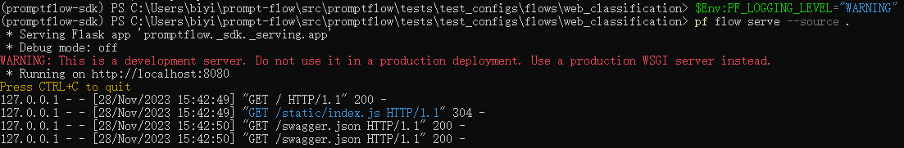

# Frequency asked questions (FAQ)

## General ##

### Stable vs experimental

Prompt flow provides both stable and experimental features in the same SDK.

|Feature status | Description |
|----------------|----------------|
Stable features	| **Production ready** <br/><br/> These features are recommended for most use cases and production environments. They are updated less frequently then experimental features.|
Experimental features | **Developmental**  <br/><br/> These features are newly developed capabilities & updates that may not be ready or fully tested for production usage. While the features are typically functional, they can include some breaking changes. Experimental features are used to iron out SDK breaking bugs, and will only receive updates for the duration of the testing period. Experimental features are also referred to as features that are in **preview**. <br/> As the name indicates, the experimental (preview) features are for experimenting and is **not considered bug free or stable**. For this reason, we only recommend experimental features to advanced users who wish to try out early versions of capabilities and updates, and intend to participate in the reporting of bugs and glitches.


### OpenAI 1.x support
Please use the following command to upgrade promptflow for openai 1.x support:
```
pip install promptflow>=1.1.0
pip install promptflow-tools>=1.0.0
```
Note that the command above will upgrade your openai package a version later than 1.0.0,
which may introduce breaking changes to custom tool code.

Reach [OpenAI migration guide](https://github.com/openai/openai-python/discussions/742) for more details.

### Promptflow 1.8.0 upgrade guide
Before upgrading to promptflow version 1.8.0 or later, it's important to first uninstall any existing installations of promptflow and its sub-packages.
This ensures a clean installation of the new version without any conflicts.
```bash
pip uninstall -y promptflow promptflow-core promptflow-devkit promptflow-azure # uninstall promptflow and its sub-packages
pip install 'promptflow>=1.8.0' # install promptflow version 1.8.0 or later
```

Reason for 'pip install promptflow>=1.8.0' or 'pf upgrade' directly not working:

`promptflow` package has been split into multiple packages. When installing `promptflow`, you will get the following packages:
  - `promptflow`:
    - `promptflow-tracing`: Tracing capability for promptflow.
    - `promptflow-core`: Core functionality to run flow.
    - `promptflow-devkit`: Development kit for promptflow.
    - `promptflow-azure`: Azure extra requires(`promptflow[azure]`) for promptflow to integrate with Azure.

When upgrading promptflow from an existing version to promptflow 1.8.0, pip will remove the old promptflow after installing promptflow subpackages,
which caused subpackage files got wrongly removed.



## Troubleshooting ##

### Connection creation failed with StoreConnectionEncryptionKeyError

```
Connection creation failed with StoreConnectionEncryptionKeyError: System keyring backend service not found in your operating system. See https://pypi.org/project/keyring/ to install requirement for different operating system, or 'pip install keyrings.alt' to use the third-party backend.
```

This error raised due to keyring can't find an available backend to store keys.
For example [macOS Keychain](https://en.wikipedia.org/wiki/Keychain_%28software%29) and [Windows Credential Locker](https://learn.microsoft.com/en-us/windows/uwp/security/credential-locker)
are valid keyring backends.

To resolve this issue, install the third-party keyring backend or write your own keyring backend, for example:
`pip install keyrings.alt`

For more detail about keyring third-party backend, please refer to 'Third-Party Backends' in [keyring](https://pypi.org/project/keyring/).

### Pf visualize show error: "tcgetpgrp failed: Not a tty"

If you are using WSL, this is a known issue for `webbrowser` under WSL; see [this issue](https://github.com/python/cpython/issues/89752) for more information. Please try to upgrade your WSL to 22.04 or later, this issue should be resolved.

If you are still facing this issue with WSL 22.04 or later, or you are not even using WSL, please open an issue to us.

### Installed tool not appearing in VSCode Extension tool list

After installing a tool package via `pip install [tool-package-name]`, the new tool may not immediately appear in the tool list within the VSCode Extension, as shown below:


This is often due to outdated cache. To refresh the tool list and make newly installed tools visible:

1. Open the VSCode Extension window.

2. Bring up the command palette by pressing "Ctrl+Shift+P".

3. Type and select the "Developer: Reload Webviews" command.

4. Wait a moment for the tool list refreshing.

Reloading clears the previous cache and populates the tool list with any newly installed tools. So that the missing tools are now visible.


### Set logging level

Promptflow uses `logging` module to log messages. You can set logging level via environment variable `PF_LOGGING_LEVEL`, valid values includes `CRITICAL`, `ERROR`, `WARNING`, `INFO`, `DEBUG`, default to `INFO`.
Below is the serving logs after setting `PF_LOGGING_LEVEL` to `DEBUG`:



Compare to the serving logs with `WARNING` level:




### Set logging format

Promptflow uses the following log format and datetime format by default:

- Log format: `%(asctime)s %(process)7d %(name)-18s %(levelname)-8s %(message)s`
- Datetime format: `%Y-%m-%d %H:%M:%S %z`

You can customize the log format with the `PF_LOG_FORMAT` environment variable, and the datetime format with `PF_LOG_DATETIME_FORMAT`. These variables can also be defined in a flow yaml file or set directly in the environment.


### Set environment variables

Currently, promptflow supports the following environment variables:

**PF_WORKER_COUNT**

Effective for batch run only, count of parallel workers in batch run execution.

The default value is 4 (was 16 when promptflow<1.4.0)

Please take the following points into consideration when changing it:

1. The concurrency should not exceed the total data rows count. Otherwise, the execution may slow down due to additional time spent on process startup and shutdown.

2. High parallelism may cause the underlying API call to reach the rate limit of your LLM endpoint. In which case you can decrease the `PF_WORKER_COUNT` or increase the rate limit. Please refer to [this doc](https://learn.microsoft.com/en-us/azure/ai-services/openai/how-to/quota) on quota management. Then you can refer to this expression to set up the concurrency.

```
PF_WORKER_COUNT <= TPM * duration_seconds / token_count / 60
```
TPM: token per minute, capacity rate limit of your LLM endpoint

duration_seconds: single flow run duration in seconds

token_count: single flow run token count


For example, if your endpoint TPM (token per minute) is 50K, the single flow run takes 10k tokens and runs for 30s, pls do not set up PF_WORKER_COUNT bigger than 2. This is a rough estimation. Please also consider collboaration (teammates use the same endpoint at the same time) and tokens consumed in deployed inference endpoints, playground and other cases which might send request to your LLM endpoints.

**PF_BATCH_METHOD**

Valid for batch run only. Optional values: 'spawn', 'fork'.

**spawn**

1. The child processes will not inherit resources of the parent process, therefore, each process needs to reinitialize the resources required for the flow, which may use more system memory.

2. Starting a process is slow because it will take some time to initialize the necessary resources.

**fork**

1. Use the copy-on-write mechanism, the child processes will inherit all the resources of the parent process, thereby using less system memory.

2. The process starts faster as it doesn't need to reinitialize resources.

Note: Windows only supports spawn, Linux and macOS support both spawn and fork.


#### How to configure environment variables

1. Configure environment variables in ```flow.dag.yaml```. Example:
```
    inputs: []
    outputs: []
    nodes: []
    environment_variables:
      PF_WORKER_COUNT: 2
      PF_BATCH_METHOD: "spawn"
      MY_CUSTOM_SETTING: my_custom_value
```

2. Specify environment variables when submitting runs.

::::{tab-set}
:::{tab-item} CLI
:sync: CLI

Use this parameter: ```--environment-variable``` to specify environment variables.
Example: ```--environment-variable PF_WORKER_COUNT="2" PF_BATCH_METHOD="spawn"```.

:::

:::{tab-item} SDK
:sync: SDK

Specify environment variables when creating run. Example:

``` python
    pf = PFClient(
        credential=credential,
        subscription_id="<SUBSCRIPTION_ID>",
        resource_group_name="<RESOURCE_GROUP>",
        workspace_name="<AML_WORKSPACE_NAME>",
    )

    flow = "web-classification"
    data = "web-classification/data.jsonl"

    environment_variables = {"PF_WORKER_COUNT": "2", "PF_BATCH_METHOD": "spawn"}

    # create run
    base_run = pf.run(
        flow=flow,
        data=data,
        environment_variables=environment_variables,
    )
```

:::

:::{tab-item} VS Code Extension
:sync: VS Code Extension

VSCode Extension supports specifying environment variables only when submitting batch runs.
Specify environment variables in ```batch_run_create.yaml```. Example:

``` yaml
    name: flow_name
    display_name: display_name
    flow: flow_folder
    data: data_file
    column_mapping:
        customer_info: <Please select a data input>
        history: <Please select a data input>
    environment_variables:
        PF_WORKER_COUNT: "2"
        PF_BATCH_METHOD: "spawn"
```

:::

::::

#### Priority
The environment variables specified when submitting runs always takes precedence over the environment variables in the flow.dag.yaml file.
