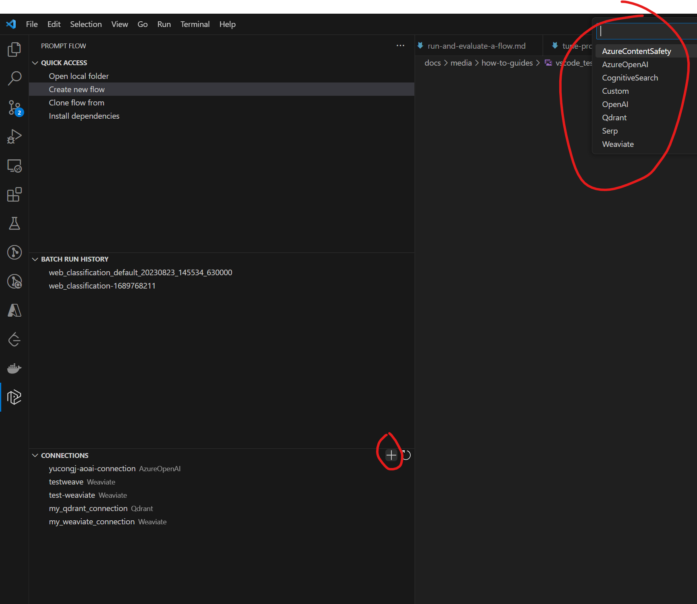
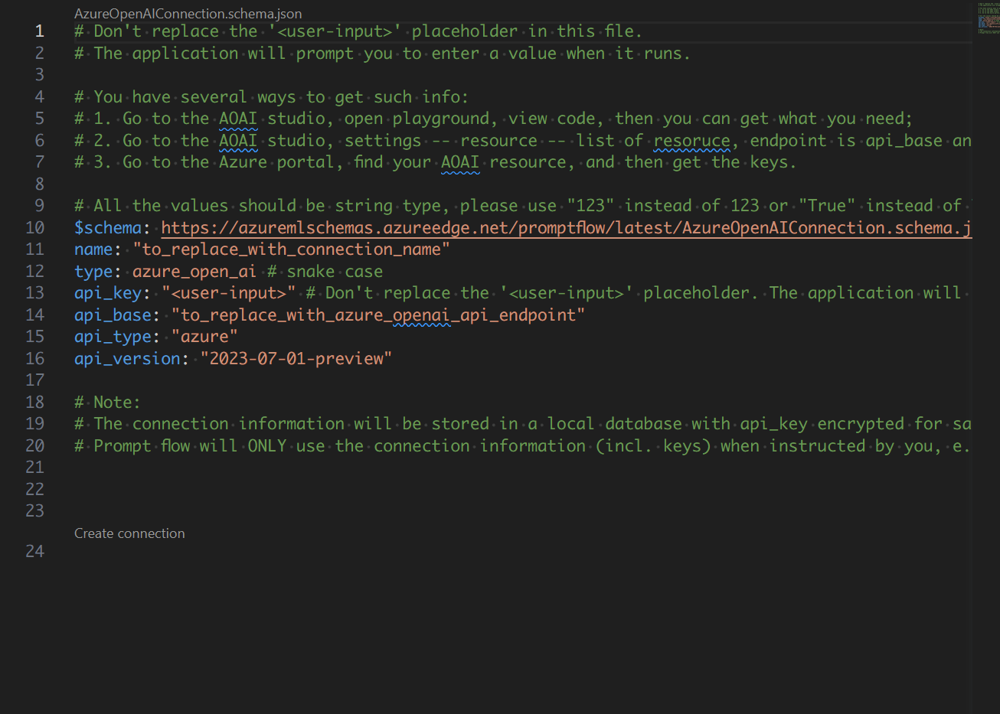

# Manage connections

:::{admonition} Experimental feature
This is an experimental feature, and may change at any time. Learn [more](faq.md#stable-vs-experimental).
:::

[Connection](../../concepts/concept-connections.md) helps securely store and manage secret keys or other sensitive credentials required for interacting with LLM (Large Language Models) and other external tools, for example, Azure Content Safety.

:::{note}
To use azureml workspace connection locally, refer to [this guide](../how-to-guides/set-global-configs.md#connectionprovider).
:::

## Connection types
There are multiple types of connections supported in promptflow, which can be simply categorized into **strong type connection** and **custom connection**. The strong type connection includes AzureOpenAIConnection, OpenAIConnection, etc. The custom connection is a generic connection type that can be used to store custom defined credentials.

We are going to use AzureOpenAIConnection as an example for strong type connection, and CustomConnection to show how to manage connections.

## Create a connection

:::{note}
If you are using `WSL` or other OS without default keyring storage backend, you may encounter `StoreConnectionEncryptionKeyError`, please refer to [FAQ](./faq.md#connection-creation-failed-with-storeconnectionencryptionkeyerror) for the solutions.
:::

::::{tab-set}
:::{tab-item} CLI
:sync: CLI
Each of the strong type connection has a corresponding yaml schema, the example below shows the AzureOpenAIConnection yaml:
```yaml
$schema: https://azuremlschemas.azureedge.net/promptflow/latest/AzureOpenAIConnection.schema.json
name: azure_open_ai_connection
type: azure_open_ai
api_key: "<to-be-replaced>"
api_base: "https://<name>.openai.azure.com/"
api_type: "azure"
api_version: "2023-03-15-preview"
```
The custom connection yaml will have two dict fields for secrets and configs, the example below shows the CustomConnection yaml:
```yaml
$schema: https://azuremlschemas.azureedge.net/promptflow/latest/CustomConnection.schema.json
name: custom_connection
type: custom
configs:
  endpoint: "<your-endpoint>"
  other_config: "other_value"
secrets:  # required
  my_key: "<your-api-key>"
```
After preparing the yaml file, use the CLI command below to create them:
```bash
# Override keys with --set to avoid yaml file changes
pf connection create -f <path-to-azure-open-ai-connection> --set api_key=<your-api-key>
# Create the custom connection
pf connection create -f <path-to-custom-connection> --set configs.endpoint=<endpoint> secrets.my_key=<your-api-key>
```
The expected result is as follows if the connection created successfully.


:::


:::{tab-item} SDK
:sync: SDK
Using SDK, each connection type has a corresponding class to create a connection. The following code snippet shows how to import the required class and create the connection:

```python
from promptflow import PFClient
from promptflow.entities import AzureOpenAIConnection, CustomConnection

# Get a pf client to manage connections
pf = PFClient()

# Initialize an AzureOpenAIConnection object
connection = AzureOpenAIConnection(
    name="my_azure_open_ai_connection", 
    api_key="<your-api-key>", 
    api_base="<your-endpoint>"
    api_version="2023-03-15-preview"
)

# Create the connection, note that api_key will be scrubbed in the returned result
result = pf.connections.create_or_update(connection)
print(result)

# Initialize a custom connection object
connection = CustomConnection(
    name="my_custom_connection", 
    # Secrets is a required field for custom connection
    secrets={"my_key": "<your-api-key>"},
    configs={"endpoint": "<your-endpoint>", "other_config": "other_value"}
)

# Create the connection, note that all secret values will be scrubbed in the returned result
result = pf.connections.create_or_update(connection)
print(result)
```
:::

:::{tab-item} VS Code Extension
:sync: VSC

On the VS Code primary sidebar > prompt flow pane. You can find the connections pane to manage your local connections. Click the "+" icon on the top right of it and follow the popped out instructions to create your new connection.



:::
::::

## Update a connection

::::{tab-set}
:::{tab-item} CLI
:sync: CLI
The commands below show how to update existing connections with new values:
```bash
# Update an azure open ai connection with a new api base
pf connection update -n my_azure_open_ai_connection --set api_base='new_value'
# Update a custom connection
pf connection update -n my_custom_connection --set configs.other_config='new_value'
```
:::


:::{tab-item} SDK
:sync: SDK
The code snippet below shows how to update existing connections with new values:
```python
# Update an azure open ai connection with a new api base
connection = pf.connections.get(name="my_azure_open_ai_connection")
connection.api_base = "new_value"
connection.api_key = "<original-key>"  # secrets are required when updating connection using sdk
result = pf.connections.create_or_update(connection)
print(connection)
# Update a custom connection
connection = pf.connections.get(name="my_custom_connection")
connection.configs["other_config"] = "new_value"
connection.secrets = {"key1": "val1"}  # secrets are required when updating connection using sdk
result = pf.connections.create_or_update(connection)
print(connection)
```
:::

:::{tab-item} VS Code Extension
:sync: VSC

On the VS Code primary sidebar > prompt flow pane. You can find the connections pane to manage your local connections. Right click the item of the connection list to update or delete your connections.

:::
::::

## List connections
::::{tab-set}
:::{tab-item} CLI
:sync: CLI
List connection command will return the connections with json list format, note that all secrets and api keys will be scrubbed:
```bash
pf connection list
```
:::


:::{tab-item} SDK
:sync: SDK
List connection command will return the connections object list, note that all secrets and api keys will be scrubbed:
```python
from promptflow import PFClient
# Get a pf client to manage connections
pf = PFClient()
# List and print connections
connection_list = pf.connections.list()
for connection in connection_list:
    print(connection)
```
:::

:::{tab-item} VS Code Extension
:sync: VSC

:::
::::

## Delete a connection
::::{tab-set}
:::{tab-item} CLI
:sync: CLI
Delete a connection with the following command:
```bash
pf connection delete -n <connection_name>
```
:::


:::{tab-item} SDK
:sync: SDK
Delete a connection with the following code snippet:
```python
from promptflow import PFClient

# Get a pf client to manage connections
pf = PFClient()
# Delete the connection with specific name
client.connections.delete(name="my_custom_connection")
```
:::

:::{tab-item} VS Code Extension
:sync: VSC

On the VS Code primary sidebar > prompt flow pane. You can find the connections pane to manage your local connections. Right click the item of the connection list to update or delete your connections.

:::
::::

## Consume connections on cloud (Azure AI)

For a smooth development flow that transitions from cloud (Azure AI) to local environments, you can directly utilize the connection already established on the cloud by setting the connection provider to "Azure AI connections".

You can set the connection provider using the following steps:

1. Navigate to the connection list in the VS Code primary sidebar.

1. Click on the ... (more options icon) at the top and select the `Set connection provider` option.

    

1. Choose one of the "Azure AI connections" provider types that you wish to use. [Click to learn more about the differences between the connection providers](#manage-connections).

    

    1. If you choose "Azure AI Connections - for current working directory", then you need to specify the cloud resources in the `config.json` file within the project folder.

        
    
    1. If you choose "Azure AI Connections - for this machine", specify the cloud resources in the connection string. You can do this in one of two ways:
    
        (1) Input connection string in the input box above.
    For example `azureml://subscriptions/<your-subscription>/resourceGroups/<your-resourcegroup>/providers/Microsoft.MachineLearningServices/workspaces/<your-workspace>`

        

         (2) Follow the wizard to set up your config step by step.
    
        
  1. Once the connection provider is set, the connection list will automatically refresh, displaying the connections retrieved from the selected provider.


Note:
1. You need to have a project folder open to use the "Azure AI connections - for current working directory" option.
1. Once you change the connection provider, it will stay that way until you change it again and save the new setting.

### Different connection providers

Currently, we support three types of connections:

|Connection provider|Type|Description|Provider Specification|Use Case|
|---|---|---|---|---|
| Local Connections| Local| Enables consume the connections created and locally and stored in local sqlite. |NA| Ideal when connections need to be stored and managed locally.|
|Azure AI connection - For current working directory| Cloud provider| Enables the consumption of connections from a cloud provider, such as a specific Azure Machine Learning workspace or Azure AI project.| Specify the resource ID in a `config.json` file placed in the project folder. <br> [Click here for more details](./set-global-configs.md#connectionprovider)| A dynamic approach for consuming connections from different providers in specific projects. Allows for setting different provider configurations for different flows by updating the `config.json` in the project folder.|
|Azure AI connection - For this machine| Cloud| Enables the consumption of connections from a cloud provider, such as a specific Azure Machine Learning workspace or Azure AI project. | Use a `connection string` to specify a cloud resource as the provider on your local machine. <br> [Click here for more details](./set-global-configs.md#full-azure-machine-learning-workspace-resource-id)|A global provider setting that applies across all working directories on your machine.|


## Next steps
- Reach more detail about [connection concepts](../../concepts/concept-connections.md).
- Try the [connection samples](https://github.com/microsoft/promptflow/blob/main/examples/connections/connection.ipynb).
- Set global configs on [connection.provider](../how-to-guides/set-global-configs.md#connectionprovider).