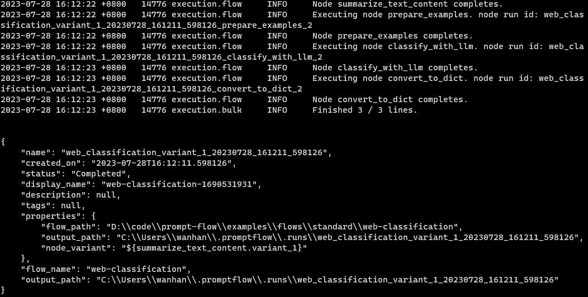
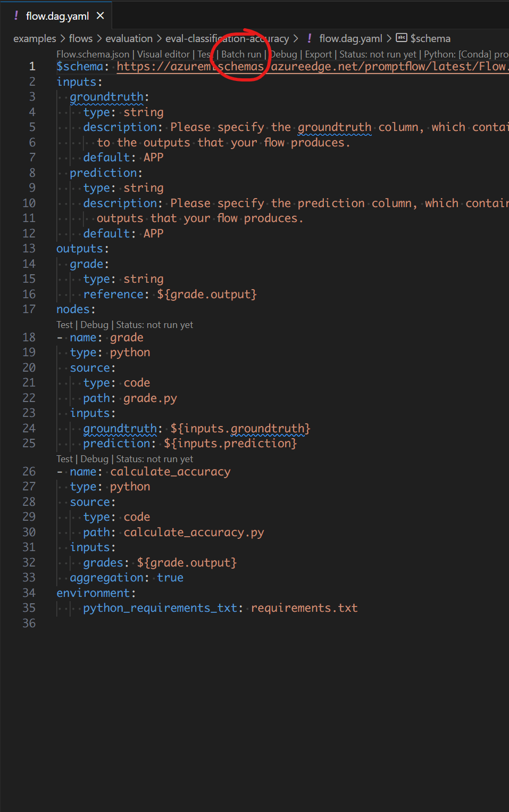
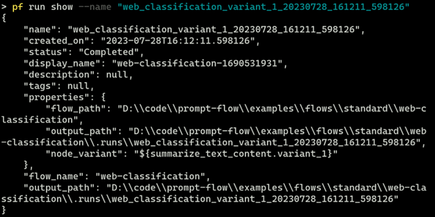
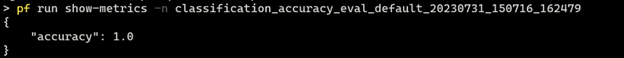
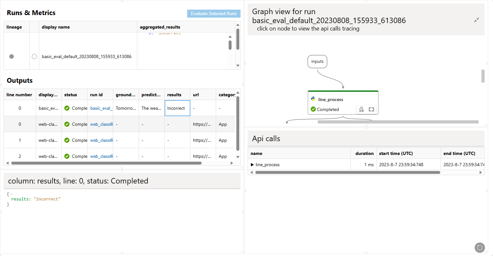

# Manage runs

:::{admonition} Experimental feature
This is an experimental feature, and may change at any time. Learn [more](faq.md#stable-vs-experimental).
:::
You can manage runs by creating a run against bulk inputs or an existing run.
You can:

- [Manage runs](#manage-runs)
  - [Create a run](#create-a-run)
  - [Get a run](#get-a-run)
  - [Show run details](#show-run-details)
  - [Show run metrics](#show-run-metrics)
  - [Visualize a run](#visualize-a-run)
  - [List runs](#list-runs)
  - [Update a run](#update-a-run)
  - [Archive a run](#archive-a-run)
  - [Restore a run](#restore-a-run)

## Create a run

::::{tab-set}
:::{tab-item} CLI
:sync: CLI
To create a run against bulk inputs, you can write the following YAML file.

```yaml
$schema: https://azuremlschemas.azureedge.net/promptflow/latest/Run.schema.json
flow: ../web_classification
data: ../webClassification1.jsonl
column_mapping:
   url: "${data.url}"
variant: ${summarize_text_content.variant_0}
```

To create a run against existing run, you can write the following YAML file.

```yaml
$schema: https://azuremlschemas.azureedge.net/promptflow/latest/Run.schema.json
flow: ../classification_accuracy_evaluation
data: ../webClassification1.jsonl
column_mapping:
   groundtruth: "${data.answer}"
   prediction: "${run.outputs.category}"
run: <existing-flow-run-name>
```

Reference [here](./use-column-mapping.md) for detailed information for column mapping.
You can find additional information about flow yaml schema in [Run YAML Schema](../reference/run-yaml-schema-reference.md).

After preparing the yaml file, use the CLI command below to create them:

```bash
# create the flow run
pf run create -f <path-to-flow-run> 

# create the flow run and stream output
pf run create -f <path-to-flow-run> --stream
```

The expected result is as follows if the run is created successfully.


:::


:::{tab-item} SDK
:sync: SDK
Using SDK, create `Run` object and submit it with `PFClient`. The following code snippet shows how to import the required class and create the run:

```python
from promptflow import PFClient
from promptflow.entities import Run

# Get a pf client to manage runs
pf = PFClient()

# Initialize an Run object
run = Run( 
    flow="<path-to-local-flow>",
    # run flow against local data or existing run, only one of data & run can be specified. 
    data="<path-to-data>",
    run="<existing-run-name>",
    column_mapping={"url": "${data.url}"},
    variant="${summarize_text_content.variant_0}"
)

# Create the run
result = pf.runs.create_or_update(run)
print(result)

```
:::

:::{tab-item} VS Code Extension
:sync: VS Code Extension

You can click on the actions on the top of the default yaml editor or the visual editor for the flow.dag.yaml files to trigger flow batch runs.



:::
::::

## Get a run

::::{tab-set}
:::{tab-item} CLI
:sync: CLI

Get a run in CLI with JSON format.

```bash
pf run show --name <run-name>
```



:::


:::{tab-item} SDK
:sync: SDK
Show run with `PFClient`
```python
from promptflow import PFClient
# Get a pf client to manage runs
pf = PFClient()
# Get and print the run
run = pf.runs.get(name="<run-name>")
print(run)
```
:::

:::{tab-item} VS Code Extension
:sync: VSC

:::
::::

## Show run details

::::{tab-set}
:::{tab-item} CLI
:sync: CLI

Get run details with TABLE format.

```bash
pf run show --name <run-name>
```


:::


:::{tab-item} SDK
:sync: SDK
Show run details with `PFClient`
```python
from promptflow import PFClient
from tabulate import tabulate

# Get a pf client to manage runs
pf = PFClient()
# Get and print the run-details
run_details = pf.runs.get_details(name="<run-name>")
print(tabulate(details.head(max_results), headers="keys", tablefmt="grid"))
```
:::

:::{tab-item} VS Code Extension
:sync: VSC

:::
::::

## Show run metrics

::::{tab-set}
:::{tab-item} CLI
:sync: CLI

Get run metrics with JSON format.

```bash
pf run show-metrics --name <run-name>
```



:::


:::{tab-item} SDK
:sync: SDK
Show run metrics with `PFClient`
```python
from promptflow import PFClient
import json

# Get a pf client to manage runs
pf = PFClient()
# Get and print the run-metrics
run_details = pf.runs.get_metrics(name="<run-name>")
print(json.dumps(metrics, indent=4))
```
:::

::::

## Visualize a run

::::{tab-set}
:::{tab-item} CLI
:sync: CLI

Visualize run in browser.

```bash
pf run visualize --name <run-name>
```

A browser will open and display run outputs.



:::


:::{tab-item} SDK
:sync: SDK
Visualize run with `PFClient`
```python
from promptflow import PFClient

# Get a pf client to manage runs
pf = PFClient()
# Visualize the run
client.runs.visualize(name="<run-name>")
```
:::

:::{tab-item} VS Code Extension
:sync: VSC

On the VS Code primary sidebar > the Prompt flow pane, there is a run list. It will list all the runs on your machine. Select one or more items and click the "visualize" button on the top-right to visualize the local runs.


:::
::::

## List runs


::::{tab-set}
:::{tab-item} CLI
:sync: CLI

List runs with JSON format.

```bash
pf run list
```


:::


:::{tab-item} SDK
:sync: SDK
List with `PFClient`
```python
from promptflow import PFClient

# Get a pf client to manage runs
pf = PFClient()
# list runs
runs = pf.runs.list()
print(runs)
```
:::

:::{tab-item} VS Code Extension
:sync: VSC

On the VS Code primary sidebar > the Prompt flow pane, there is a run list. It will list all the runs on your machine. Hover on it to view more details.

:::
::::

## Update a run

::::{tab-set}
:::{tab-item} CLI
:sync: CLI

Get run metrics with JSON format.

```bash
pf run update --name <run-name> --set display_name=new_display_name
```

:::


:::{tab-item} SDK
:sync: SDK
Update run with `PFClient`
```python
from promptflow import PFClient

# Get a pf client to manage runs
pf = PFClient()
# Get and print the run-metrics
run = pf.runs.update(name="<run-name>", display_name="new_display_name")
print(run)
```
:::
::::

## Archive a run

::::{tab-set}
:::{tab-item} CLI
:sync: CLI

Archive the run so it won't show in run list results.

```bash
pf run archive --name <run-name>
```
:::


:::{tab-item} SDK
:sync: SDK
Archive with `PFClient`
```python
from promptflow import PFClient

# Get a pf client to manage runs
pf = PFClient()
# archive a run
client.runs.archive(name="<run-name>")
```
:::

:::{tab-item} VS Code Extension
:sync: VSC

:::
::::

## Restore a run

::::{tab-set}
:::{tab-item} CLI
:sync: CLI

Restore an archived run so it can show in run list results.

```bash
pf run restore --name <run-name>
```
:::


:::{tab-item} SDK
:sync: SDK
Restore with `PFClient`
```python
from promptflow import PFClient

# Get a pf client to manage runs
pf = PFClient()
# restore a run
client.runs.restore(name="<run-name>")
```
:::
::::
