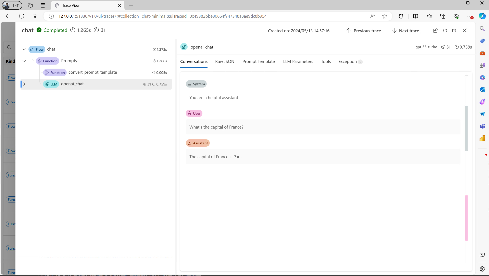
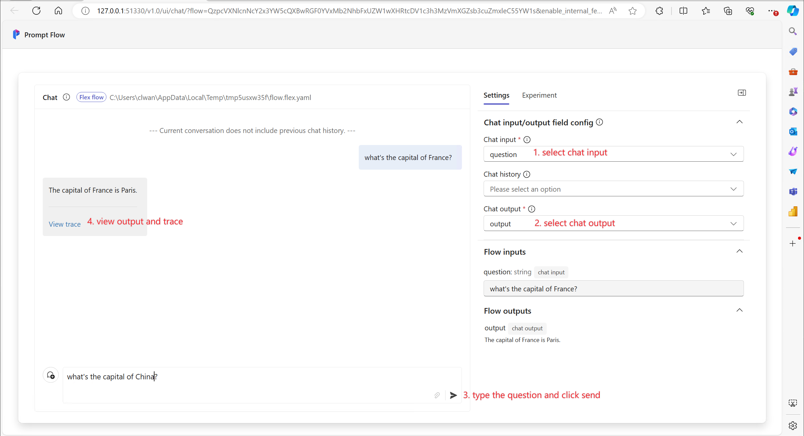

# Quick start

This guide will walk you through the first steps of the prompt flow code-first experience.

**Prerequisite** - To make the most of this tutorial, you'll need:
- Python programming knowledge

**Learning Objectives** - Upon completing this tutorial, you should know how to:
- Setup your python environment to run prompt flow
- Create a flow using a prompt and python function
- Test the flow using your favorite experience: CLI, SDK or UI.

## Installation

Install promptflow package to start.
```sh
pip install promptflow
```

Learn more about [installation](./installation/index.md).

## Create your first flow

### Model a LLM call with a prompty

Create a Prompty file to help you trigger one LLM call. 

```md
---
name: Minimal Chat
model:
  api: chat
  configuration:
    type: azure_openai
    azure_deployment: gpt-35-turbo
  parameters:
    temperature: 0.2
    max_tokens: 1024
inputs:
  question:
    type: string
sample:
  question: "What is Prompt flow?"
---

system:
You are a helpful assistant.

user:
{{question}}
```

Prompty is a markdown file. The front matter structured in `YAML`, encapsulates a series of metadata fields pivotal for defining the model’s configuration and the inputs for the prompty. After this front matter is the prompt template, articulated in the `Jinja` format.
See more details in [Develop a prompty](./develop-a-prompty/index.md). 

### Create a flow
Create a python function which is the entry of a `flow`. 

```python
import os

from dotenv import load_dotenv
from pathlib import Path
from promptflow.tracing import trace
from promptflow.core import Prompty

BASE_DIR = Path(__file__).absolute().parent

@trace
def chat(question: str = "What's the capital of France?") -> str:
    """Flow entry function."""

    if "OPENAI_API_KEY" not in os.environ and "AZURE_OPENAI_API_KEY" not in os.environ:
        # load environment variables from .env file
        load_dotenv()

    prompty = Prompty.load(source=BASE_DIR / "chat.prompty")
    # trigger a llm call with the prompty obj
    output = prompty(question=question)
    return output
```

Flow can be a python function or class or a yaml file describing a DAG which encapsulates your LLM application logic.
Learn more on the [flow concept](../concepts/concept-flows.md) and how to [Develop a flow](./develop-a-flex-flow/index.md).

See the full example of this python file in: [Minimal Chat](https://github.com/microsoft/promptflow/tree/main/examples/flex-flows/chat-minimal).

## Test the flow

Test the flow with your favorite experience: CLI, SDK or UI.

::::{tab-set}

:::{tab-item} CLI
:sync: CLI

`pf` is the CLI command you get when you install the `promptflow` package. Learn more about features of the `pf` CLI in the [reference doc](https://microsoft.github.io/promptflow/reference/pf-command-reference.html).

```sh
pf flow test --flow flow:chat --inputs question="What's the capital of France?"
```

You will get some output like the following in your terminal.
```text
Prompt flow service has started...
You can view the trace detail from the following URL:
http://127.0.0.1:51330/v1.0/ui/traces/?#collection=chat-minimal&uiTraceId=0x49382bbe30664f747348a8ae9dc8b954

The capital of France is Paris

```

If you click the trace URL printed, you will see a trace UI which helps you understand the actual LLM call that happened behind the scenes.



:::

:::{tab-item} SDK
:sync: SDK

Call the chat function with your question. Assume you have a `flow.py` file with the following content.
```python
if __name__ == "__main__":
    from promptflow.tracing import start_trace

    start_trace()

    result = chat("What's the capital of France?")
    print(result)
```

Run the script with `python flow.py`, and you will get some output like below:
```text
Prompt flow service has started...
You can view the trace detail from the following URL:
http://127.0.0.1:51330/v1.0/ui/traces/?#collection=chat-minimal&uiTraceId=0x49382bbe30664f747348a8ae9dc8b954

The capital of France is Paris

```

If you click the trace URL printed, you will see a trace UI which helps you understand the actual LLM call that happened behind the scenes.

:::

:::{tab-item} UI
:sync: VS Code Extension

Start test chat ui with below command.

```sh
pf flow test --flow flow:chat --ui 
```

The command will open a browser page like below:


See more details of this topic in [Chat with a flow](./chat-with-a-flow/index.md).


Click the "View trace" button to see a trace UI which helps you understand the actual LLM call that happened behind the scenes.


:::

::::


## Next steps

Learn more on how to:
- [Tracing](./tracing/index.md): details on how tracing works.
- [Develop a prompty](./develop-a-prompty/index.md): details on how to develop prompty.
- [Develop a flow](./develop-a-flex-flow/index.md): details on how to develop a flow using a python function or class.
- [Develop a DAG flow](./develop-a-dag-flow/index.md): details on how to develop a flow using friendly DAG UI.

And you can also check our [Tutorials](https://microsoft.github.io/promptflow/tutorials/index.html), especially:
- [Tutorial: Chat with PDF](https://microsoft.github.io/promptflow/tutorials/chat-with-pdf.html): An end-to-end tutorial on how to build a high quality chat application with prompt flow, including flow development and evaluation with metrics.

