# Quick Start

This guide will walk you through the fist step using of prompt flow code-first experience. 

**Prerequisite** - To make the most of this tutorial, you'll need:

- Know how to program with Python :)
- A basic understanding of Machine Learning can be beneficial, but it's not mandatory.


**Learning Objectives** - Upon completing this tutorial, you should learn how to:
- Setup your python environment to run prompt flow
- Clone a sample flow & understand what's a flow
- Understand how to edit the flow using visual editor or yaml
- Test the flow using your favorite experience: CLI, SDK or VS Code Extension.


## Set up your dev environment

1. A python environment with version `python=3.9` or higher version like 3.10. It's recommended to use python environment manager [miniconda](https://docs.conda.io/en/latest/miniconda.html). After you have installed miniconda, run below commands to create a python environment:
```bash
conda create --name pf python=3.9
conda activate pf
```

2. Install `promptflow` and `promptflow-tools`.
```sh
pip install promptflow promptflow-tools
```

3. Check the installation.
```bash
# should print promptflow version, e.g. "0.1.0b3"
pf -v
```

## Understand what's a flow

A flow, represented as a YAML file, is a DAG of functions, which connected via input/output dependencies, and executed based on the topology by Prompt flow executor. See [Flows](../../concepts/concept-flows.md) for more details.

### Get the flow sample

Clone the sample repo and check flows in folder [examples/flows](https://github.com/microsoft/promptflow/tree/main/examples/flows).

```bash
git clone https://github.com/microsoft/promptflow.git
```

### Understand flow directory
The sample used in this tutorial is the [web-classification](https://github.com/microsoft/promptflow/tree/main/examples/flows/standard/web-classification) flow, which categorizes URLs into several predefined classes. Classification is a traditional machine learning task, and this sample illustrates how to perform classification using GPT and prompts.

```bash
cd promptflow/examples/flows/standard/web-classification
```

A flow directory is a directory that contains all contents of a flow. Structure of flow folder:
- **flow.dag.yaml**: The flow definition with inputs/outputs, nodes, tools and variants for authoring purpose.
- **.promptflow/flow.tools.json**: It contains all package tools meta that references in `flow.dag.yaml`.
- **Source code files (.py, .jinja2)**: User managed, the code scripts that references by tools.
- **requirements.txt**: Python package dependencies for this flow.


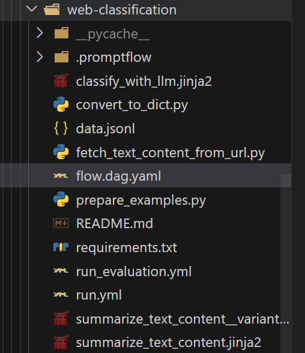

In order to run this specific flow, you need to install its requirements first.

```sh
pip install -r requirements.txt
```

### Understand the flow yaml
The entry file of a flow directory is [`flow.dag.yaml`](https://github.com/microsoft/promptflow/blob/main/examples/flows/standard/web-classification/flow.dag.yaml) which describes the `DAG(Directed Acyclic Graph)` of a flow. The flow dag of this sample likes below:

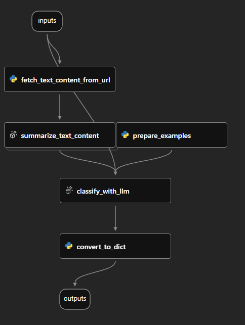

This graph is rendered by VS Code extension which will be introduced in the next section.

### Using VS Code Extension to visualize the flow
_Note: Prompt flow VS Code Extension is highly recommended for flow development and debugging._

Click to watch the demo video:

<a href="https://youtu.be/05Utfsm0ptc" title="vsc demo" target="_blank"></a>

1. Prerequisites for VS Code extension.
   - Install latest stable version of [VS Code](https://code.visualstudio.com/)
   - Install [VS Code Python extension](https://marketplace.visualstudio.com/items?itemName=ms-python.python)

2. Install [Prompt flow for VS Code extension](https://marketplace.visualstudio.com/items?itemName=prompt-flow.prompt-flow)

3. Select python interpreter

    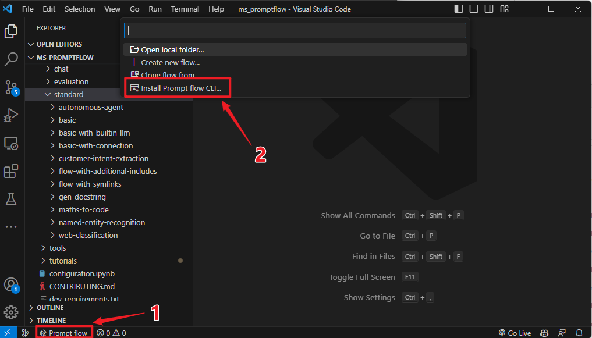
   
    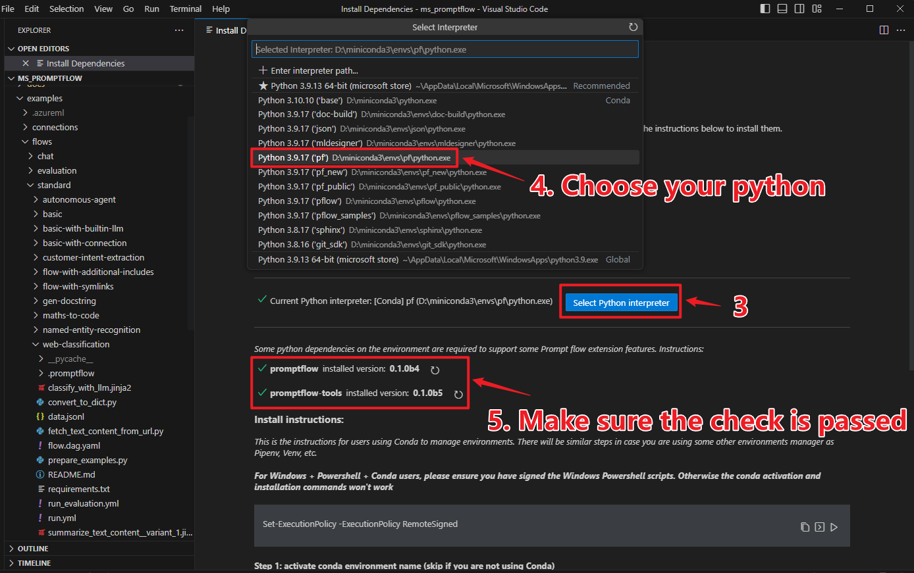


2. Open dag in vscode. You can open the `flow.dag.yaml` as yaml file, or you can also open it in `visual editor`.
   
    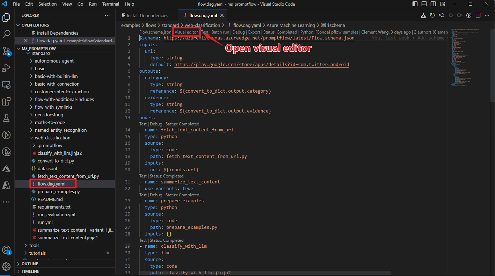

## Develop and test your flow

### How to edit the flow

To test your flow with varying input data, you have the option to modify the default input. If you are well-versed with the structure, you may also add or remove nodes to alter the flow's arrangement.

```yaml
$schema: https://azuremlschemas.azureedge.net/promptflow/latest/Flow.schema.json
inputs:
  url:
    type: string
    # change the default value of input url here
    default: https://play.google.com/store/apps/details?id=com.twitter.android
...
```

### Create necessary connections

The [`connection`](../concepts/concept-connections.md) helps securely store and manage secret keys or other sensitive credentials required for interacting with LLM and other external tools for example Azure Content Safety.

The sample flow [web-classification](https://github.com/microsoft/promptflow/tree/main/examples/flows/standard/web-classification) uses connection `open_ai_connection` inside, e.g. `classify_with_llm` node needs to talk to `llm` using the connection. 

We need to set up the connection if we haven't added it before. Once created, the connection will be stored in local db and can be used in any flow.

::::{tab-set}

:::{tab-item} CLI
:sync: CLI

Firstly we need a connection yaml file `connection.yaml`:

If you are using Azure Open AI, prepare your resource follow with this [instruction](https://learn.microsoft.com/en-us/azure/cognitive-services/openai/how-to/create-resource?pivots=web-portal) and get your `api_key` if you don't have one.
```yaml
$schema: https://azuremlschemas.azureedge.net/promptflow/latest/AzureOpenAIConnection.schema.json
name: open_ai_connection
type: azure_open_ai
api_key: <test_key>
api_base: <test_base>
api_type: azure
api_version: <test_version>
```

If you are using OpenAI, sign up account via [OpenAI website](https://openai.com/), login and [find personal API key](https://platform.openai.com/account/api-keys), then use this yaml:
```yaml
$schema: https://azuremlschemas.azureedge.net/promptflow/latest/AzureOpenAIConnection.schema.json
name: open_ai_connection
type: azure_open_ai
api_key: <test_key>
organization: "" # optional
```
Then we can use CLI command to create the connection.

```sh
pf connection create -f connection.yaml
```

More command details can be found in [CLI reference](../reference/pf-command-reference.md).

:::

:::{tab-item} SDK
:sync: SDK

In SDK, connections can be created and managed with `PFClient`.

```python
from promptflow import PFClient
from promptflow.entities import AzureOpenAIConnection

# PFClient can help manage your runs and connections.
pf = PFClient()

try:
    conn_name = "open_ai_connection"
    conn = pf.connections.get(name=conn_name)
    print("using existing connection")
except:
    connection = AzureOpenAIConnection(
        name=conn_name,
        api_key="<test_key>",
        api_base="<test_base>",
        api_type="azure",
        api_version="<test_version>",
    )

    # use this if you have an existing OpenAI account
    # from promptflow.entities import OpenAIConnection
    # connection = OpenAIConnection(
    #     name=conn_name,
    #     api_key="<user-input>",
    # )

    conn = pf.connections.create_or_update(connection)
    print("successfully created connection")

print(conn)
```
:::

:::{tab-item} VS Code Extension
:sync: VS Code Extension


1. Click the promptflow icon to enter promptflow control panel

    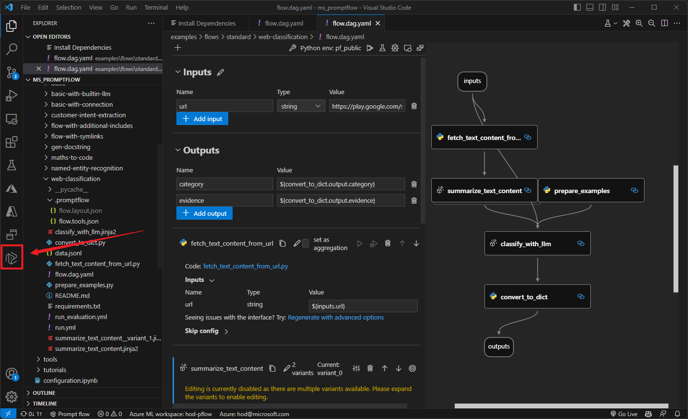

2. Create your connection.

    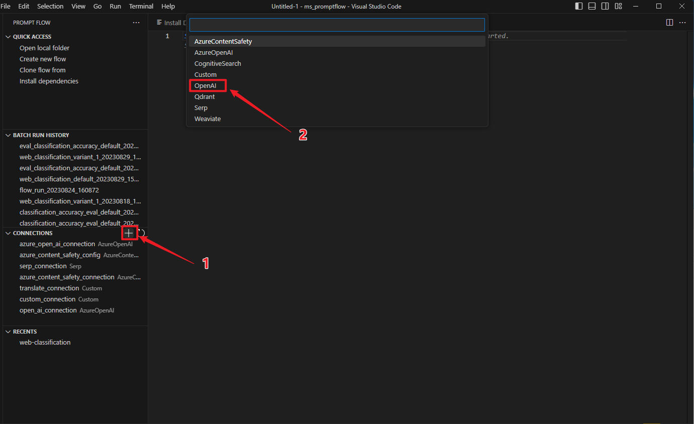

    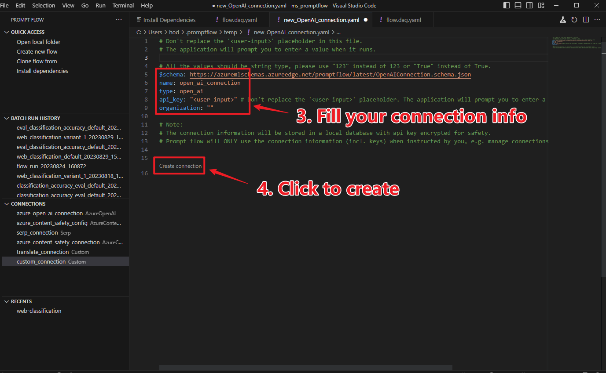

    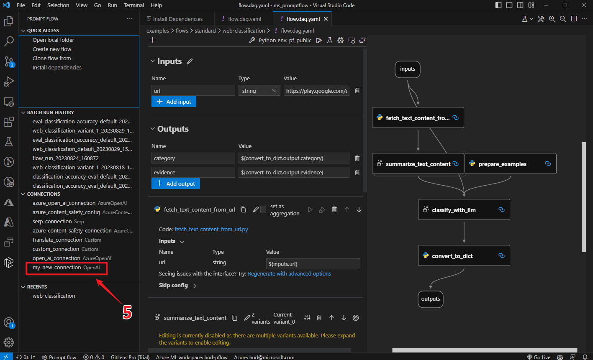


:::

::::

Learn more on more actions like delete conection in: [Manage connections](./manage-connections.md).

### Test the flow
Assuming you are in working directory `promptflow/examples/flows/standard/`

::::{tab-set}

:::{tab-item} CLI
:sync: CLI

Change the default input to the value you want to test.

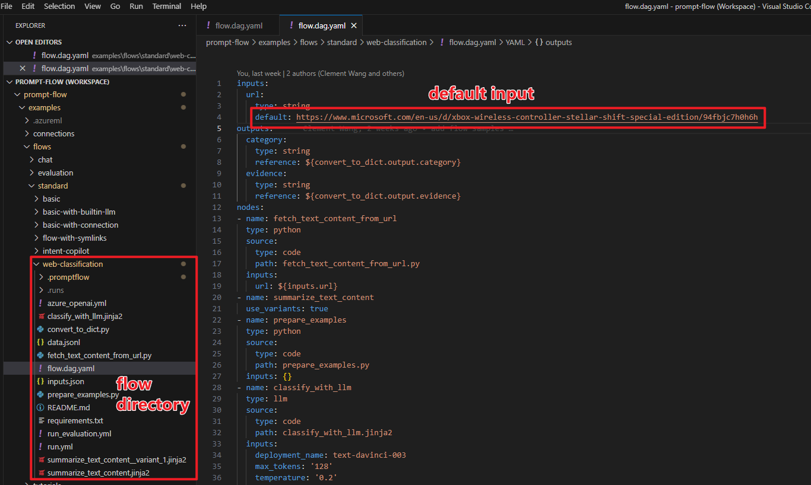

```sh
pf flow test --flow web-classification  # "web-classification" is the directory name
```

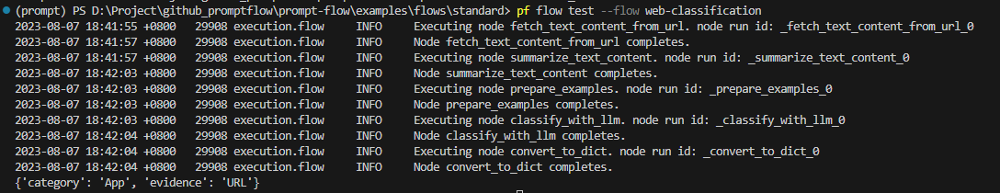

:::

:::{tab-item} SDK
:sync: SDK

The return value of `test` function is the flow/node outputs.

```python
from promptflow import PFClient

pf_client = PFClient()

flow_path = "web-classification"  # "web-classification" is the directory name

# Test flow
flow_inputs = {"url": "https://www.youtube.com/watch?v=o5ZQyXaAv1g", "answer": "Channel", "evidence": "Url"}  # The inputs of the flow.
flow_result = pf_client.test(flow=flow_path, inputs=inputs)
print(f"Flow outputs: {flow_result}")

# Test node in the flow
node_name = "fetch_text_content_from_url"  # The node name in the flow.
node_inputs = {"url": "https://www.youtube.com/watch?v=o5ZQyXaAv1g"}  # The inputs of the node.
node_result = pf_client.test(flow=flow_path, inputs=node_inputs, node=node_name)
print(f"Node outputs: {node_result}")
```


:::

:::{tab-item} VS Code Extension
:sync: VS Code Extension

Use the code lens action on the top of the yaml editor to trigger flow test
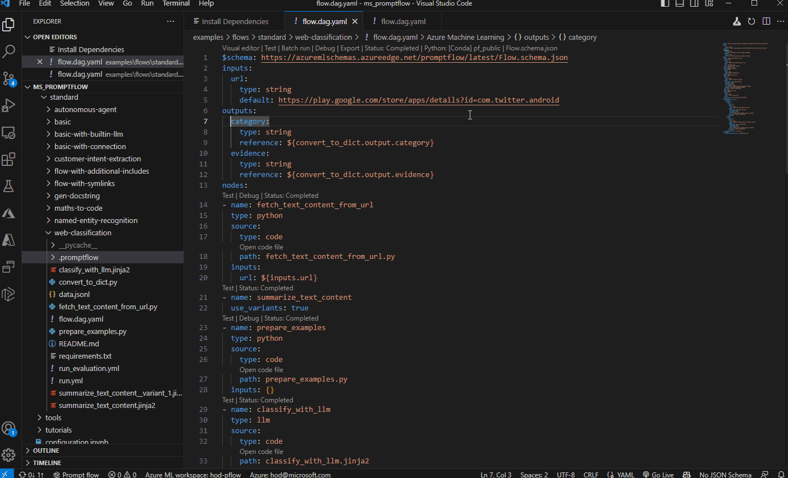


Click the run flow button on the top of the visual editor to trigger flow test.

:::

::::

See more details of this topic in [Initialize and test a flow](./init-and-test-a-flow.md).

## Next steps

Learn more on how to:
- [Initialize and test a flow](./init-and-test-a-flow.md): details on how develop a flow from scratch or existing code.
- [Run and evaluate a flow](./run-and-evaluate-a-flow.md): run and evaluate the flow using multi line data file.
- [Deploy a flow](./deploy-a-flow/index.md): how to deploy the flow as a web app.
- [Manage connections](./manage-connections.md): how to manage the endpoints/secrets information to access external services including LLMs.
- [Prompt flow in Azure AI](../cloud/azureai/quick-start.md): run and evaluate flow in Azure AI where you can collaborate with team better.

And you can also check our [examples](https://github.com/microsoft/promptflow/tree/main/examples), especially:
- [Getting Started with Prompt Flow](https://github.com/microsoft/promptflow/blob/main/examples/tutorials/get-started/quickstart.ipynb): the notebook covering the python sdk experience for sample introduced in this doc.
- [Tutorial: Chat with PDF](https://github.com/microsoft/promptflow/blob/main/examples/tutorials/e2e-development/chat-with-pdf.md): An end-to-end tutorial on how to build a high quality chat application with prompt flow, including flow development and evaluation with metrics.
