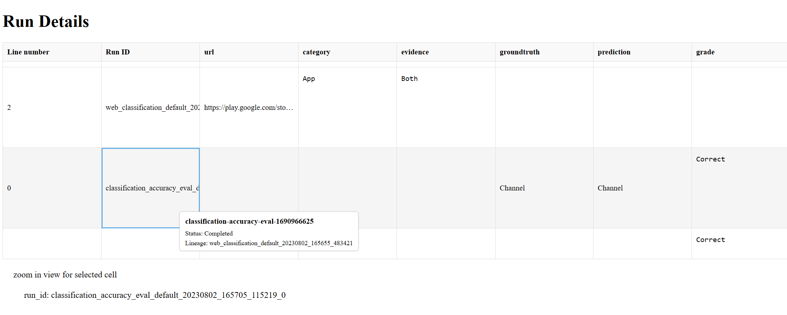
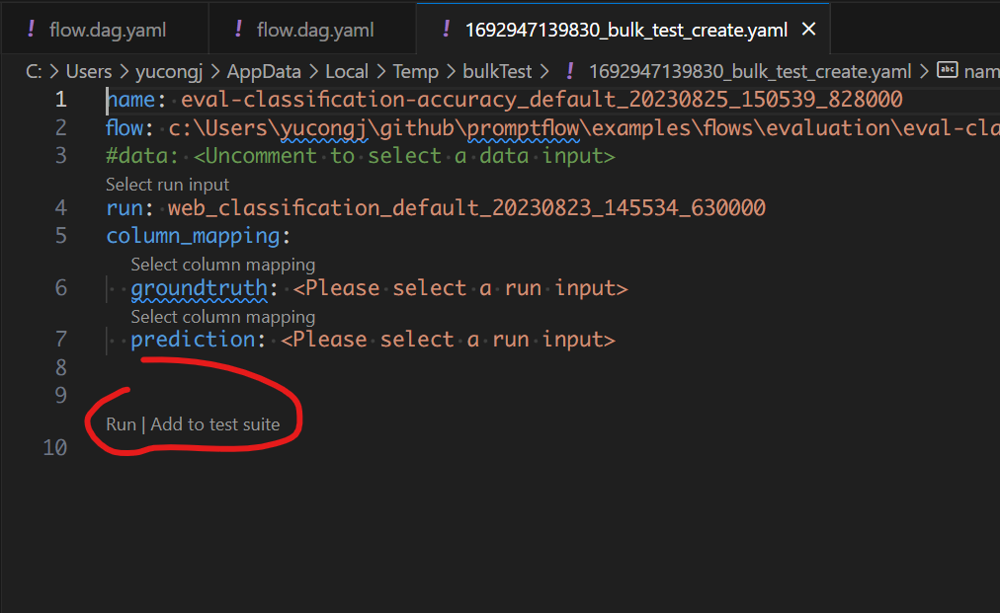

# Run and evaluate a flow

:::{admonition} Experimental feature
This is an experimental feature, and may change at any time. Learn [more](../faq.md#stable-vs-experimental).
:::

After you have developed and tested the flow in [init and test a flow](../init-and-test-a-flow.md), this guide will help you learn how to run a flow with a larger dataset and then evaluate the flow you have created.


## Create a batch run

Since you have run your flow successfully with a small set of data, you might want to test if it performs well in large set of data, you can run a batch test and check the outputs.

A bulk test allows you to run your flow with a large dataset and generate outputs for each data row, and the run results will be recorded in local db so you can use [pf commands](../../reference/pf-command-reference.md) to view the run results at anytime. (e.g. `pf run list`)

Let's create a run with flow [web-classification](https://github.com/microsoft/promptflow/tree/main/examples/flows/standard/web-classification). It is a flow demonstrating multi-class classification with LLM. Given an url, it will classify the url into one web category with just a few shots, simple summarization and classification prompts.

To begin with the guide, you need:
- Git clone the sample repository(above flow link) and set the working directory to `<path-to-the-sample-repo>/examples/flows/`.
- Make sure you have already created the necessary connection following [Create necessary connections](../quick-start.md#create-necessary-connections).

::::{tab-set}

:::{tab-item} CLI
:sync: CLI

Create the run with flow and data, can add `--stream` to stream the run.
```sh
pf run create --flow standard/web-classification --data standard/web-classification/data.jsonl --column-mapping url='${data.url}' --stream 
```

Note `column-mapping` is a mapping from flow input name to specified values, see more details in [Use column mapping](https://aka.ms/pf/column-mapping).

You can also name the run by specifying `--name my_first_run` in above command, otherwise the run name will be generated in a certain pattern which has timestamp inside.


With a run name, you can easily view or visualize the run details using below commands:

```sh
pf run show-details -n my_first_run
```


```sh
pf run visualize -n my_first_run
```


More details can be found with `pf run --help`

:::
:::{tab-item} SDK
:sync: SDK

```python
from promptflow import PFClient

# PFClient can help manage your runs and connections.
pf = PFClient()

# Set flow path and run input data
flow = "standard/web-classification" # set the flow directory
data= "standard/web-classification/data.jsonl" # set the data file

# create a run, stream it until it's finished
base_run = pf.run(
    flow=flow,
    data=data,
    stream=True,
)
```


```python
# get the inputs/outputs details of a finished run.
details = pf.get_details(base_run)
details.head(10)
```


```python
# visualize the run in a web browser
pf.visualize(base_run)
```


:::

:::{tab-item} VS Code Extension
:sync: VS Code Extension
Use the code lens action on the top of the yaml editor to trigger batch run


Click the bulk test button on the top of the visual editor to trigger flow test.

:::

::::


## Evaluate your flow

You can use an evaluation method to evaluate your flow. The evaluation methods are also flows which use Python or LLM etc., to calculate metrics like accuracy, relevance score. Please refer to [Develop evaluation flow](../develop-a-flow/develop-evaluation-flow.md) to learn how to develop an evaluation flow.

In this guide, we use [eval-classification-accuracy](https://github.com/microsoft/promptflow/tree/main/examples/flows/evaluation/eval-classification-accuracy) flow to evaluate. This is a flow illustrating how to evaluate the performance of a classification system. It involves comparing each prediction to the groundtruth and assigns a `Correct` or `Incorrect` grade, and aggregating the results to produce metrics such as `accuracy`, which reflects how good the system is at classifying the data.

### Run evaluation flow against run

::::{tab-set}

:::{tab-item} CLI
:sync: CLI

**Evaluate the finished flow run**

After the run is finished, you can evaluate the run with below command, compared with the normal run create command, note there are two extra arguments:

- `column-mapping`: A mapping from flow input name to specified data values. Reference [here](https://aka.ms/pf/column-mapping) for detailed information.
- `run`: The run name of the flow run to be evaluated.

More details can be found in [Use column mapping](https://aka.ms/pf/column-mapping).

```sh
pf run create --flow evaluation/eval-classification-accuracy --data standard/web-classification/data.jsonl --column-mapping groundtruth='${data.answer}' prediction='${run.outputs.category}' --run my_first_run --stream
```

Same as the previous run, you can specify the evaluation run name with `--name my_first_eval_run` in above command.

You can also stream or view the run details with:

```sh
pf run stream -n my_first_eval_run  # same as "--stream" in command "run create"
pf run show-details -n my_first_eval_run
pf run show-metrics -n my_first_eval_run
```

Since now you have two different runs `my_first_run` and `my_first_eval_run`, you can visualize the two runs at the same time with below command.

```sh
pf run visualize -n "my_first_run,my_first_eval_run"
```

A web browser will be opened to show the visualization result.



:::

:::{tab-item} SDK
:sync: SDK

**Evaluate the finished flow run**

After the run is finished, you can evaluate the run with below command, compared with the normal run create command, note there are two extra arguments:

- `column-mapping`: A dictionary represents sources of the input data that are needed for the evaluation method. The sources can be from the flow run output or from your test dataset.
  - If the data column is in your test dataset, then it is specified as `${data.<column_name>}`.
  - If the data column is from your flow output, then it is specified as `${run.outputs.<output_name>}`.
- `run`: The run name or run instance of the flow run to be evaluated.

More details can be found in [Use column mapping](https://aka.ms/pf/column-mapping).

```python
from promptflow import PFClient

# PFClient can help manage your runs and connections.
pf = PFClient()

# set eval flow path
eval_flow = "evaluation/eval-classification-accuracy"
data= "standard/web-classification/data.jsonl"

# run the flow with existing run
eval_run = pf.run(
    flow=eval_flow,
    data=data,
    run=base_run,
    column_mapping={  # map the url field from the data to the url input of the flow
      "groundtruth": "${data.answer}",
      "prediction": "${run.outputs.category}",
    }
)

# stream the run until it's finished
pf.stream(eval_run)

# get the inputs/outputs details of a finished run.
details = pf.get_details(eval_run)
details.head(10)

# view the metrics of the eval run
metrics = pf.get_metrics(eval_run)
print(json.dumps(metrics, indent=4))

# visualize both the base run and the eval run
pf.visualize([base_run, eval_run])

```

A web browser will be opened to show the visualization result.


:::

:::{tab-item} VS Code Extension
:sync: VS Code Extension

There are actions to trigger local batch runs. To perform an evaluation you can use the run against "existing runs" actions.



:::

::::

## Next steps

Learn more about:
- [Tune prompts with variants](../tune-prompts-with-variants.md)
- [Deploy a flow](../deploy-a-flow/index.md)
